<!-- cspell:ignore peterxcli Xiangpeng ish laggy Zstd overclaim amz -->

Recently I created [https://ozone.s3.peterxcli.dev/](https://ozone.s3.peterxcli.dev/), an automated update dashboard for Apache Ozone S3 compatibility. It runs Ozone against real S3 compatibility suites, publishes the result every day, and lets you search test cases, inspect failures, read source snippets, open logs, and check whether your PR really helps the compatibility story. It is fully open source at [https://github.com/peterxcli/ozone-s3-compatibility](https://github.com/peterxcli/ozone-s3-compatibility).

<!-- truncate -->

TL;DR:

- This really helped me get promoted as a PMC member of the Apache Ozone project.
- Overall, **7% (50/711)** compatibility improvement at the time that this article was written.
- Parquet \+ search-index optimization made the Pages data **11.8x smaller**, yearly git growth **12x slower**, and search data **14x smaller**.
- It runs Apache Ozone against [`ceph/s3-tests`](https://github.com/ceph/s3-tests) and [`minio/mint`](https://github.com/minio/mint), then publishes a GitHub Pages report.
- It turns compatibility from “a few epic tickets and some memory in people’s heads” into a searchable, linkable, daily signal.
- For users, it answers “does Ozone support this S3 behavior today?” For developers, it answers “which exact test is failing, why, and did my PR move it?”

## Why did I create it?

Before this dashboard was introduced, Apache Ozone already tried really hard to track the compatibility gap with a few epic issues, for example: [Ozone S3 gateway Phase 4](https://issues.apache.org/jira/browse/HDDS-1186), [Ozone S3 gateway (phase III)](https://issues.apache.org/jira/browse/HDDS-12716), and [S3 API compatibility improvements and fixes](https://issues.apache.org/jira/browse/HDDS-8423).

But I believe if you really click into the above links, you will quickly get lost among them. They are useful, but they are not a fresh report of what Apache Ozone’s S3 compatibility looks like today.

Users don’t know whether Ozone really supports a specific S3 behavior. Developers don’t know whether a feature gap, implementation gap, or corner case is already handled correctly. And when a compatibility issue is fixed or newly introduced, there was no fresh source of truth to show that change.

Also, when we develop S3 features, we often look at AWS S3 docs or source code from other open source S3-compatible systems, then infer how the implementation should behave and what test cases we should add. That works sometimes, but it is still mostly guessing. There was no easy harness to continuously test Ozone’s behavior against existing compatibility suites and make the result easy to inspect.

So that’s why I wanted to create this dashboard.

## How to use it?

I usually think of the dashboard as having a few different modes.

First, start from the latest run summary. The top cards show the current `s3-tests` and `mint` compatibility rate, eligible case count, pass/fail/error count, skipped count, and the delta compared with the previous run. This makes it easy to know whether today’s result is better, worse, or basically unchanged. One small detail here: the compatibility rate is `passed / (passed + failed + errored)`.

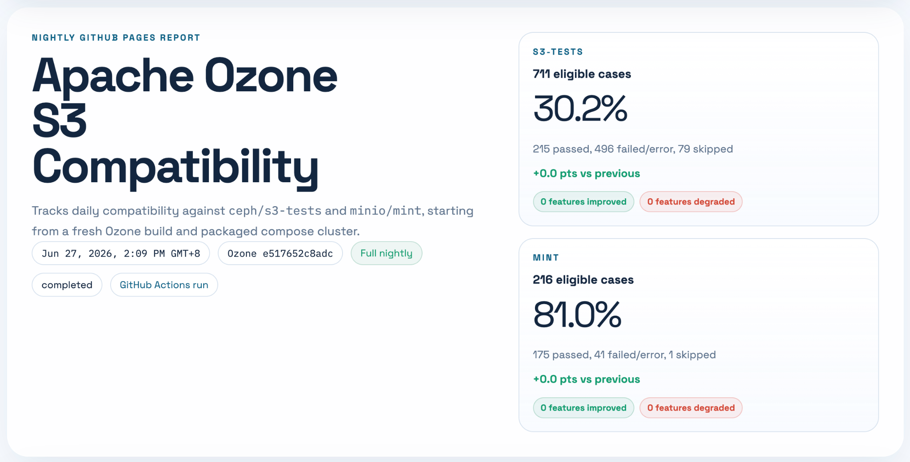

Second, use the search box as the main debugging entry point. You can search by suite, test name, run id, run date, source path, feature name, status, or failure text. For example, if you are working on object tagging, you can search for `tagging`; if you are looking at a specific failure from `s3-tests`, you can paste part of the error message. Search results show the matched fields, suite, run date, status, feature tags, and a short failure preview.
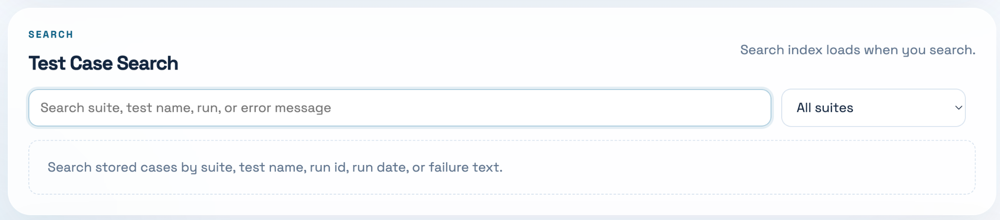

Third, click a search result. The modal shows the full failure detail, related metadata, a permalink, and the test code. For `s3-tests`, the dashboard can fetch the upstream source file and extract the Python test function, so you don’t need to jump between the report, GitHub, and your local checkout just to understand what the test is really asking for.

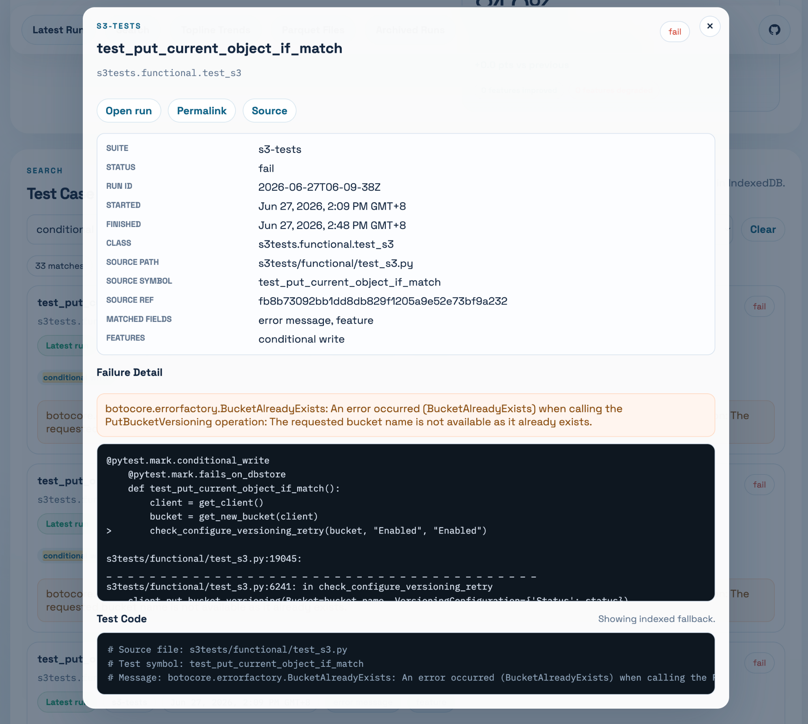

Fourth, open the current report detail. The page does not force-load all case details at the beginning. Instead, it loads summary first, then fetches the full run detail when you open the latest run or an archived run. Inside the run detail, you can inspect suites, feature summaries, individual failed cases, and log files.
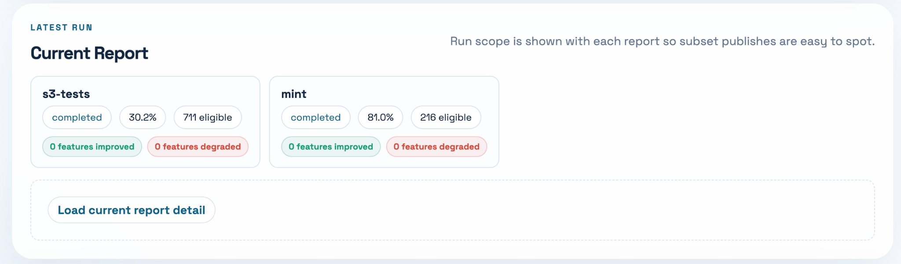
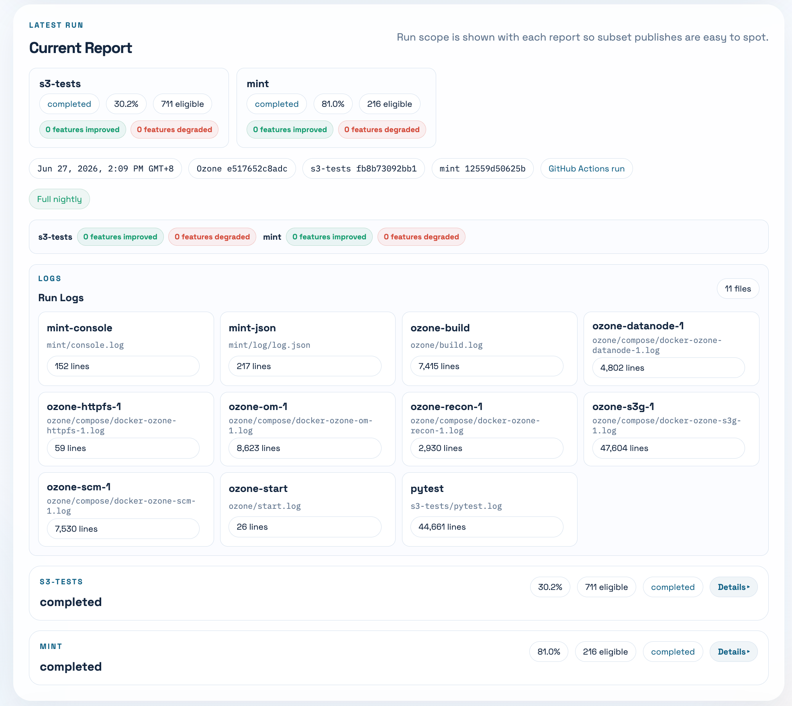
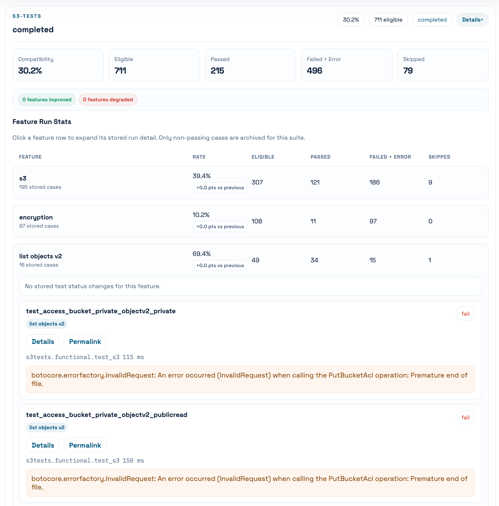

Fifth, use the trend panel. The top-line trend is useful to see whether the overall compatibility is moving. The per-feature trend is even more useful because a single global number can hide what really changed. For example, a PR might only improve object tagging, bucket listing, copy object behavior, or some conditional-write corner case. Those changes are much easier to reason about feature by feature.

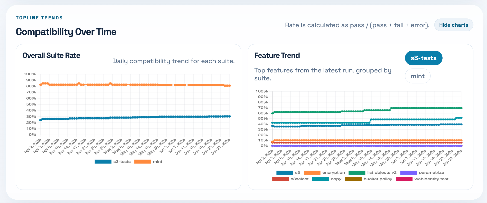

Sixth, use archived runs when you need history. Old runs are still there, but their details are loaded only when opened. This is helpful when you want to compare a failure today with an older run, or when a PR says “this test used to fail before the fix.”
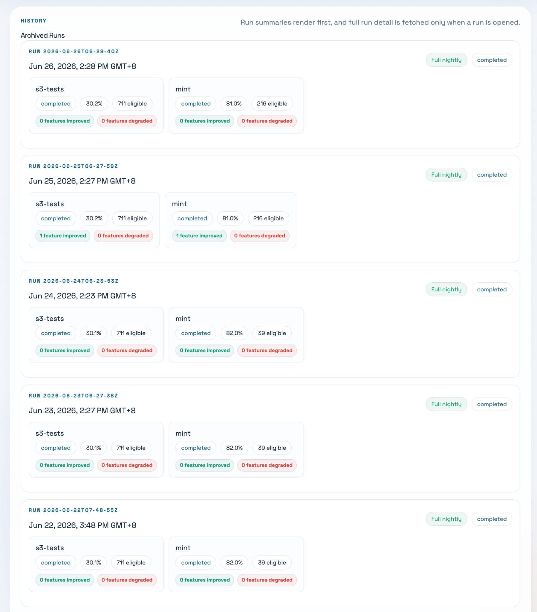

Finally, the Parquet file inspector is there for people who want to inspect the published dataset itself. This is mostly for debugging the dashboard and data model, but it is surprisingly useful when you want to understand what files were generated, how many rows they contain, and whether the published data looks sane. Also thanks Xiangpeng for building the [Parquet Viewer](https://github.com/XiangpengHao/parquet-viewer), which let us inspect the parquet file content directly on the site.
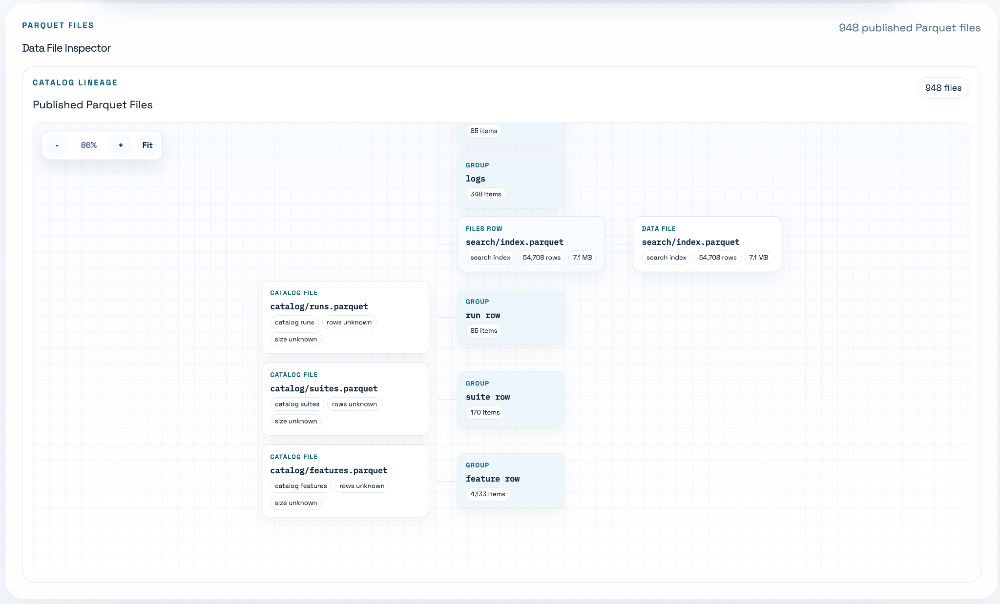
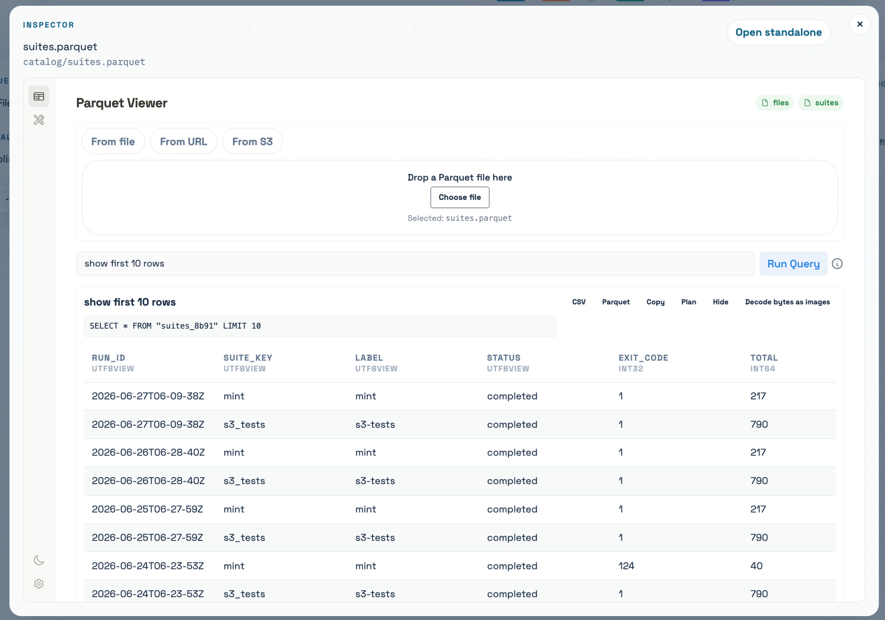

For PR authors, there is also a PR comparison workflow. It can run an Ozone PR head, compare it with the latest published main run, write a step summary, and optionally comment back on the Ozone PR. That is the part I like the most: compatibility is not just a dashboard to look at, but something you can wire into development review.

## How is this built?

For the very first version, I literally just prompted Codex with `gpt5.4 xhigh`:

:::info Prompt
I want to create a repo that runs [https://github.com/ceph/s3-tests](https://github.com/ceph/s3-tests) and [https://github.com/minio/mint](https://github.com/minio/mint) on GitHub Action and generate the compatibility report page on GitHub Pages nightly. Make the page pretty. My desired steps that run in the GitHub Action are: clone the Ozone repo, pull latest master change, compile, start running cluster, run Mint and s3-tests to get result, compile result to be the page. We can show the compatibility rate of each feature for each test (`s3-tests`, `mint`) daily change as a chart at the page top, followed by the report page, then also include the old result expansion button to allow users to check a specific date’s running result. BTW I have the local clone of Ozone at `~/Documents/oss/apache/ozone`, you can look into it directly without searching the codebase on the website.
:::

Then it almost one-shotted this. Actually I still made some follow-ups on the result, like “attach `s3-tests` and `mint` as submodule” and “use `act` to test the GitHub Action really works locally within Docker”, but those were relatively minor compared with the first scaffold.

The nightly workflow now does roughly this:

1. Build the Vue/Vite report frontend.
2. Clone Ozone and the upstream compatibility suites.
3. Build an Ozone distribution.
4. Start a packaged Ozone compose cluster.
5. Run `s3-tests` and Mint against the S3 Gateway.
6. Normalize the raw output into a run result.
7. Build the static Pages output, including the historical data.
8. Publish to `gh-pages` for scheduled runs.

The frontend is Vue 3 \+ Vite. The backend-ish part is just scripts and GitHub Actions. The data processing is mostly Python. For the newer version, the published report data is JSON.

### Optimization

After a few runs, I started to notice that the dashboard was becoming laggy. After some inspection, I found a few reasons.

1. First, we originally used one JSON file to represent one run result. Each latest run was about 0.236 MiB. This sounds small, but the problem is that we did not lazy load these files at the beginning. Every time the page refreshed, even if some files might already be cached by the browser, the TypeScript data structure still ended up holding too much content from too many files. That is very memory-consuming.

2. Second, the JSON data had a ton of room to compress. The data shape is very repetitive: `run_id`, `suite_key`, `status`, feature names, source paths, class names, test names, and similar object keys appear again and again. JSON stores all of that as repeated text and nested objects. Even if HTTP compression helps over the network, the browser still has to parse it into JavaScript objects, and Git still stores changed blobs. This kind of data is much closer to a table than a document, so a columnar format makes more sense.

3. Finally, the search index data was not normalized correctly. The index repeated run metadata and case metadata too much, and it grew quickly. For Git history, this is especially bad because every new run changes a large generated file again.

So then I basically applied three optimizations: lazy loading, Parquet compression, and search/index normalization.

1. **Lazy loading.** The page now loads the light catalog/index first. Full run details are fetched only when you open the latest run or expand an archived run. Search index loading is also delayed until you actually search, and the browser can keep the FlexSearch index in IndexedDB. Logs are fetched only when you open a log modal. Source snippets are fetched only when you open a case. This makes the first page load much cheaper.
2. **Compress data as Parquet.** Instead of treating every run as one large JSON document, the report data is split into Parquet tables: catalog runs, suites, features, per-run metadata, per-run cases, search rows, log files, and log lines. The Parquet writer uses Zstd compression and dictionary encoding, which is a much better fit for repeated values like suite names, statuses, feature tags, and source paths. The frontend then queries these Parquet files in the browser through DuckDB-Wasm.
3. **Index file optimization.** The search rows now contain normalized fields and a short `detail_preview`, while the full case detail can be hydrated from the per-run case Parquet file when needed. For JSON fallback, the index and search data are partitioned into smaller shards. For the normal Parquet path, the global search index is a compressed Parquet file. The search index also has a stable `index_id`, so the browser can reuse the IndexedDB cache when the data has not changed.

Result is crazy:

1. Parquet data now:
   1. search rows: 7.64 MiB, 33,876 rows, growing about 0.142-0.147 MiB/run
   2. run case/detail data excluding search: 4.92 MiB across 52 runs, growing about 0.093 MiB/run
   3. catalog/index data: 0.03 MiB now, growing less than 1 KiB/run
   4. total Pages data: 12.59 MiB across 52 runs
   5. latest run data: 246,696 bytes \= 0.235 MiB
2. Projection at the current rate:
   1. about \+0.236 MiB/run
   2. about \+7.1 MiB/month
   3. about \+86 MiB/year
2. Compared with the JSON baseline:
   1. current data size: 149.11 MiB \-\> 12.59 MiB, about 11.8x smaller
   2. yearly growth: \~1.0 GiB/year \-\> \~86 MiB/year, about 12x slower
   3. search data: 107.09 MiB \-\> 7.64 MiB, about 14x smaller

## Current Effect

Ozone has already improved since the dashboard was released.
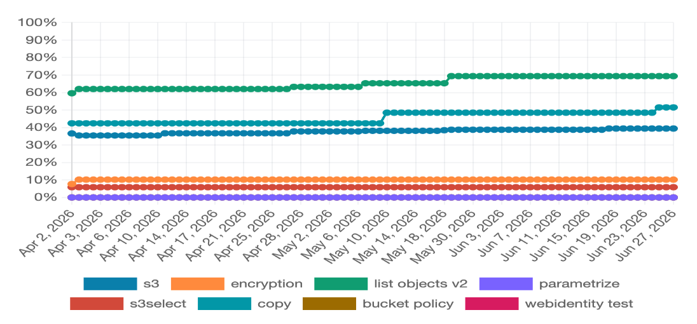

I don’t want to overclaim that every improvement below was caused only by this dashboard, but I do think the dashboard changed the workflow. It gives us concrete failing cases, links that can be pasted into PRs, and an easy way to check whether the gap is still there after a patch.

There are already quite a few PRs and designs which aim to fix compatibility gaps discovered or made easier to discuss by the dashboard:

- Object tagging and bucket tagging:
  - [HDDS-15258. Include x-amz-tagging-count header in HEAD object tagging responses](https://github.com/apache/ozone/pull/10265)
  - [HDDS-15283. GetObjectTagging should return TagSet in sorted order of key](https://github.com/apache/ozone/pull/10277)
  - [HDDS-15259. PutObject should treat null tag value for x-amz-tagging header as empty tag value](https://github.com/apache/ozone/pull/10299)
  - [HDDS-15510. Implement OM read/write paths for bucket tagging with audit and metrics](https://github.com/apache/ozone/pull/10498)
  - [Proposal: S3 Bucket Tagging in Apache Ozone](https://docs.google.com/document/d/1jq1JOatCrUpD7k3PutfkGrZ7nFC1C69BkMoMWcRWaw4/edit?tab=t.0#heading=h.rs6cprl5cddi)
- Bucket listing and directory bucket behavior:
  - [HDDS-15302. Throw S3 InvalidArgument for RequestParameters getInt if parsing error](https://github.com/apache/ozone/pull/10297)
  - [HDDS-15303. Enable prefix filter for OBS](https://github.com/apache/ozone/pull/10298)
  - [HDDS-15450. Implement ListDirectoryBuckets S3 API for Directory Buckets support](https://github.com/apache/ozone/pull/10408)
- Other compatibility-related correctness work:
  - [HDDS-15515. Support object Content-Type end-to-end in S3 Gateway](https://github.com/apache/ozone/pull/10472)

The most useful effect is not just that the percentage moved. It is that the compatibility gap became much more concrete. A failed test can now become a dashboard link, then a JIRA, then a PR, then a nightly result showing whether it really passed.

## Insight

1. The main reason this really got adopted by other community members is that I posted it at the first time after I thought it could really work: [\[DISCUSS\] Nightly Ozone S3 compatibility report](https://lists.apache.org/thread/2td4jt8r26pwph5lwq3ncbnv97n27d5w). It was not perfect yet, but it was already useful enough for people to try. I think posting early was important.
2. This also really helped me get promoted as a PMC member of the Apache Ozone project. Not because the dashboard itself is magical, but because it made a long-standing problem visible and gave the community a practical tool to keep improving it.
3. Not every failed test case means Ozone is wrong. Sometimes the compatibility suite itself has a questionable expectation. For example, I opened [ceph/s3-tests\#735](https://github.com/ceph/s3-tests/pull/735) to align conditional write tests with `If-None-Match: *` semantics. At the time of writing, it is still open. This is a good reminder that compatibility work is not only “fix Ozone until all tests pass”; sometimes it is also “debug the tests and upstream better expectations.”
4. A dashboard is also a social tool. If the result is not searchable, linkable, and easy to quote in a PR, it will not be used much. The permalink part sounds small, but it matters a lot when people discuss failures asynchronously.
5. A single compatibility percentage is useful, but it is not enough. The real value is in the drill-down: which feature changed, which test changed, what error message changed, and what source code was the test running. Without that, the percentage is just a vanity number.
6. LLMs are very good at scaffolding this kind of glue project. But the part that made it trustworthy was not the first generated code. It was the boring follow-up: run it locally with `act`, add tests, normalize data, make it faster, and keep it running every day.
7. I should have treated the data model as important from the beginning. The UI can grow quickly, but if the data layout is wrong, the page becomes slow and the Git history becomes huge. Moving to Parquet later worked, but I probably should have designed the report as a dataset earlier.

## Conclusion

This dashboard started as a pretty simple idea: run `s3-tests` and Mint against Apache Ozone every night, then publish a nice report page. But after using it for a while, I think the more important part is that it turns S3 compatibility into a feedback loop.

Before, compatibility was scattered across JIRA epics, docs, people’s memory, and occasional manual testing. Now there is a daily report that users can search, developers can debug, and PR authors can use as evidence. It is still not perfect, and some failures still need human judgment, but at least we have a place to look.

If you are using Ozone S3 Gateway, or if you are working on Ozone S3 compatibility, please try the dashboard and the repo. Search for the feature you care about, click into the failures, and open issues or PRs when something looks wrong. The more boring and continuous this compatibility work becomes, the better Ozone will get.
