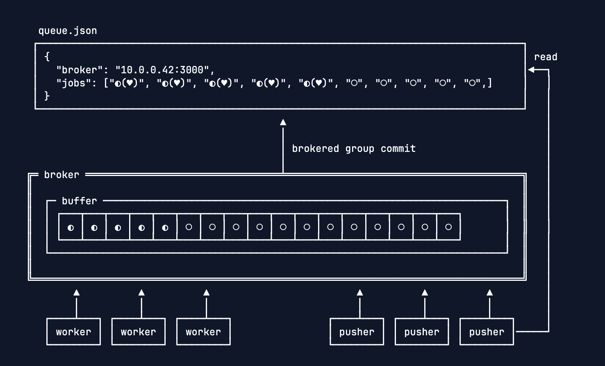
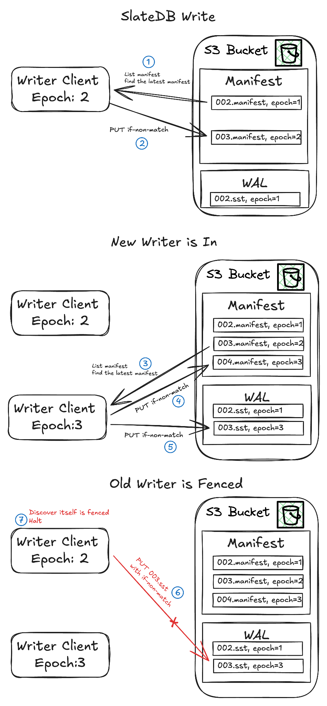
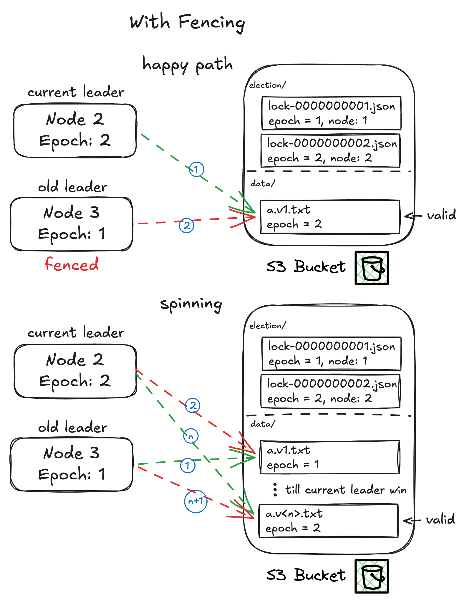
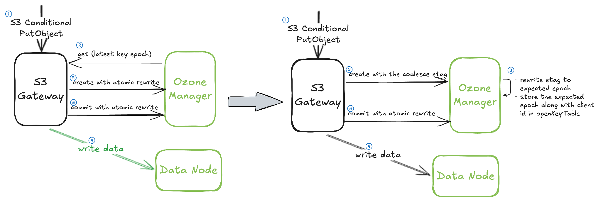
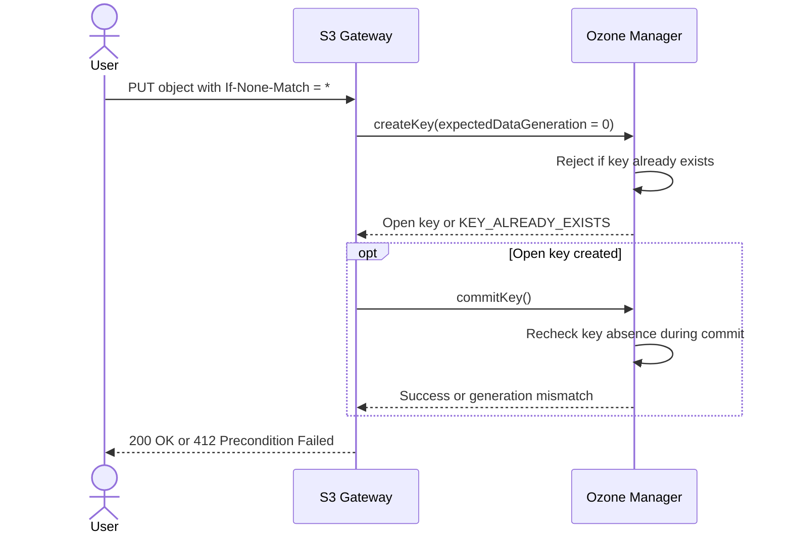
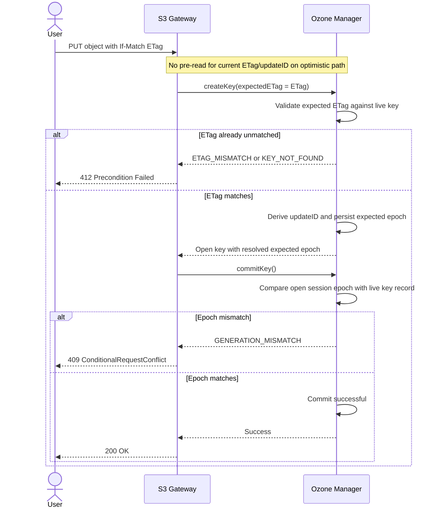
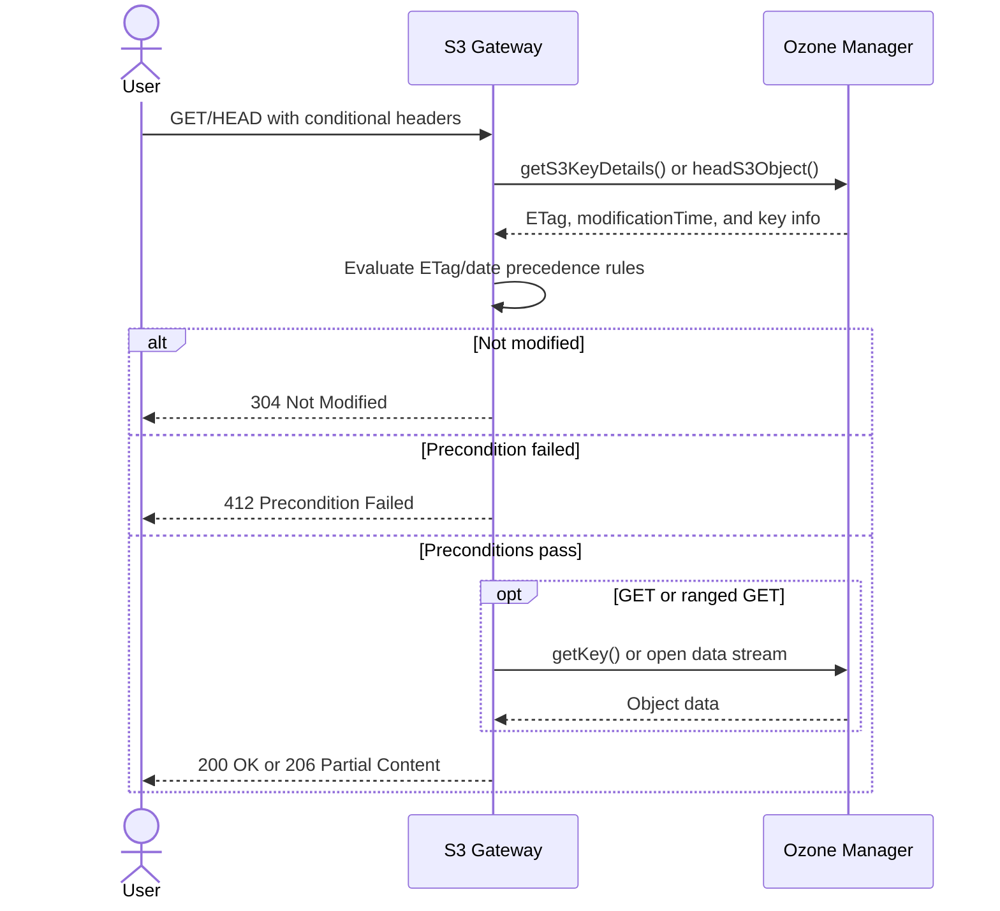
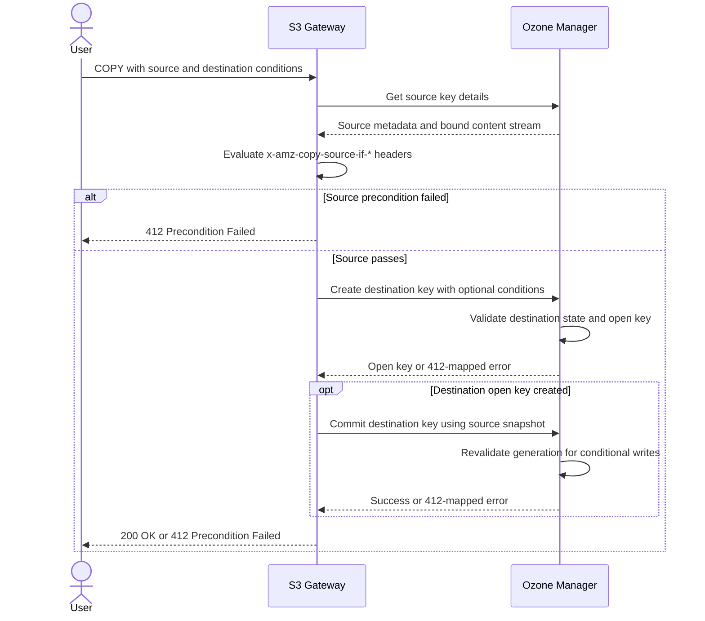
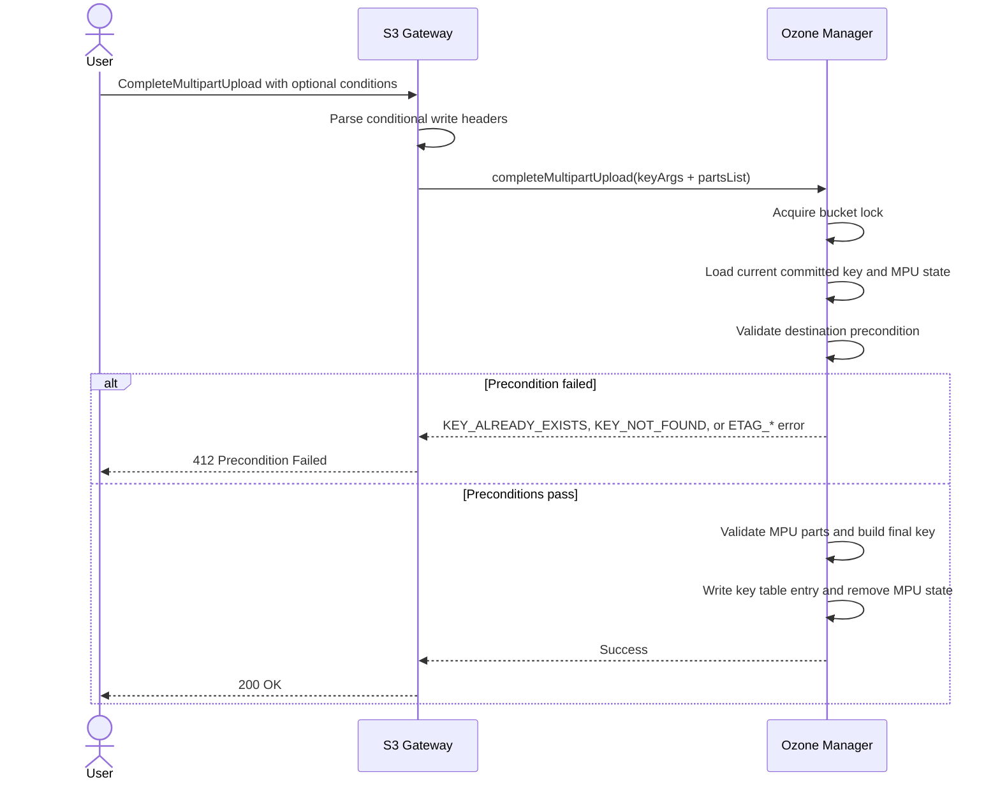
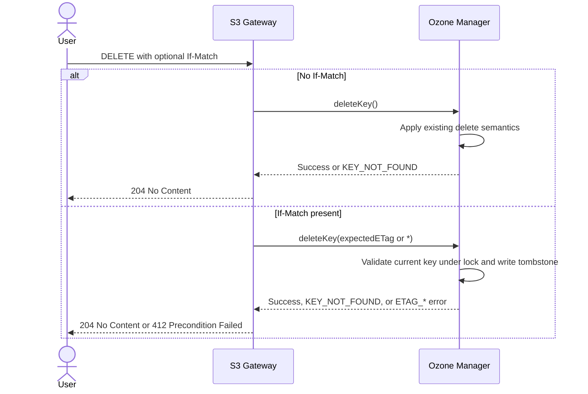

<!-- cspell:ignore peterxcli RDBMS LSN CAS amaliujia Turbopuffer MVCC -->

:::note
Apache Ozone will support conditional `PutObject`, `GetObject`, `HeadObject`, `CopyObject`, and `CompleteMultipartUpload` in the upcoming [2.2 release](https://github.com/apache/ozone/releases/tag/ozone-2.2.0-RC0) (RC0 is currently under a [vote](https://lists.apache.org/thread/gz567ljydh4ht63h6c9pjfclrbrrr9z7)), and will add conditional `DeleteObject` and `DeleteObjects` support in 2.3.
:::

An increasing number of database systems are moving storage to S3 in shared-everything architectures to reduce cost, dependencies, and operational complexity. In the Hadoop 🐘 era, we typically used ZooKeeper and HDFS as the control plane and data plane. Modern systems are moving the control plane to self-managed consensus groups or RDBMS-backed catalogs, while moving the data plane onto AWS S3 or S3-compatible storage.

Shared-everything systems usually have two pain points: communication overhead and coordination. To reduce write latency, systems often use inline data writes, background flush, and LSN-based union reads. To reduce read latency, they add multi-layer caches, such as self-managed or OS-managed in-memory caches and on-disk caches. Coordination is harder: multiple clients may read the same metadata, make decisions locally, and then try to update the same object. Without a storage-level compare-and-set primitive, applications often need an external lock service, catalog database, or consensus system just to avoid lost updates.

Because Apache Ozone exposes S3, HCFS, HttpFS, and Java APIs as part of its multi-protocol story, conditional requests have become increasingly important. This work is now nearly complete.

<!-- truncate -->

## TL;DR

Apache Ozone is adding S3 conditional request support for operations such as `PutObject`, `GetObject`, `HeadObject`, `CopyObject`, `DeleteObject`, and `CompleteMultipartUpload`. This allows applications to perform an operation only when the object state matches expected conditions, such as “create this object only if it does not already exist” or “overwrite this object only if the current ETag still matches.”

Under the hood, Ozone reuses its atomic rewrite path. For conditional writes, the S3 Gateway passes the caller’s expected ETag to Ozone Manager (OM). OM validates it near the metadata write path, stores the matched generation in the open key, and revalidates it during commit. This keeps the ETag check close to the place where the object state changes, so Ozone can provide a distributed CAS-style primitive without adding an extra gateway-side metadata read on the successful path.

This unlocks safer optimistic concurrency control for data systems built on top of object storage, including metadata catalogs, WAL-like workflows, leader-election patterns, queues, model-serving caches, and object-store-backed databases.

## What is an S3 conditional request?

:::note
You can use conditional requests to add preconditions to your S3 operations. To use conditional requests, you add an additional header to your Amazon S3 API operation. This header specifies a condition that, if not met, will result in the S3 operation failing.

Source: [Amazon S3 conditional requests](https://docs.aws.amazon.com/AmazonS3/latest/userguide/conditional-requests.html)
:::

Conditional requests allow atomic CAS operations on target objects: clients can coordinate through S3 objects instead of relying on external arbiters. Using S3 conditional requests is like moving part of the coordination logic into storage.

AWS also noted that conditional requests [let customers remove workaround code and simplify their systems](https://www.allthingsdistributed.com/2025/03/in-s3-simplicity-is-table-stakes.html#:~:text=When%20we%20moved%20S3%20to,similar%20reaction). The same storage-level feature also [powers S3 Tables](https://www.allthingsdistributed.com/2025/03/in-s3-simplicity-is-table-stakes.html#:~:text=they%20involve%20a%20complex,storage%2Dlevel%20features), which manages tabular data on S3.

Common conditional request patterns include:

- **Conditional `PUT`**
  - Use `If-None-Match: *` to create an object only if it does not already exist.
  - Use `If-Match: <etag>` to overwrite an object only if the current ETag is still the one the client observed.
  - Use case: metadata commits, manifest updates, distributed lock files, and create-only log chunks.
- **Conditional `GET`**
  - Use `If-None-Match: <etag>` or date-based conditions to download the object only when it has changed.
  - Use case: cache validation, dynamic model reloading, config refresh, and avoiding repeated downloads of large objects.
- **Conditional `HEAD`**
  - Same idea as conditional `GET`, but metadata-only.
  - Use case: checking whether an object is still current without fetching the body.
- **Conditional `POST` / `CompleteMultipartUpload`**
  - Multipart upload writes data in parts, but the destination object becomes visible only when `CompleteMultipartUpload` succeeds.
  - Conditional completion lets the client say: “complete this large object only if the destination still does not exist” or “only if the destination still matches this ETag.”
  - Use case: large object writes where the final commit still needs create-only or compare-and-swap semantics.
- **Conditional `COPY`**
  - Source-side conditions make sure the source object is the version the client expects.
  - Destination-side conditions make sure the copy does not overwrite unexpected data.
  - Use case: snapshot promotion, clone/copy workflows, and metadata copy where both source and destination need validation.
- **Conditional `DELETE`**
  - Use `If-Match: <etag>` to delete only if the object is still unchanged.
  - Use `If-Match: *` to delete only if the object exists.
  - Use case: preventing a client from deleting an object that another writer has already replaced.

To see this in practice, let’s look at how modern systems use these APIs.

## Application use cases

Who is this for?

### Dynamic AI model reloading

Advanced inference servers often cache massive model weights on local NVMe drives. To keep these models updated without constantly re-downloading them every few minutes, they can use S3 conditional requests. For example, the inference server can send a `GET` request with `If-None-Match` and the ETag of the model it already has.

If the ETag still matches, Ozone can return `304 Not Modified`, so the server keeps using the local cached model and skips the download. If the ETag does not match, the model has been updated, so the server downloads the newest model and stores the new ETag for the next check. Thanks to [@amaliujia](https://github.com/amaliujia) for the example.

*Figure 1. An inference server uses `If-None-Match` to avoid re-downloading unchanged model weights.*

### Turbopuffer

Turbopuffer’s object-storage queue is a great example of using a small metadata object to coordinate larger data work. In the simple version, a pusher reads `queue.json`, appends a job, and writes it back with CAS. A worker does the same thing to claim the next job. The CAS write only succeeds if `queue.json` has not changed since the client read it; otherwise the client reads the new queue and retries.

This design is simple, but many clients can contend on one queue object. Turbopuffer improves it by batching updates with group commit, then moving the object-storage interaction behind a stateless broker. Clients talk to the broker, the broker performs one group-commit loop, and it only acknowledges work after the updated queue is durably committed.

*Figure 2. Turbopuffer’s object-storage queue batches contended CAS updates behind a broker. Source: [Turbopuffer object storage queue](https://turbopuffer.com/blog/object-storage-queue).*

### SlateDB

SlateDB is an embedded LSM-tree storage engine built for object storage. It stores durable state as object-store files: WAL SSTs, compacted SSTs, and manifest files. Like other LSM engines, it relies on immutable files for most data movement, but it still needs a safe coordination point to decide which writer owns the next part of the log.

Conditional object creation is useful here because SlateDB can use object names as fencing points. Instead of overwriting a shared file, the writer creates the next manifest or WAL object with `If-None-Match: *`. The write succeeds only if that object does not already exist.

*Figure 3. A SlateDB writer uses conditional object creation as a fencing point for object-store state.*

### Iceberg file catalog

Iceberg is another natural fit for this style of coordination. Iceberg table state is maintained in metadata files, and each commit creates a new metadata file. The commit succeeds by atomically swapping the table metadata pointer from the old metadata file to the new one. If another writer commits first, the swap fails, and the writer retries against the new table state.

For an Iceberg-style file catalog on object storage, conditional requests can provide the missing compare-and-swap primitive. The catalog can store a small pointer object, such as `current.json`, that points to the latest table metadata file. A writer first writes the new metadata file using a unique name, then updates the current metadata pointer only if its ETag still matches the ETag that the writer read.

*Figure 4. An Iceberg-style file catalog updates a small metadata pointer only if its ETag still matches.*

### Leader election

Leader election can also be built on top of conditional writes. The basic idea is to have all nodes compete to create the next lock file, such as `lock-0000000002.json`, using `If-None-Match: *`. Only one node can create the file successfully. That node becomes the leader for that epoch; the others receive a precondition failure and keep watching.

*Figure 5. Nodes compete to create the next epoch lock file; only one writer succeeds.*

Leader election by itself is not enough. A paused old leader can come back and still believe it owns the lock. This is the “zombie leader” problem. The fix is to use the leader epoch as a fencing token. Every request made by the leader includes the epoch, and downstream systems reject requests with an older epoch than the highest one they have already seen.

*Figure 6. Epoch fencing prevents an old paused leader from writing after a newer leader takes over.*

The leader should periodically update the lock file it acquired to signal liveness. Other nodes can poll the lock and check whether the lock was released or expired by looking at `Last-Modified`, which S3 exposes as standard object metadata.

### WAL Writes and Reads with OSWALD

OSWALD, the Object Storage Write-Ahead Log Device, shows how to build a WAL directly on object storage primitives. The design has three object types: a manifest object, snapshots, and log chunks. The manifest tracks the latest checkpoint and garbage collection progress; chunks hold the log content.

Appending to the WAL can be done with conditional object creation. A writer creates the next chunk with `PUT If-None-Match`. If another writer already created that chunk for the same LSN, the write fails and the writer catches up by tailing the log. After creating a chunk, the writer also checks the manifest with `GET If-None-Match` to make sure garbage collection has not moved past its LSN before acknowledging the write.

*Figure 7. OSWALD uses manifest, snapshot, and chunk objects to build a WAL on object storage. Source: [OSWALD](https://github.com/nvartolomei/oswald).*

Now let’s look at how Ozone implements S3 conditional requests efficiently.

## Technical details

To keep performance overhead minimal—thanks to [Ivan](https://github.com/ivandika3)’s suggestion—we coalesce the “conditional flag” with the normal client-to-server RPC message, so no additional RPC round trip is introduced. This fits well with the optimistic concurrency path.

Before diving into that coalescing optimization, let’s look at Ozone’s atomic rewrite work, which is the foundation reused by S3 conditional requests.

### Atomic rewrite

*Figure 8. Atomic rewrite create and write phases.*

The client indicates the expected epoch of the target object in the key-creation request. After Ozone Manager receives the `createKey` request, it first compares the expected epoch with the live key in the key table. If they match, OM stores the expected epoch along with the open key record in the open key table.

At this stage, two clients can both successfully create an open key, so they can both start streaming file data to the datanode pipeline. Once a client believes the file data write is finished, it starts committing the key.

:::note
The client ID in `/vol1/bucket1/key1/{client_id}` is generated by Ozone Manager. It is a unique, non-human-readable ID that binds to a single key-creation lifecycle. It is not a persistent client ID. “Session ID” would probably be a better name, but the diagram uses a meaningful ID for clarity.
:::

During the commit phase, Ozone Manager compares the expected epoch stored in the client’s open key record with the live key epoch in the key table in the same transaction. If they match, OM overwrites the live key with the open key. If they do not match, OM cleans up the open key table and returns an atomic rewrite failure for the concurrent conflict.

*Figure 9. Atomic rewrite commit phase.*

### Coalescing the conditional flag

In normal workloads, and especially under optimistic concurrency control, the successful path is expected to be common. Therefore, we validate the key’s ETag metadata at the same time as the key-creation request. Instead of introducing an additional request to fetch the latest key epoch and then plumbing that epoch into the atomic rewrite path, we extend atomic rewrite so it can recognize the expected ETag sent from S3 Gateway, validate it, translate it to an expected epoch, and store that epoch in the open key table. This lets the atomic rewrite commit path stay untouched.

> For more information, see the discussion in [apache/ozone#9334](https://github.com/apache/ozone/pull/9334#discussion_r2558578333).

*Figure 10. Coalescing the conditional flag into the normal Ozone write path.*

### Implementation by API

The discussion, design, and patches are available in Apache Jira and GitHub:

- Epic ticket: [HDDS-13117](https://issues.apache.org/jira/browse/HDDS-13117)
- Design: [`s3-conditional-requests.md`](https://github.com/apache/ozone/blob/master/hadoop-hdds/docs/content/design/s3-conditional-requests.md)

#### PutObject

Ozone Manager enforces conditional writes using a two-phase validation process, returning specific HTTP error codes depending on when a state mismatch is detected.

During the initial `createKey` request, if OM determines that the expected ETag already mismatches the current state of the key, it immediately rejects the request with `412 Precondition Failed`.

If the initial check passes but a concurrent modification occurs during the upload, OM detects the discrepancy during the `commitKey` phase. By comparing the expected epoch stored in the open session against the live key record in the key table, OM identifies the concurrent update and returns `409 Conflict`.

Related patches:

- [apache/ozone#10182](https://github.com/apache/ozone/pull/10182)
- [apache/ozone#10023](https://github.com/apache/ozone/pull/10023)
- [apache/ozone#9815](https://github.com/apache/ozone/pull/9815)

##### `If-None-Match`

We extend the existing atomic rewrite path to support the “generation must match `0`” condition, which matches GCS semantics. `If-None-Match: *` then reuses this create-if-absent path.

*Figure 11. `PUT If-None-Match` maps create-if-absent semantics to Ozone’s generation-match path.*

##### `If-Match`

S3 Gateway carries the expected ETag along with the `createKey` request. OM compares it with the live key, translates it to the expected epoch recognized by atomic rewrite, and then reuses the existing commit path.

*Figure 12. `PUT If-Match` validates the ETag once, stores the matched epoch, and rechecks that epoch at commit time.*

#### GetObject / HeadObject

For `GetObject` and `HeadObject`, S3 Gateway fetches key metadata from OM and evaluates the conditional headers against that metadata.

Related patch: [apache/ozone#10031](https://github.com/apache/ozone/pull/10031)

*Figure 13. `GET` and `HEAD` evaluate conditional headers after retrieving object metadata from OM.*

#### CopyObject

`CopyObject` is effectively `GetObject` plus `PutObject`, because it must enforce conditional logic on both the source and destination. During the source phase, the gateway resolves the source object metadata and evaluates preconditions against that snapshot before streaming the data. In the destination phase, the gateway performs a conditional write to the destination, reusing the atomic write APIs introduced for `PutObject`.

Related patch: [apache/ozone#10207](https://github.com/apache/ozone/pull/10207). Thanks [@YutaLin](https://github.com/YutaLin).

*Figure 14. `CopyObject` checks source preconditions first, then reuses conditional destination writes.*

#### CompleteMultipartUpload

`CompleteMultipartUpload` compares the caller’s expected ETag or create-if-absent condition with the committed key state.

Related patch: [apache/ozone#10164](https://github.com/apache/ozone/pull/10164). Thanks [@YutaLin](https://github.com/YutaLin).

*Figure 15. Conditional `CompleteMultipartUpload` validates the destination state before publishing the completed object.*

#### DeleteObject

`DeleteObject` compares the caller’s expected ETag with the committed key state before writing the delete tombstone.

Related patch: [apache/ozone#10511](https://github.com/apache/ozone/pull/10511)

*Figure 16. Conditional `DeleteObject` deletes only when the current object still matches the expected ETag.*

## Benchmark

The main performance question for conditional writes is whether adding the precondition makes the common successful path slower than a normal write. In Ozone, the expected ETag or create-if-absent flag is carried with the normal S3 Gateway to OM request, then validated in OM’s metadata update path. This design avoids a separate gateway-side metadata read before every conditional write.

To sanity-check that assumption, we ran a small local benchmark against a Docker Compose Ozone cluster through S3 Gateway. The benchmark used 4 KiB objects, 15 warmup iterations, and 100 measured iterations per operation. It compared four operations:

- normal `PUT` creating a new key,
- `PUT If-None-Match: *` creating a new key,
- normal `PUT` overwriting an existing key,
- `PUT If-Match: <etag>` overwriting an existing key.

*Figure 17. Local benchmark latency for normal `PUT`, `PUT If-None-Match`, normal overwrite, and `PUT If-Match`.*

In this setup, conditional create was effectively the same as normal create: the mean latency differed by about 0.12 ms, and the p95 was slightly lower. Conditional overwrite was also close to normal overwrite: the mean latency was about 0.35 ms higher, while p95 remained slightly lower and p99 was nearly identical.

## Conclusion

Object storage has quietly crossed a line. It is no longer just where systems park their bytes.  It has become the place where they coordinate. Metadata catalogs, write-ahead logs, leader election, job queues, model caches: all of these need a single point of truth about “who wrote last,” and increasingly they want to ask that question of the storage layer itself.

By bringing native S3 conditional requests to Apache Ozone without adding an extra RPC on the happy path, we turn Ozone into a first-class substrate for optimistic concurrency control. Applications can compare-and-swap directly against the objects they already store, and retire the external lock services, catalog databases, and consensus clusters they once needed just to avoid a lost update.

The result is a simpler architecture: fewer moving parts, one less thing to operate, and coordination that lives exactly where the data does.

## References

- [Amazon S3 conditional requests](https://docs.aws.amazon.com/AmazonS3/latest/userguide/conditional-requests.html)
- [In S3, simplicity is table stakes](https://www.allthingsdistributed.com/2025/03/in-s3-simplicity-is-table-stakes.html)
- [Protocols for transactional usage](https://www.bitsxpages.com/p/protocols-for-transactional-usage)
- [Leader election with S3 conditional writes](https://www.morling.dev/blog/leader-election-with-s3-conditional-writes/)
- [OSWALD writer-writer conflicts](https://nvartolomei.com/oswald/#writer-writer-conflicts)
- [OSWALD repository](https://github.com/nvartolomei/oswald/tree/main/p/Oswald)
- [An MVCC-like columnar table on S3 with constant-time deletes](https://www.shayon.dev/post/2025/277/an-mvcc-like-columnar-table-on-s3-with-constant-time-deletes/#the-delete-problem-with-immutable-formats)
- [Turbopuffer object storage queue](https://turbopuffer.com/blog/object-storage-queue)
- [SeaweedFS S3 conditional operations](https://github.com/seaweedfs/seaweedfs/wiki/S3-Conditional-Operations)
- [Hacker News discussion on S3 conditional writes](https://news.ycombinator.com/item?id=45493158)
- [Buffer HA pipelines without Kafka](https://www.opendata.dev/blog/buffer-ha-pipelines-without-kafka)
