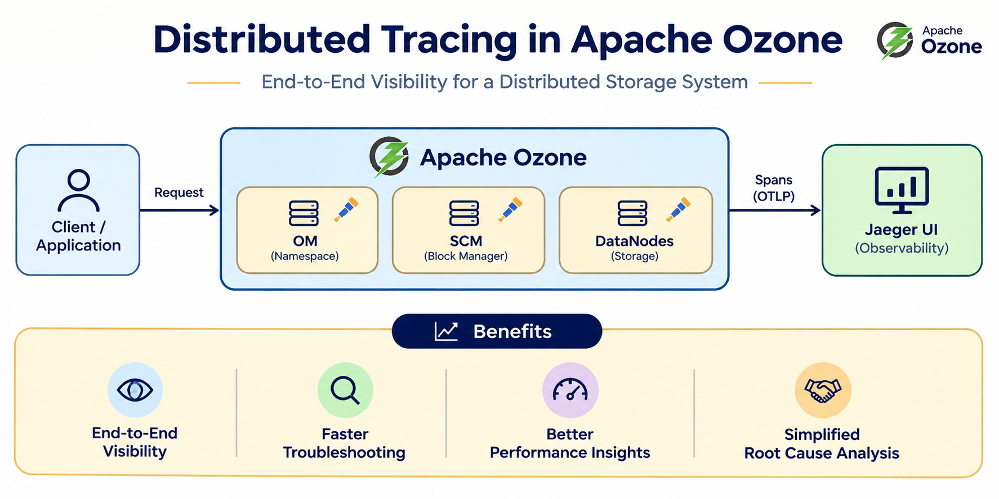
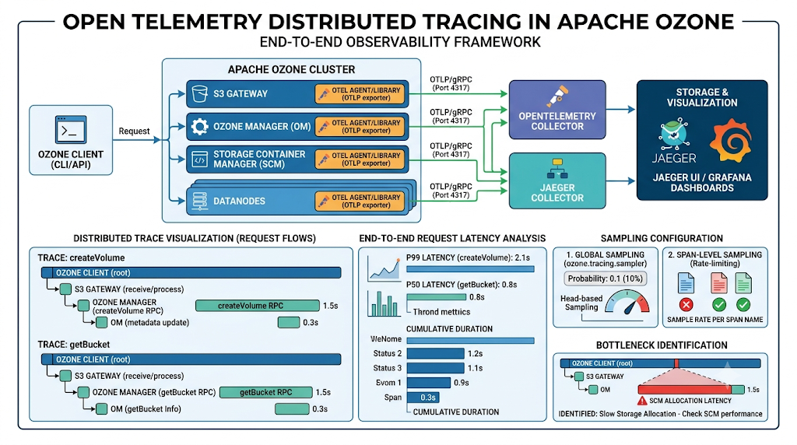
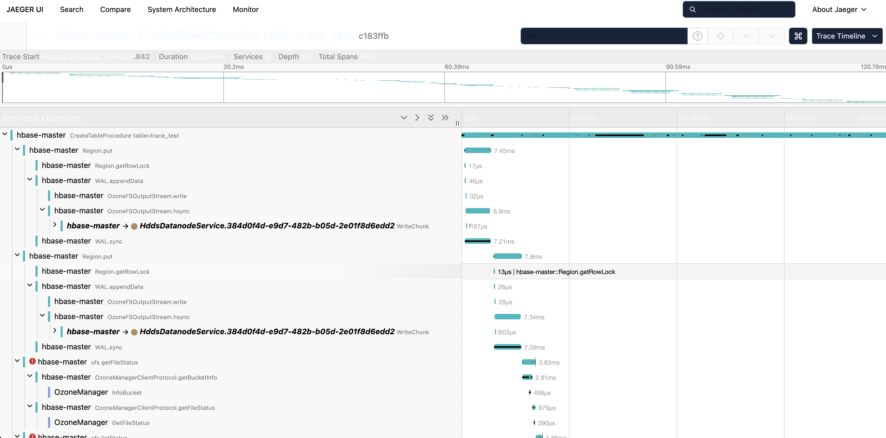
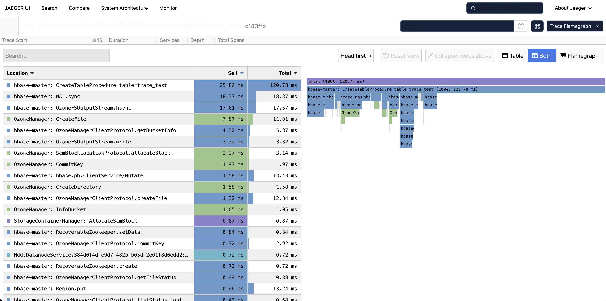

If you have ever stared at a wall of logs trying to figure out why a single request took ten seconds, you know the struggle: each service tells its own story, but none of them show you the full journey.

Apache Ozone is a distributed system by design. A single request can touch the Ozone Manager (OM), Storage Container Manager (SCM), and multiple Datanodes. When things slow down, metrics might tell you something is wrong but they rarely show the full path. The logs might tell you where something complained, but they're hard to interpret.

Distributed tracing changes that. It maps the end-to-end path of a request with timing for every hop. Ozone now exports these paths using [OpenTelemetry](https://opentelemetry.io/) over OTLP, so you can pull them into tools like [Jaeger](https://jaegertracing.io) and actually see what happened.

<!-- truncate -->

## The Problem Tracing Solves

Picture a slow write. Was OM stuck on metadata? SCM slow to allocate a block? Or a Datanode lagging on chunk I/O? Without tracing, you're correlating timestamps across four different log files.

Ozone's stack is layered — OM for metadata, SCM for blocks, Datanodes for the actual writes — so the bottleneck could be anywhere. Tracing lays out the whole write as a single timeline so you can see exactly where it slowed down.



## How It Works

Ozone instruments tracing in its core services through the OpenTelemetry SDK. Trace context propagates across network boundaries, so a client request and the downstream work stay linked in one trace. Traces are exported over OTLP/gRPC (port 4317 by default) to your preferred collector, like Jaeger.



## Turning It On

Tracing is off by default, so the first step is enabling it in `ozone-site.xml`:

```xml
<property>
  <name>ozone.tracing.enabled</name>
  <value>true</value>
</property>
```

Next, tell Ozone where to send traces. You can set `ozone.tracing.endpoint` in `ozone-site.xml`, or use the `OTEL_EXPORTER_OTLP_ENDPOINT` environment variable on each service. If you use both, the `ozone-site.xml` value takes priority.

With that in place, generate some traffic — Freon is a simple option — and open Jaeger. If you see spans for services like `OzoneManager` or `freon`, tracing is working.

## Keeping the Noise Down

On a busy cluster, tracing every request can add overhead and flood your collector. Ozone gives you two levels of control.

**Global sampling** sets the overall rate — for example, `0.01` traces 1% of requests. That's usually enough for day-to-day monitoring without much cost.

**Span-level sampling** lets you go deeper on specific operations. You can always capture spans you care about, like `CommitKey` or `WriteChunk`, even when global sampling is low. That way you get broad coverage when you want it, and full detail exactly where you need it.

## Application-Aware Client Tracing

Most tracing examples start inside Ozone — Freon, the shell, the S3 Gateway. In real deployments, something else is usually on top.

[HBase](https://hbase.apache.org/) stores its data on Ozone through `ofs://`, and when a table creation is slow, you want the trace to start there — not halfway down the stack.

Application-aware client tracing handles that. When it's on, Ozone doesn't start its own trace. It adds its work as steps inside whatever trace the application already has running.

We tried this with HBase on Ozone. Running `create 'trace_test', 'cf'` produced one trace for the whole operation — about 120ms, across HBase, Ozone Manager, SCM, and Datanodes.



You can follow it from `CreateTableProcedure` on the HBase master, through the WAL sync and into Ozone's file creation and block writes.

Open the step you want to see where storage time actually went — without jumping between HBase and Ozone logs trying to match things up.



**To get this working:**

1. [Configure HBase to store data on Ozone](https://ozone.apache.org/docs/user-guide/integrations/hbase).
2. Keep `ozone.tracing.client.application-aware=true` (the default).
3. Bump up the OpenTelemetry version in Hbase and point it at the same Jaeger collector as Ozone.

That's it — one trace, one view, from HBase down to the Datanodes.

## Why Bother?

Distributed tracing pays off the first time it saves you from a multi-service log hunt. It doesn't replace metrics or Recon — it fills the gap between "this metric looks bad" and "this specific RPC on this path is why."

Distributed tracing makes the invisible visible. For a system as complex as Ozone, that is the difference between debugging and guessing.

If you want to go deeper, check out [HDDS-13679](https://issues.apache.org/jira/browse/HDDS-13679) and the [distributed tracing documentation](https://ozone.apache.org/docs/next/administrator-guide/operations/observability/distributed-tracing). Enable it on a dev cluster, play with the sampling, and see what your execution paths look like under the hood.
