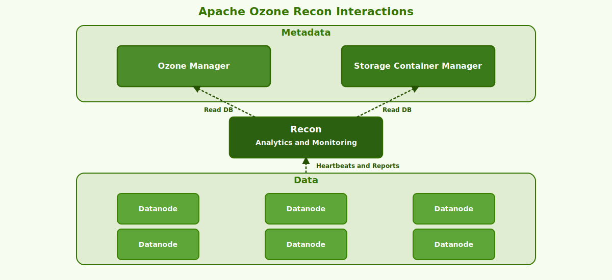

# Architecture

Apache Ozone is a scalable, distributed, and highly available object store designed to handle billions of objects of any size. This document provides an overview of Ozone's architecture, including its core components, data organization, and operational concepts.

## Ozone Namespace

Ozone organizes data in a hierarchical namespace consisting of three levels:

### Volumes

Volumes are the top-level entities in the Ozone namespace, conceptually similar to filesystems in traditional storage systems. They typically represent:

- Multi-tenant boundaries
- Organizational divisions
- Project groupings

Volumes provide isolation and can have their own admins and quota limits. For more information, see [Volumes Overview](01-namespace/01-volumes/01-overview.md).

### Buckets

Buckets exist within volumes and act as containers for objects (keys). Each bucket can be configured with specific properties:

- Storage type and replication factor
- Encryption settings
- Access control policies
- Quota limits

Buckets are analogous to directories in a filesystem or buckets in cloud object stores. For more information, see [Buckets Overview](01-namespace/02-buckets/01-overview.md).

### Keys (Objects)

Keys are the actual data objects stored in buckets. They can be:

- Files of any size
- Binary data
- Named using a path-like structure depending on bucket layout

For more details about Ozone's namespace, see [Namespace Overview](01-namespace/README.mdx).

### Ozone Bucket Types

Ozone supports two distinct bucket layouts, each optimized for different use cases:

#### Object Store Layout

The Object Store layout (OBS) works like traditional object stores with a flat namespace:

- Objects are stored with their full key path
- No concept of directories (though path-like naming is supported)
- Optimized for object storage workloads
- Compatible with S3-style access patterns

#### File System Optimized Layout

The File System Optimized layout (FSO) provides hierarchical directory structure:

- Directories are first-class entities
- Supports efficient directory operations (listing, renaming)
- Includes filesystem features like trash
- Better performance for filesystem-style workloads
- Default layout type

The bucket layout determines how data is organized and accessed within a bucket. For more information, see [Bucket Layouts](01-namespace/02-buckets/04-layouts/README.mdx).

## Core Components

Ozone has a modular architecture with several key components that work together to provide a scalable and reliable storage system.

### Ozone Manager (OM)

The Ozone Manager is the metadata server that manages the namespace:

- Handles all volume, bucket, and key operations
- Maintains metadata in RocksDB
- Allocates blocks for data storage
- Manages access control
- Supports HA deployment with Ratis consensus protocol

The OM is the entry point for all namespace operations. It tracks which objects exist and where they are stored. For more information, see [Ozone Manager Details](../07-system-internals/01-components/01-ozone-manager/README.mdx).

### Storage Container Manager (SCM)

The Storage Container Manager orchestrates the container lifecycle and coordinates datanodes:

- Manages container creation and allocation
- Tracks datanode status and health
- Handles container replication and EC
- Issues block allocation requests
- Coordinates container balancing
- Supports HA deployment with Ratis

SCM is the control plane for container management. For more information, see [Storage Container Manager Details](../07-system-internals/01-components/02-storage-container-manager/README.mdx).

### Datanode

Datanodes are the workhorses that store the actual data:

- Store data in containers on local disks
- Serve read and write requests
- Report container statistics to SCM
- Participate in replication pipelines
- Handle data integrity checks

Each datanode manages a set of containers and serves read/write requests from clients. For more information, see [Datanode Details](../07-system-internals/01-components/03-datanode/README.mdx).

### Recon

Recon is the analytics and monitoring component:

- Collects and aggregates metrics
- Provides a web UI for monitoring
- Offers a consolidated view of the cluster
- Helps identify issues and bottlenecks
- Syncs data from OM, SCM, and Datanodes

Recon is an optional but recommended component for operational visibility. For more information, see [Recon Details](../07-system-internals/01-components/04-recon/README.mdx).

### S3 Gateway

The S3 Gateway provides S3-compatible API access:

- Implements S3 REST API
- Translates S3 operations to Ozone operations
- Supports most S3 features and SDKs
- Provides authentication and authorization

The S3 Gateway enables applications built for S3 to work with Ozone. For more information, see [S3 Gateway Details](../07-system-internals/01-components/05-s3-gateway/README.mdx).

### HttpFS

HttpFS provides a REST interface compatible with WebHDFS:

- Enables HTTP access to Ozone
- Compatible with HDFS clients
- Supports read/write operations
- Facilitates integration with web applications

HttpFS allows web applications to interact with Ozone using familiar APIs. For more information, see [HttpFS Details](../07-system-internals/01-components/07-httpfs/README.mdx).

### Ozone Client

The Ozone client is the software component that enables applications to interact with the Ozone storage system:

- Provides Java libraries for programmatic access
- Handles communication with OM for namespace operations
- Manages direct data transfer with datanodes
- Implements client-side caching for improved performance
- Offers pluggable interfaces for different protocols (O3, S3, OFS)
- Handles authentication and token management

The client library abstracts away the complexity of the distributed system, providing applications with a simple, consistent interface to Ozone storage. For more information, see [Client Details](../07-system-internals/01-components/06-client/README.mdx).

### Component Interactions

The components of Ozone interact in well-defined patterns for different operations:

#### Write Path Sequence

The typical write sequence follows these steps:

1. **Namespace Operations**: The client contacts the Ozone Manager to create or locate the key in the namespace
2. **Block Allocation**: The Ozone Manager requests blocks from the Storage Container Manager
3. **Data Transfer**: The client directly writes data to the selected Datanodes according to the replication pipeline

#### Read Path Sequence

For reads, the process is simpler:

1. The client requests key location information from the Ozone Manager
2. Using the block location information, the client reads data directly from Datanodes
3. In case of failures, the client retries with alternative replicas

#### Monitoring and Management

The Recon service continuously:
- Collects metrics from the Ozone Manager, Storage Container Manager, and Datanodes
- Provides consolidated views of system health and performance
- Facilitates troubleshooting and management

## Ozone Internals

Understanding Ozone's internal structure helps to grasp how data is organized and protected.

### Containers

Containers are the fundamental storage units in Ozone:

- Fixed-size (typically 5GB) units of storage
- Managed by the Storage Container Manager (SCM)
- Replicated or erasure-coded across datanodes
- Contain multiple blocks
- Include metadata and chunk files

Containers are self-contained units that include all necessary metadata and data. They are the unit of replication in Ozone.

### Blocks

Blocks are logical units of data within containers:

- Represent portions of objects/keys
- Created when clients write data
- Referenced by object metadata
- Allocated by the Ozone Manager
- Secured with block tokens

When a client writes data, the OM allocates blocks from SCM, and the client writes data to these blocks through datanodes.

### Chunks

Chunks are the physical data units stored on disk:

- Fixed-size portions of blocks
- Written sequentially in container data files
- Checksummed for data integrity
- Optimized for disk I/O

Chunks are the smallest units of data stored on disk and include checksums for integrity verification.

### Replicated Containers

Ozone provides durability through container replication:

- Default replication factor is 3
- Uses Ratis (Raft) consensus protocol
- Synchronously replicates data across datanodes
- Provides strong consistency guarantees
- Handles node failures transparently

Replicated containers ensure data durability by storing multiple copies of each container across different datanodes.

### Erasure Encoded Containers

Erasure coding provides space-efficient durability:

- Splits data across multiple datanodes with parity
- Supports various coding schemes (e.g., RS-3-2-1024k)
- Reduces storage overhead compared to replication
- Trades some performance for storage efficiency
- Suitable for cold data storage

Erasure coding allows for data durability with less storage overhead than full replication.

### Pipelines

Pipelines are groups of datanodes that work together to store data:

- Managed by SCM
- Consist of multiple datanodes
- Handle write operations as a unit
- Support different replication strategies

For detailed information, see [Write Pipelines](http://localhost:3001/docs/core-concepts/replication/write-pipelines).

#### Ratis Replicated

Ratis pipelines use the Raft consensus protocol:

- Typically three datanodes per pipeline
- One leader and multiple followers
- Synchronous replication
- Strong consistency guarantees
- Automatic leader election on failure

#### Erasure Coded

Erasure coded pipelines distribute data and parity:

- Datanodes store data or parity chunks
- EC pipeline size depends on the coding scheme
- Handles reconstruction on node failure
- Optimized for storage efficiency

## Multi-Protocol Access

Ozone supports multiple access protocols, making it versatile for different applications:

### Native API (o3)

- Command-line interface and Java API
- Full feature access
- Highest performance

### Ozone File System (OFS)

- Hadoop-compatible filesystem interface
- Works with all Hadoop ecosystem applications
- Path format: `ofs://om-host/volume/bucket/key`

### S3 Compatible

- REST API compatible with Amazon S3
- Works with S3 clients and SDKs
- Path format: `http://s3g-host/bucket/key`

### HttpFS

- REST API compatible with WebHDFS
- Enables web applications to access Ozone
- Path format: `http://httpfs-host/webhdfs/v1/volume/bucket/key`

The multi-protocol architecture allows for flexible integration with existing applications and workflows. For more information, see [Client Interfaces](../04-user-guide/01-client-interfaces/README.mdx).

## Summary

Apache Ozone's architecture provides:

1. **Scalability** through separation of metadata and data paths
2. **Reliability** via replication and erasure coding
3. **Flexibility** with multiple access protocols
4. **Performance** through optimized data paths
5. **Manageability** with comprehensive monitoring

This architecture enables Ozone to serve as both an object store and a filesystem, making it suitable for a wide range of applications from big data analytics to cloud-native workloads.

For more detailed information about Ozone's components and internals, see the [System Internals](../07-system-internals/README.mdx) section.