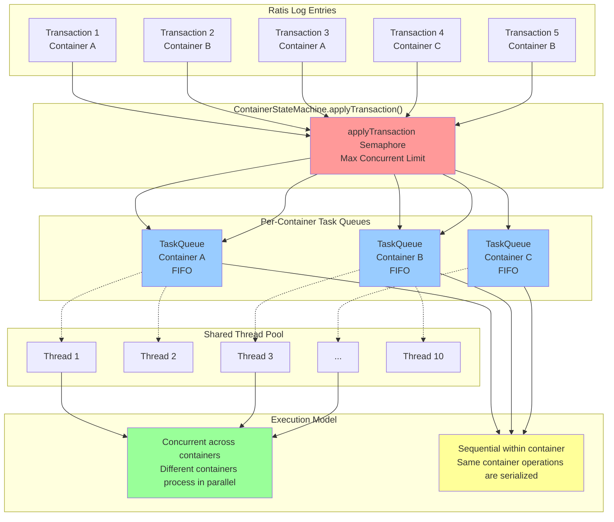

# Consistency Guarantees

## OM (Ozone Manager) HA Consistency

:::info
Notice: Before Ozone 2.2.0 (current is 2.1.0), all operations in OM are linearizable. After [HDDS-14424](https://issues.apache.org/jira/browse/HDDS-14424) is done and released in Ozone 2.2.0, users will have more options to configure the consistency guarantees for OM based on the tradeoff across scalability, throughput and staleness.
:::

### Default Configuration (Non-Linearizable) (will release in Ozone 2.2)
- **Read Path**: Only the leader serves read requests
- **Mechanism**: Reads query the state machine directly without ReadIndex
- **Guarantee**: **Non-linearizable** - may return stale data during leader transitions
- **Performance**: No heartbeat rounds required for reads, better latency
- **Risk**: Short-period split-brain scenario possible (old leader may serve stale reads during leadership transition)

### Optional: Linearizable Reads (will release in Ozone 2.2)
- **Configuration**: `ozone.om.ha.raft.server.read.option=LINEARIZABLE`
- **Mechanism**: Uses Raft ReadIndex (Raft section 6.4)
- **Guarantee**: Linearizability - reads reflect all committed writes
- **Trade-off**: Requires leader to confirm leadership via heartbeat rounds
- **Benefit**: Both the leader and followers can serve reads

### Write Path
- **All writes** go through Ratis consensus for replication
- **Application**: Single-threaded executor ensures **ordered application** of transactions
- **Double Buffer**: Used for batching responses while maintaining ordering

### Advanced Read Optimizations

#### Follower Read with Local Lease (will release in Ozone 2.2)
- Config: `ozone.om.follower.read.local.lease.enabled=false` (default)
- Allows followers to serve reads if:
  - Follower is caught up (within `ozone.om.follower.read.local.lease.lag.limit=10000` log entries)
  - Leader is active (heartbeat within `ozone.om.follower.read.local.lease.time.ms=5000`)
- Reduces read latency by load balancing across replicas

#### Leader Skip Linearizable Read
- Config: `ozone.om.allow.leader.skip.linearizable.read=false` (default)
- Leader serves committed reads locally without ReadIndex
- Lower latency but may not reflect uncommitted writes

## SCM (Storage Container Manager) HA Consistency

### Consistency Model
- **Strong consistency** via Apache Ratis (Raft consensus)
- **Simpler than OM**: Leader-only reads, no follower read options

### Read Path
- **Only the leader serves requests**
- No linearizable read options exposed
- No follower read support

### Write Path
- All mutations use `@Replicate` annotation
- Routed through `SCMHAInvocationHandler` to Ratis
- Replicated to followers before acknowledgment
- **Batched DB operations** via `SCMHADBTransactionBufferImpl`

### Key Differences from OM
| Aspect       | SCM HA                            | OM HA                            |
| ------------ | --------------------------------- | -------------------------------- |
| Read options | Leader-only                       | Linearizable, follower reads     |
| Complexity   | Simpler                           | More flexible                    |
| Use case     | Metadata for containers/pipelines | High-volume namespace operations |

## DN (DataNode) ContainerStateMachine Consistency

### Concurrent Execution Model
This is the **key differentiator** from OM/SCM:

#### OM/SCM
Single global executor, **sequential application** of all transactions
- Ensures simple ordering and `lastAppliedIndex` tracking
- Trade-off: Lower throughput, but for storage systems, the metadata throughput is not the primary concern.

#### ContainerStateMachine
**Per-container concurrency**
- Config: `hdds.container.ratis.num.container.op.executors=10` (default)
- Multiple `applyTransaction` calls can execute **concurrently**
- Each container has its own `TaskQueue` for **per-container serialization**
- Different containers process operations **in parallel**

### Architecture

1. **Container Independence**: Operations on different containers don't conflict
2. **Per-Container Ordering**: Each container's operations are serialized via `TaskQueue`
3. **Throughput Optimization**: Multiple containers can process concurrently
4. **Semaphore Control**: `applyTransactionSemaphore` limits total concurrent operations

### BCSID (Block Commit Sequence ID)
- **Purpose**: Tracks block commit order **within each container**
- **Per-container sequence number** incremented on each block commit
- **Used for**:
  - Conflict detection during replication
  - Recovery and validation
  - Ensuring read requests are valid
