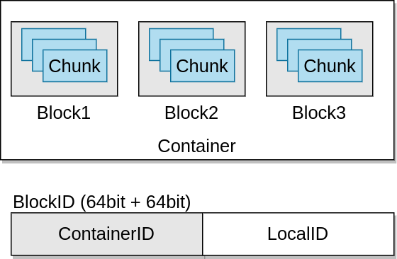

# Storage Containers

Storage Containers, or Containers (not to be confused with Docker containers) are the fundamental replication unit of Ozone, they are managed by the Storage Container Manager (SCM) service.

Containers are big binary units (5GB by default) which can contain multiple blocks:

Blocks are local information and not managed by SCM. Therefore even if billions of small files are created in the system (which means billions of blocks are created), only of the status of the containers will be reported by the Datanodes and containers will be replicated.
When Ozone Manager requests a new Block allocation from the SCM, SCM will identify the suitable container and generate a block id which contains `ContainerId` + `LocalId`. Client will connect to the Datanode which stores the Container, and Datanode can manage the separated block based on the `LocalId`.

## Open vs. Closed containers

When a container is created it starts in an OPEN state. When it's full (~5GB data is written), container will be closed and becomes a CLOSED container.

The fundamental differences between OPEN and CLOSED containers:

| OPEN                                | CLOSED                               |
| ----------------------------------- | ------------------------------------ |
| Mutable                             | Immutable                            |
| Replicated with RAFT (Ratis)        | Replicated with async container copy |
| Raft leader is used to READ / WRITE | All the nodes can be used to READ    |
