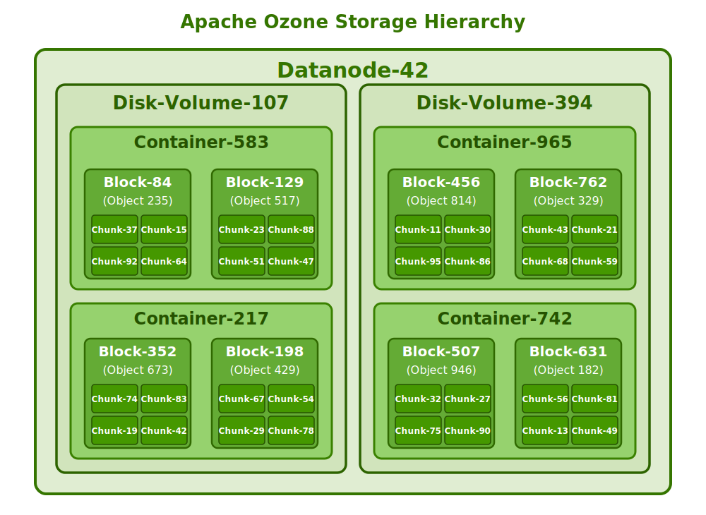
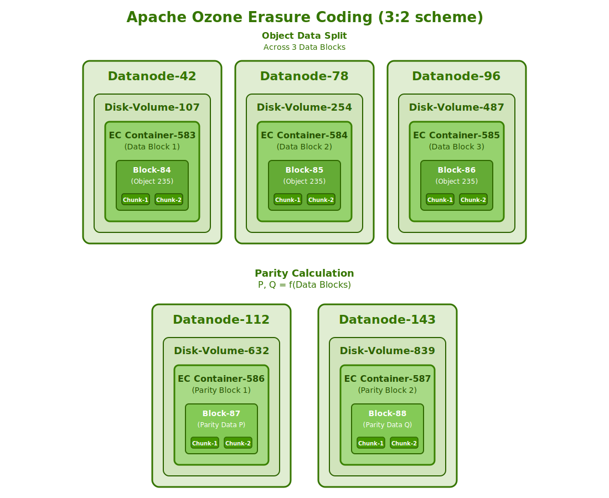

# Storage Containers

Storage containers are the fundamental unit of replication and data management in Apache Ozone. They serve as the building blocks that enable Ozone to achieve high scalability, durability, and performance while handling large volumes of data.

## What are Storage Containers?

Storage containers are fixed-size (typically 5GB configured by `ozone.scm.container.size`) binary units that store data in Ozone. They are:

- Managed by the Storage Container Manager (SCM)
- The primary unit of replication in the system
- Self-contained units that include all necessary metadata and data for themselves.
- Designed to contain multiple blocks across different buckets and volumes

Containers provide a critical abstraction layer that separates the logical namespace management (handled by Ozone Manager) from the physical storage management (handled by Storage Container Manager).

## Container Structure

Each container consists of:

- **Blocks**: Logical units of data within containers that represent portions of objects/keys
- **Chunks**: Physical data units stored on disk as fixed-size portions of blocks
- **Metadata**: Information about the blocks, chunks, and their relationships



The container structure enables efficient storage and retrieval of data, with container-level operations providing advantages for both small and large files.

## Container Replication

Containers provide durability through two replication strategies:

1. **Replicated Containers**: The default approach uses a replication factor of 3, with the Ratis (Raft) consensus protocol ensuring consistency across replicas.


2. **Erasure Coded Containers**: A more space-efficient approach that splits data across multiple datanodes with parity blocks, reducing storage overhead while maintaining durability.



Replication happens at the container level rather than the block or object level, which significantly reduces the metadata management overhead and enables Ozone to scale to billions of objects efficiently.

## Container Lifecycle and States

Containers follow a defined lifecycle with distinct states, the two major states are:

### 1. OPEN State
- Newly created containers start in this state
- Containers are mutable and can accept new blocks
- Replicated using RAFT (Ratis) or Erasure Coded for storage efficient durability and availability. 

### 2. CLOSED State
- Triggered when a container reaches its capacity limit
- Containers become immutable
- Replicated via asynchronous container copy mechanisms or reconstructed via Erasure Code.
- All replica nodes can serve READ operations, improving read performance

## Containers and Scaling

Storage containers are essential to Ozone's scalability advantages:

1. **Namespace Efficiency**: The Storage Container Manager scales based on the capacity under management, not the number of blocks or objects stored.

2. **Recovery Speed**: Containers are the unit of recovery from failures. The recovery speed is determined by the container size, not by the size or number of objects stored within it. This means recovery time is consistent regardless of whether a container holds many small files or few large files.

3. **Cross-Bucket Storage**: Containers can host blocks across different buckets and volumes, enabling more efficient storage utilization.

## Container Management

The Storage Container Manager provides several tools for container management:

### CLI Commands for Containers

Ozone offers several CLI commands for container operations through the debug and admin utilities:

```bash
# List containers
ozone debug datanode container list [options]

# Get container information
ozone debug datanode container info <container-id> [options]

# Inspect container details
ozone debug datanode container inspect <container-id> [options]

# Export container data
ozone debug datanode container export <container-id> <output-path> [options]
```

Note: Since containers are primarily an internal storage concept, these commands are typically used by administrators and for debugging purposes.


## Conclusion

Storage containers are at the heart of Ozone's architecture, providing the foundation for its scalability, durability, and performance characteristics. By understanding containers, you can better appreciate how Ozone achieves its design goals and how data flows through the system.