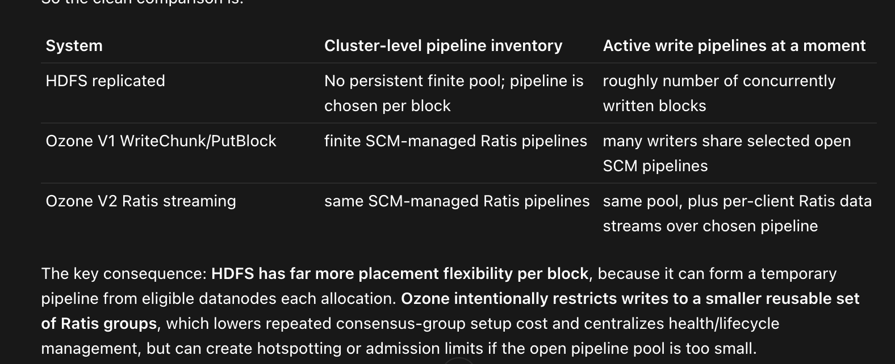

# Calculating Ratis Pipeline Limits

ReplicationFactor.THREE is controlled by three configuration properties that limit the
number of pipelines in the cluster at a cluster-wide level and a datanode level, respectively.
The number of pipelines created by SCM is restricted by these limits.

1.  **Cluster-wide Limit (`ozone.scm.ratis.pipeline.limit`)**
    *   **Description**: An absolute, global limit for the total number of open Ratis pipelines
        across the entire cluster. This acts as a final cap on the total number of pipelines.
    *   **Default Value**: `0` (which means no global limit by default).

2.  **Datanode-level Fixed Limit (`ozone.scm.datanode.pipeline.limit`)**
    *   **Description**: When set to a positive number, this property defines a fixed maximum number of pipelines for
        every datanode.
    *   **Default Value**: `2`
    *   **Cluster-wide Limit Calculation**: If this property is set,
        the number of pipelines in the cluster is in addition limited by
        `(<this value> * <number of healthy datanodes>) / 3`.

3.  **Datanode-level Dynamic Limit (`ozone.scm.pipeline.per.metadata.disk`)**
    *   **Description**: This property takes effect when `ozone.scm.datanode.pipeline.limit` is not set to a positive number.
        It calculates a dynamic limit for each datanode based on its available metadata disks.
    *   **Default Value**: `2`

## How Limits are Applied

SCM first calculates a target number of pipelines based on either the **Datanode-level Fixed Limit** or the
**Datanode-level Dynamic Limit**. It then compares this calculated target to the **Cluster-wide Limit**. The
**lowest value** is used as the final target for the number of open pipelines.

**Example (Dynamic Limit):**

Consider a cluster with **10 healthy datanodes**.
*   **8 datanodes** have 4 metadata disks each.
*   **2 datanodes** have 2 metadata disks each.

And the configuration is:
*   `ozone.scm.ratis.pipeline.limit` = **30** (A global cap is set)
*   `ozone.scm.datanode.pipeline.limit` = **0** (Use dynamic calculation)
*   `ozone.scm.pipeline.per.metadata.disk` = **2** (Default)

**Calculation Steps:**
1.  Calculate the limit for the first group of datanodes: `8 datanodes * (2 pipelines/disk * 4 disks/datanode) = 64 pipelines`
2.  Calculate the limit for the second group of datanodes: `2 datanodes * (2 pipelines/disk * 2 disks/datanode) = 8 pipelines`
3.  Calculate the total raw target from the dynamic limit: `(64 + 8) / 3 = 24`
4.  Compare with the global limit: `min(24, 30) = 24`

SCM will attempt to create and maintain approximately **24** open, FACTOR_THREE Ratis pipelines.

## Sizing Trade-offs

Pipeline limits balance write throughput against Datanode resource usage. Each open Ratis pipeline is one Ratis
replication group, so the number of pipelines directly affects how much concurrent write capacity the cluster
exposes.

**Benefits of more pipelines**

- **Higher write parallelism**: Each pipeline is an independent Ratis group, so more pipelines allow more
  concurrent write streams across the cluster.
- **Lower write latency under contention**: With more pipelines, different clients are less likely to share the
  same Ratis group, reducing queueing on a single Raft leader.

**Costs of too many pipelines**

- **Datanode resource pressure**: Each pipeline consumes CPU, memory, and metadata-disk I/O on the Datanodes
  that participate in it. Very high pipeline counts can overload individual nodes.
- **Follower lag and tail latency**: When a Datanode hosts many Raft groups, followers can fall behind on log
  replication (index lag). This delays WATCH responses and increases write tail latency for pipelines on that
  node.

### Ozone vs HDFS write pipelines

Ozone and HDFS take different approaches to grouping Datanodes for replicated writes:

| | Ozone (Ratis pipelines) | HDFS (stateless pipelines) |
| --- | --- | --- |
| **Pipeline model** | SCM creates and tracks a bounded set of explicit Ratis pipelines | Any three Datanodes can form an ad hoc "pipeline" for three block replicas |
| **Control & visibility** | Centralized limits and monitoring via SCM (`ozone admin pipeline list`, SCM UI) | No equivalent cluster-wide pipeline registry |
| **Load spreading** | Bounded by configured pipeline limits; may cap peak write throughput | Blocks can spread across any DNs, spreading load more evenly |
| **Operational trade-off** | More predictable capacity planning; may sacrifice some peak throughput | Higher potential throughput; harder to observe and cap concurrent write groups |

## Production Recommendation

For most production deployments, start with the dynamic per-disk limit (`ozone.scm.datanode.pipeline.limit=0`).
This lets pipeline capacity scale naturally with metadata disk resources. A good starting value for
`ozone.scm.pipeline.per.metadata.disk` is **2**.

Increase pipeline limits only when you observe write contention—for example, many clients sharing the same
pipelines or sustained write queueing—and Datanode resources (CPU, memory, metadata-disk I/O) have headroom.
Use `ozone.scm.ratis.pipeline.limit` as a safety cap rather than the primary tuning knob.

Monitor the **Pipeline Statistics** section in the SCM web UI, or run `ozone admin pipeline list`, to confirm
the actual number of open pipelines aligns with your configured targets. Watch for follower index lag or
elevated resource usage on Datanodes as signals that pipeline counts may be too high.

## Related Topics

Limits on this page apply to **open Ratis pipelines** (ReplicationFactor.THREE). The number of OPEN containers
and containers per pipeline are separate concerns and are not covered here. For background on Multi-Raft and
Datanode metadata directories, see [Multi-Raft](./multi-raft). For EC pipeline sizing, see
[Calculating EC Pipeline Limits](./calculating-ec-pipeline-limits).
