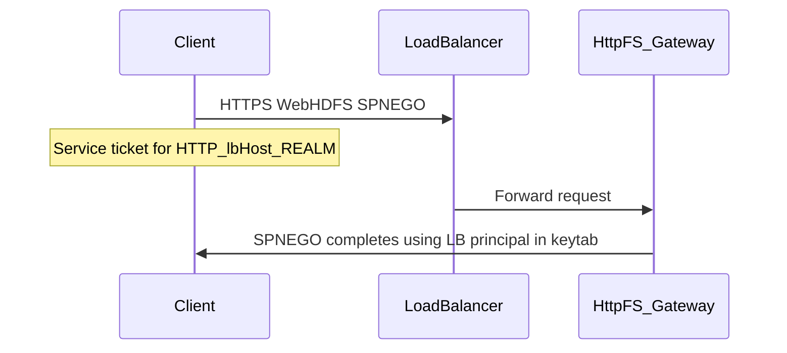

# HttpFS Gateway behind a load balancer (Kerberos)

Clients that use HTTP SPNEGO (negotiate authentication) obtain a Kerberos service ticket for the **hostname they connect to**. If HttpFS is reachable only through a load balancer, that hostname is the load balancer’s DNS name—not the individual HttpFS gateway hosts. Requests then fail with **401 Authentication required** unless each HttpFS instance is configured to use the **same HTTP service principal** as the one clients expect for the load balancer.

Direct access to a single HttpFS host often works because the default principal matches that host (for example `HTTP/<httpfs-hostname>@REALM`). The same WebHDFS calls through the load balancer fail until the client-facing principal and keytab are aligned with the load balancer name.

:::caution
Running HttpFS behind a load balancer with Kerberos is a valid pattern (similar to HDFS HttpFS), but **your organization should validate** the full stack—clients, TLS, load balancer forwarding, and delegation tokens—in its own environment. Treat this page as operational guidance, not a product certification matrix.
:::

## Prerequisites

- A stable DNS name for the load balancer that clients use in URLs: `<load-balancer-host>`.
- Cluster Kerberos realm: `<CLUSTER_REALM>` (for example `EXAMPLE.COM`).
- The OS user that runs the HttpFS process (often `hdfs`) must be able to read the keytab file you deploy.

## Kerberos principal and keytab

1. Create (or use) a service principal in the standard HTTP SPNEGO form:

   `HTTP/<load-balancer-host>@<CLUSTER_REALM>`

2. Export a keytab that contains this principal and distribute it to **each** host that runs the Ozone HttpFS Gateway. Use the **same filesystem path** on every host so one configuration snippet applies everywhere. Example path (your environment may differ):

   `/var/lib/hadoop-ozone/keytabs/httpfs.keytab`

3. When exporting the keytab, avoid creating a new random key version unexpectedly (for example on MIT Kerberos use `kadmin`’s `ktadd` with **`-norandkey`** when adding an existing key to the keytab so the KDC key version stays consistent with what clients and other hosts expect, per your operational procedures).

## Configuration (`httpfs-site.xml`)

Set the **client-facing** HTTP Kerberos principal and keytab to the load balancer principal and the deployed keytab. Prefer the canonical Hadoop property names:

| Property | Value |
| -------- | ----- |
| `hadoop.http.authentication.kerberos.principal` | `HTTP/<load-balancer-host>@<CLUSTER_REALM>` |
| `hadoop.http.authentication.kerberos.keytab` | Path to the keytab on the host (for example `/var/lib/hadoop-ozone/keytabs/httpfs.keytab`) |

Example fragment:

```xml
<property>
  <name>hadoop.http.authentication.kerberos.principal</name>
  <value>HTTP/<load-balancer-host>@<CLUSTER_REALM></value>
</property>
<property>
  <name>hadoop.http.authentication.kerberos.keytab</name>
  <value>/var/lib/hadoop-ozone/keytabs/httpfs.keytab</value>
</property>
```

The older names `httpfs.authentication.kerberos.principal` and `httpfs.authentication.kerberos.keytab` are **deprecated** aliases for the same settings; prefer `hadoop.http.authentication.kerberos.*` for new configuration. See the [configuration appendix](../appendix) for reference.

Apply these settings in `httpfs-site.xml` on **every** HttpFS Gateway host, deploy the keytab at the same path on each host, then restart HttpFS.

The **internal** HttpFS-to-Ozone Manager authentication (`httpfs.hadoop.authentication.*`) is separate; this page only changes what clients use when they talk to the **HTTP** endpoint in front of the load balancer.

## Multiple HttpFS instances behind one load balancer

If more than one HttpFS gateway sits behind the same VIP, they should behave consistently for HTTP authentication cookies. Configure a **shared** signature secret so `hadoop-auth` cookies validate on any instance. See `hadoop.http.authentication.signature.secret.file` in the [configuration appendix](../appendix).

## TLS and clients

- Prefer **HTTPS** between clients and the load balancer when using Kerberos/SPNEGO. Some clients (including `curl`) do not follow authentication handshakes correctly when redirects move from HTTPS to HTTP, which can break SPNEGO.
- Terminating TLS on the load balancer and using HTTP or HTTPS to the HttpFS backends is common; ensure your load balancer forwards headers and protocols in a way compatible with your HttpFS and TLS settings.

## Common mistakes

- **Wrong principal**: Principal still references the backend host while clients use the load balancer DNS name.
- **Keytab not readable** by the user running HttpFS (for example permissions or SELinux contexts).
- **Realm mapping**: The load balancer hostname must resolve to the correct realm in **`krb5.conf`** (for example `[domain_realm]`). If the client cannot obtain a service ticket for `HTTP/<load-balancer-host>@<CLUSTER_REALM>`, enable trace logging (below) and verify KDC and DNS SRV records if you use them.
- **Key version mismatch** after re-exporting keytabs without coordinating `kvno` across hosts.

## Debugging

- Run a client with `export KRB5_TRACE=/dev/stdout` to trace ticket requests and failures.
- Compare behavior **directly** to an HttpFS backend versus **through** the load balancer to isolate hostname and principal mismatches.
- Check HttpFS and load balancer access logs for repeated 401 responses and failed `Negotiate` exchanges.

## How SPNEGO sees the load balancer



## See also

- [Configuring Kerberos](../security/kerberos#httpfs-gateway) — HttpFS-related Kerberos properties overview
- [HttpFS Gateway](../../../user-guide/client-interfaces/httpfs) — REST API introduction and examples
