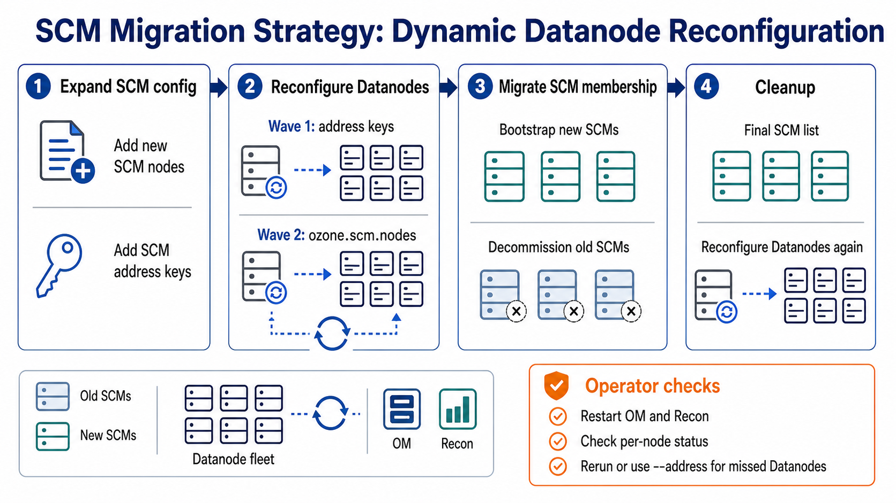
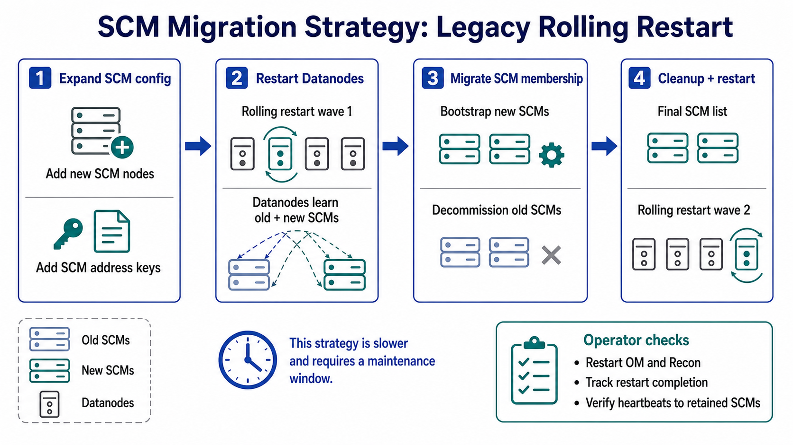

# Storage Container Manager migration approach

This page describes how to move Storage Container Manager (SCM) roles to new hosts in an HA deployment while avoiding a full rolling restart of every Datanode for SCM endpoint changes.

SCM migration is different from Ozone Manager (OM) migration. SCM is not client-facing in the same way OM is, so there is no DNS-based client transition strategy. The main operational concern is making Ozone services, especially Datanodes, learn the new SCM peer list before the old SCMs are removed.

The procedure uses the same SCM Ratis membership operations as normal SCM HA administration: bootstrap the new SCMs, make sure an SCM being removed is not leader, decommission the old SCMs, and clean up obsolete configuration. The difference is that Datanodes can dynamically reload the SCM node list instead of being restarted twice.

For background on SCM HA configuration and bootstrap, see [SCM High Availability](../../../../administrator-guide/configuration/high-availability/scm-ha). For removing individual SCMs, see [Storage Container Manager decommission](./decommission). For the `ozone admin reconfig` command, see [Dynamic Property Reload](../../../../administrator-guide/operations/dynamic-property-reload).

## Comparing the strategies

| Concern | Dynamic Datanode reconfiguration | Legacy rolling restart |
| ------- | -------------------------------- | ---------------------- |
| Datanode changes | Datanodes reload SCM address keys and `ozone.scm.nodes.<scmServiceId>` while running. | Datanodes must be restarted after adding new SCMs and restarted again after removing old SCMs. |
| SCM peer identity | Each SCM has a unique node ID and configured address. The migration temporarily expands the SCM list, then shrinks it after decommission. | Same peer identity model, but Datanodes only pick up changes on restart. |
| Client DNS changes | Not needed. SCM is not migrated through client-facing DNS remapping. | Not needed. |
| Migration order | Bootstrap new SCMs, reload Datanodes to connect to old and new SCMs, move leadership if needed, decommission old SCMs, reload Datanodes to keep only retained SCMs. | Add new SCMs and roll Datanodes, decommission old SCMs, then roll Datanodes again with the final SCM list. |
| Operational speed | Faster on large clusters because Datanodes avoid two rolling restarts. | Slower when the Datanode fleet is large or restart windows are limited. |
| Failure mode | A failed address or node-list reload can leave one Datanode on the previous effective SCM list until the issue is corrected and reconfiguration is retried. | A failed restart can leave one Datanode on the previous on-disk configuration until it is restarted successfully. |

Use dynamic Datanode reconfiguration for SCM host replacement when the cluster version supports `ozone.scm.nodes.<scmServiceId>` reconfiguration on Datanodes. Use the legacy rolling restart flow only when dynamic reconfiguration is not available or your operational process requires restarts.



## Migration order

Do the migration in two configuration waves. First, expand the SCM configuration so old and new SCMs are both known. After the new SCMs are healthy and the old SCMs are decommissioned, shrink the configuration to only the retained SCMs.

The examples below use an SCM service ID of `prod` and migrate three SCMs from `scm1`, `scm2`, and `scm3` to `scm4`, `scm5`, and `scm6`.

| SCM node | Hostname | Initial state |
| -------- | -------- | ------------- |
| `scm1` | `scm1.example.com` | Existing SCM to be replaced |
| `scm2` | `scm2.example.com` | Existing SCM to be replaced |
| `scm3` | `scm3.example.com` | Existing SCM to be replaced |
| `scm4` | `scm4.example.com` | New SCM host |
| `scm5` | `scm5.example.com` | New SCM host |
| `scm6` | `scm6.example.com` | New SCM host |

## Leadership transfer and rollback

Before decommissioning an SCM, verify that it is not the current leader:

```shell
ozone admin scm roles --service-id=prod
```

If the SCM being removed is leader, transfer leadership to an SCM that should remain available. The `-n` option expects the target SCM's SCM ID, which is the Raft peer ID reported by `ozone admin scm roles`:

```shell
ozone admin scm transfer --service-id=prod -n <target-scm-peer-id>
```

Ozone also supports transferring leadership to a randomly chosen follower:

```shell
ozone admin scm transfer --service-id=prod -r
```

Rollback depends on how far the migration has progressed:

- Before an old SCM is decommissioned, keep or restore the expanded configuration, transfer leadership back to an old SCM if needed, and stop or decommission the newly bootstrapped replacement.
- After an old SCM is decommissioned, do not try to bring it back with the same membership identity. Bootstrap a replacement SCM with a new node ID, then add that replacement through the same expansion flow.
- If a Datanode reconfiguration partially succeeds, fix the missing address or node-list configuration and rerun Datanode reconfiguration. The callback returns the effective SCM node list that the Datanode actually connected to, so a later retry can add or remove the remaining endpoints.

## Configuration-based SCM migration

Configuration-based SCM migration gives each new SCM its own unique address in `ozone-site.xml`. Existing SCMs, new SCMs, OMs, Recon, and Datanodes learn about new SCM peers through configuration rollout.

### Step 1: Publish the expanded SCM configuration

#### SCM node configuration

Add all new SCMs to the SCM HA configuration used by the existing SCMs and the new SCMs:

```xml
<property>
  <name>ozone.scm.nodes.prod</name>
  <value>scm1,scm2,scm3,scm4,scm5,scm6</value>
</property>
<property>
  <name>ozone.scm.address.prod.scm4</name>
  <value>scm4.example.com</value>
</property>
<property>
  <name>ozone.scm.address.prod.scm5</name>
  <value>scm5.example.com</value>
</property>
<property>
  <name>ozone.scm.address.prod.scm6</name>
  <value>scm6.example.com</value>
</property>
```

Include any SCM Datanode RPC address or port overrides used by your deployment, such as `ozone.scm.datanode.address.prod.scm4` or `ozone.scm.datanode.port.prod.scm4`. If those keys are not set, Datanodes derive the Datanode RPC endpoint from the normal SCM address and default SCM Datanode RPC port.

#### Ozone service configuration

Roll the same expanded SCM list to Ozone services that use SCM peer configuration, such as OMs, Recon, and Datanodes:

```xml
<property>
  <name>ozone.scm.nodes.prod</name>
  <value>scm1,scm2,scm3,scm4,scm5,scm6</value>
</property>
<property>
  <name>ozone.scm.address.prod.scm4</name>
  <value>scm4.example.com</value>
</property>
<property>
  <name>ozone.scm.address.prod.scm5</name>
  <value>scm5.example.com</value>
</property>
<property>
  <name>ozone.scm.address.prod.scm6</name>
  <value>scm6.example.com</value>
</property>
```

OMs and Recon do not support dynamic reconfiguration of SCM node-list changes. After rolling the expanded SCM configuration to OM and Recon hosts, restart those services so they pick up the new SCM peers before the old SCMs are decommissioned. This keeps OM-to-SCM and Recon-to-SCM communication valid if a retained or newly added SCM becomes the active SCM endpoint used by the service.

Datanodes must know the address keys before `ozone.scm.nodes.prod` is reloaded. Apply Datanode reconfiguration in two waves:

1. Roll the new `ozone.scm.address.prod.<scm-node-id>` keys and reconfigure the Datanodes.
2. Roll the expanded `ozone.scm.nodes.prod` value and reconfigure the Datanodes again.

If both changes are present before the first Datanode reconfiguration, the node-list reload can fail while resolving the new SCM node IDs. Verify the Datanode reconfiguration status and retry the reconfiguration after the address keys are loaded. The retry can still reach the same final state.

#### Validation

Confirm that every new SCM node ID has matching address settings in the configuration files distributed to SCMs and Datanodes. On representative Datanodes, confirm that the keys are reconfigurable:

```shell
ozone admin reconfig --service=DATANODE --address=<dn-host>:<dn-rpc-port> properties
```

The output should include `ozone.scm.nodes.prod` and the `ozone.scm.address.prod.*` address keys.

### Step 2: Bootstrap the new SCMs

#### SCM node action

Apply the expanded configuration to each new SCM host. Make sure `ozone.scm.primordial.node.id` still points to an existing SCM that can issue SCM certificates in a secure cluster. Then bootstrap and start each new SCM:

```shell
# On scm4.example.com
ozone scm --bootstrap
ozone --daemon start scm

# On scm5.example.com
ozone scm --bootstrap
ozone --daemon start scm

# On scm6.example.com
ozone scm --bootstrap
ozone --daemon start scm
```

#### Datanode action

After address keys for the new SCMs are visible on each Datanode, reload the expanded SCM node list without restarting the Datanode:

```shell
ozone admin reconfig --service=DATANODE --address=<dn-host>:<dn-rpc-port> start
ozone admin reconfig --service=DATANODE --address=<dn-host>:<dn-rpc-port> status
```

To apply the same on-disk configuration to all `IN_SERVICE` Datanodes:

```shell
ozone admin reconfig --service=DATANODE --in-service-datanodes start
ozone admin reconfig --service=DATANODE --in-service-datanodes status
```

The batch form discovers targets from SCM when the command starts. It targets Datanodes in the `IN_SERVICE` operational state, skips Datanodes reported as `DEAD`, and skips Datanodes without a `CLIENT_RPC` port. Datanodes that are unavailable, not `IN_SERVICE`, or become available after discovery can be missed by that batch run. Review the per-node output and status, rerun the batch command if needed, or reconfigure missed Datanodes explicitly with `--address=<dn-host>:<dn-rpc-port>`. Do not rely only on the aggregate success and failure count printed by the batch command.

The Datanode must be in the `RUNNING` state for this reconfiguration to succeed. During SCM node-list reload, the Datanode compares the previous and new node ID sets, resolves SCM Datanode RPC addresses, adds new SCM connections, removes dropped SCM connections, and resizes internal endpoint-processing pools to match the active SCM and Recon endpoints.

#### Validation

Validate SCM roles:

```shell
ozone admin scm roles --service-id=prod
```

The expected state at this point is that old and new SCMs are all in the HA ring:

```text
scm1 : FOLLOWER
scm2 : LEADER
scm3 : FOLLOWER
scm4 : FOLLOWER
scm5 : FOLLOWER
scm6 : FOLLOWER
```

Wait until Datanodes have registered with the new SCMs and all SCMs report healthy Datanode heartbeats. Check SCM UI, SCM metrics, or Datanode logs for failed endpoint registration, unresolved SCM addresses, or repeated heartbeat errors before decommissioning old SCMs.

### Step 3: Decommission the old SCMs

#### SCM node action

Decommission the old SCMs in a controlled sequence. Before each command, confirm that the target SCM is not leader; if needed, transfer leadership to a retained SCM. The `-nodeid` value is the SCM ID reported by `ozone admin scm roles`, not the logical configuration name such as `scm1`.

```shell
ozone admin scm decommission --service-id=prod -nodeid=<scm1-scm-id>
ozone admin scm decommission --service-id=prod -nodeid=<scm2-scm-id>
ozone admin scm decommission --service-id=prod -nodeid=<scm3-scm-id>
```

If you decommission the primordial SCM, update `ozone.scm.primordial.node.id` to a retained SCM before decommissioning and follow the security notes in [SCM HA Security](../../../../administrator-guide/configuration/high-availability/scm-ha#scm-ha-security).

#### Datanode configuration

Do not remove `scm1`, `scm2`, or `scm3` from Datanode configuration before decommissioning finishes. During decommission, Datanodes can safely carry both old and new SCM addresses as long as the retained SCMs are reachable.

#### Validation

The decommissioned SCMs should stop and disappear from `ozone admin scm roles` output:

```text
scm4 : LEADER
scm5 : FOLLOWER
scm6 : FOLLOWER
```

Confirm that retained SCMs no longer list the removed SCM peers and that Datanode heartbeat health remains normal.

### Step 4: Clean up the old SCM configuration

#### SCM node configuration

After the old SCMs have been decommissioned, remove obsolete entries from the retained SCM configuration:

- `ozone.scm.address.prod.scm1`
- `ozone.scm.address.prod.scm2`
- `ozone.scm.address.prod.scm3`
- any old `ozone.scm.datanode.address.*` or `ozone.scm.datanode.port.*` entries
- the old node IDs from `ozone.scm.nodes.prod`

The retained SCM configuration should contain only the new SCMs:

```xml
<property>
  <name>ozone.scm.nodes.prod</name>
  <value>scm4,scm5,scm6</value>
</property>
```

When convenient, restart retained SCMs so the cleaned configuration is reflected consistently in each SCM process.

Roll the cleanup configuration to OMs and Recon and restart them as well. Unlike Datanodes, these services cannot remove retired SCM peers through `ozone admin reconfig`.

#### Datanode action

Roll the cleanup configuration to Datanodes and run Datanode reconfiguration again:

```shell
ozone admin reconfig --service=DATANODE --in-service-datanodes start
ozone admin reconfig --service=DATANODE --in-service-datanodes status
```

After a successful reload, Datanodes close RPC connections to the retired SCM endpoints. The effective `ozone.scm.nodes.prod` value on each Datanode should contain only `scm4`, `scm5`, and `scm6`.

The same batch-discovery caveat applies during cleanup. Reconfigure any Datanode missed by the batch command after it returns to `IN_SERVICE` and `RUNNING`.

#### Validation

Confirm that Datanodes continue sending heartbeats to retained SCMs and no expected traffic still targets `scm1.example.com`, `scm2.example.com`, or `scm3.example.com`. Do not shut down or repurpose the old machines until retained SCM health and Datanode heartbeat health are stable.

## Behavior and limitations

SCM node-list reconfiguration on Datanodes is intentionally scoped to Datanode endpoint connections. It does not replace SCM bootstrap, SCM Ratis membership changes, SCM decommission, or SCM leadership transfer.

The Datanode rejects an empty `ozone.scm.nodes.<scmServiceId>` value. If a new SCM address cannot be resolved during an add operation, that endpoint is skipped with a warning and the effective node list remains limited to SCMs the Datanode actually connected to. If some add or remove operations fail because of an I/O error, retry after correcting the environment.

The Datanode adds new SCM endpoints before removing old ones, then resizes endpoint-processing pools to match the number of active SCM and Recon connections. This keeps the process connected to at least the previous SCM set when an addition fails before old endpoints are removed.

## Legacy behavior without dynamic reconfiguration

Without dynamic reload, the same logical migration requires two Datanode restart waves:



1. Set `ozone.scm.nodes.<scmServiceId>` to the union of old and new SCM node IDs, then restart every Datanode.
2. After old SCMs are decommissioned, set `ozone.scm.nodes.<scmServiceId>` to the final retained SCM list and restart every Datanode again.

Dynamic Datanode reconfiguration removes the need for those two restart waves when updating SCM membership endpoints.
