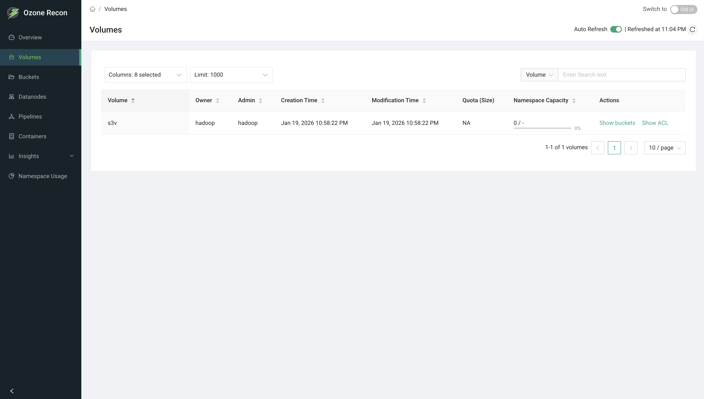
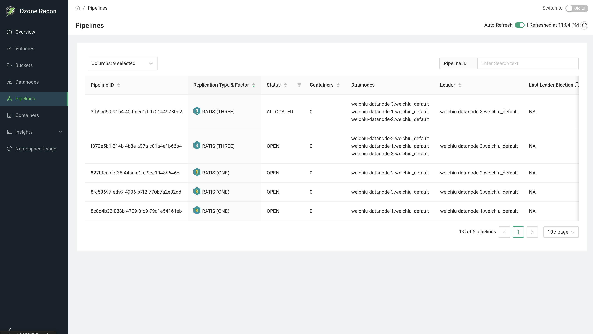
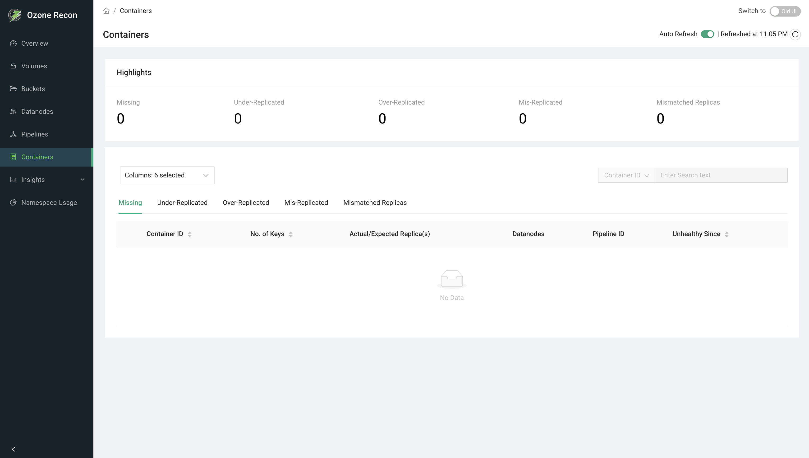
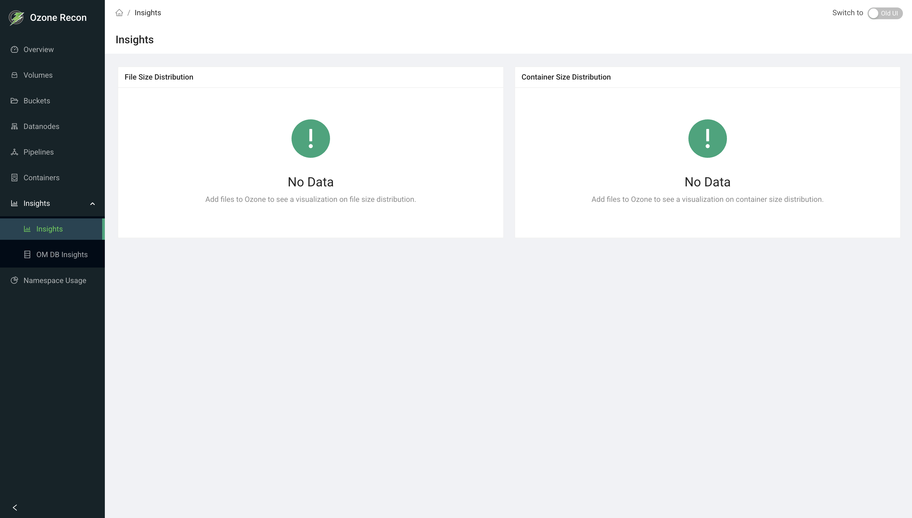
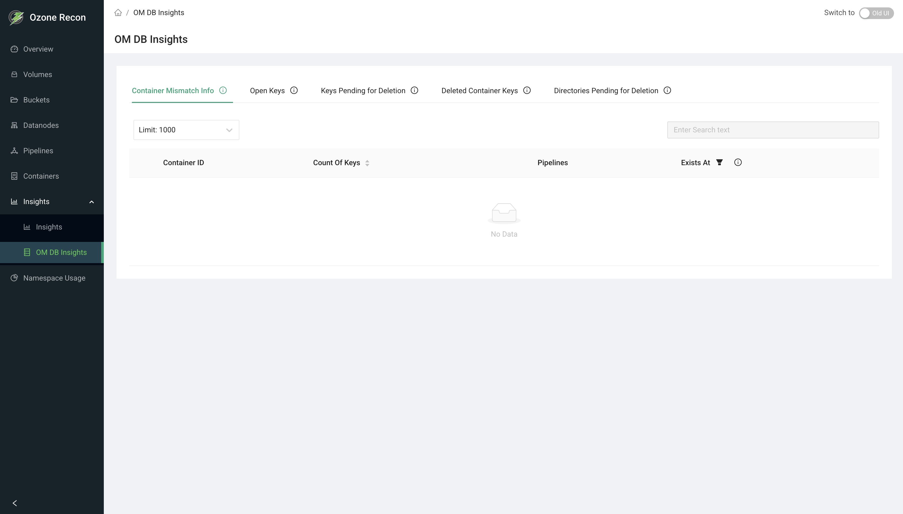
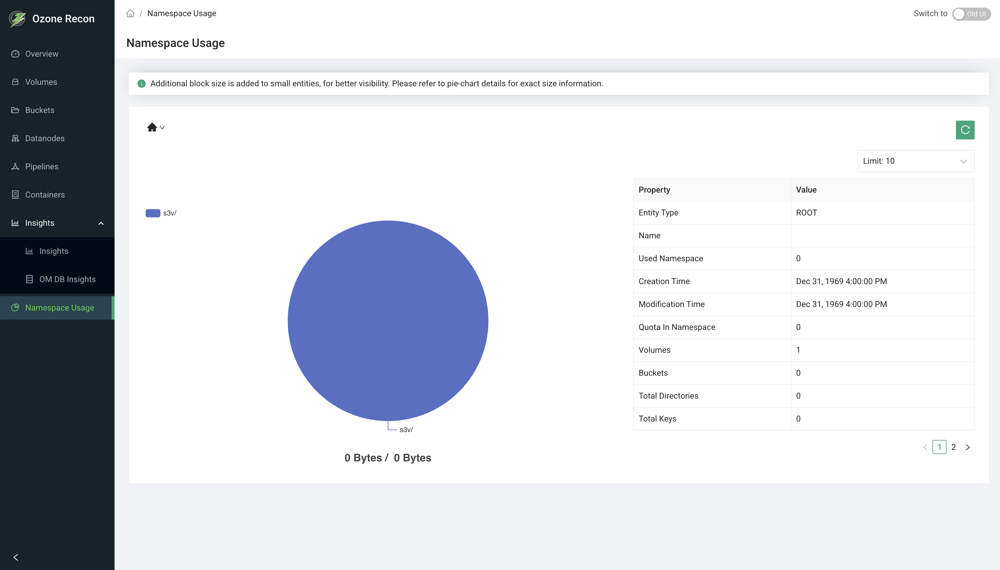

# Recon Web UI

## Introduction

Apache Ozone Recon is a read-only monitoring and observability service for Apache Ozone clusters, designed for cluster administrators. Recon aggregates metadata from Ozone Manager (OM), Storage Container Manager (SCM), and Datanodes, and exposes this information through a web-based user interface.

Recon does not modify cluster state. It is designed to provide visibility, diagnostics, and insight into the health and usage of an Ozone cluster.

## Accessing the Recon UI

The Recon UI is available via the Recon HTTP endpoint, typically:

`http://<recon-host>:9888/`

The left navigation panel provides access to all available views:

- Overview
- Volumes
- Buckets
- Datanodes
- Pipelines
- Containers
- Insights
- OM DB Insights
- Namespace Usage

Most pages support:

- Automatic refresh
- Manual refresh
- Column selection
- Sorting and filtering

## Overview Page

The Overview page provides a high-level summary of cluster health and usage.

### Health

Displays overall health indicators for:

- Datanodes
- Containers

The health status reflects Recon’s aggregated view of SCM and Datanode reports.

### Cluster Capacity

Shows a capacity breakdown using a ring chart:

- Ozone Used: Storage consumed by Ozone keys
- Non-Ozone Used: Disk usage outside of Ozone
- Remaining: Free capacity
- Container Pre-allocated: Space reserved by containers

In newly initialized or empty clusters, values may be zero.

### Summary Counters

Quick counts for:

- Volumes
- Buckets
- Keys
- Pipelines
- Deleted Containers

These counters help operators confirm overall namespace activity.

### Open Keys and Delete Pending Keys

Displays summary information related to:

- Open keys
- Keys pending deletion
- Replicated and unreplicated data sizes

These metrics are useful when diagnosing delayed deletions or space reclamation issues.

## Volumes Page

The Volumes page lists all volumes known to the cluster.

### Displayed Information

- Volume name
- Owner
- Admin
- Creation time
- Modification time
- Storage quota
- Namespace capacity usage

### Actions

- Show Buckets: Navigates to buckets within the selected volume
- Show ACL: Displays access control configuration

This page is commonly used to verify ownership, quotas, and namespace usage at the volume level.

## Buckets Page

The Buckets page lists all buckets across all volumes.

### Displayed Information

- Bucket name
- Volume
- Owner
- Versioning status
- Storage type
- Bucket layout
- Creation and modification times
- Storage capacity usage
- Namespace capacity usage

An empty table indicates that no buckets exist in the cluster.

This view is useful for auditing bucket configuration and identifying buckets with high namespace or storage usage.

## Datanodes Page

The Datanodes page provides detailed status information for each Datanode.

### Displayed Information

- Hostname
- Health state
- Operational state (for example, IN_SERVICE)
- UUID
- Storage capacity utilization
- Last heartbeat timestamp
- Pipeline membership
- Leader count

This page is commonly used to:

- Detect unhealthy or missing Datanodes
- Verify heartbeat freshness
- Inspect Ratis leader distribution

## Pipelines Page

The Pipelines page displays all SCM-managed pipelines.

### Displayed Information

- Pipeline ID
- Replication type and factor
- Pipeline status
- Number of containers
- Datanode membership
- Current leader
- Last leader election time

Pipeline information is useful for diagnosing container allocation issues and validating Ratis pipeline health.

## Containers Page

The Containers page focuses on container health and replication status.

### Highlights

Displays summary counts for:

- Missing containers
- Under-replicated containers
- Over-replicated containers
- Mis-replicated containers
- Mismatched replicas

### Detailed Views

Each category provides a detailed table showing:

- Container ID
- Number of keys
- Actual versus expected replica count
- Hosting Datanodes
- Pipeline ID
- Time since unhealthy state

This page is primarily used for replication and durability diagnostics.

## Insights Page

The Insights page provides analytical summaries derived from Recon metadata.

### Available Charts

- File size distribution
- Container size distribution

If no data is present, Recon displays an explicit “No Data” indicator.

These charts become useful once the cluster has active workloads.

## OM DB Insights

The OM DB Insights section exposes internal Ozone Manager metadata conditions derived from Recon analysis.

### Available Views

- Container mismatch information
- Open keys
- Keys pending deletion
- Deleted container keys
- Directories pending deletion

These views are intended for advanced operators and developers investigating OM metadata behavior or inconsistencies.

## Namespace Usage

The Namespace Usage page visualizes namespace consumption hierarchically.

### Visualization

A pie chart displays namespace usage by:

- Volume
- Bucket
- Directory

Small entities may be visually amplified for readability; exact values are available in the details panel.

### Entity Details

For the selected entity, Recon displays:

- Entity type
- Namespace usage
- Namespace quota
- Creation and modification time
- Counts of volumes, buckets, directories, and keys

This view is useful for identifying namespace-heavy tenants and planning quota usage.

## Limitations

Recon is read-only and cannot be used to modify cluster state.

Recon data freshness depends on metadata synchronization from OM and SCM.

Operational actions must be performed using standard Ozone administrative tools.

## Summary

Apache Ozone Recon provides:

- Centralized visibility into cluster health
- Namespace and capacity observability
- Diagnostics for containers, pipelines, and metadata

Recon is intended to complement, not replace, existing Ozone administrative workflows.
