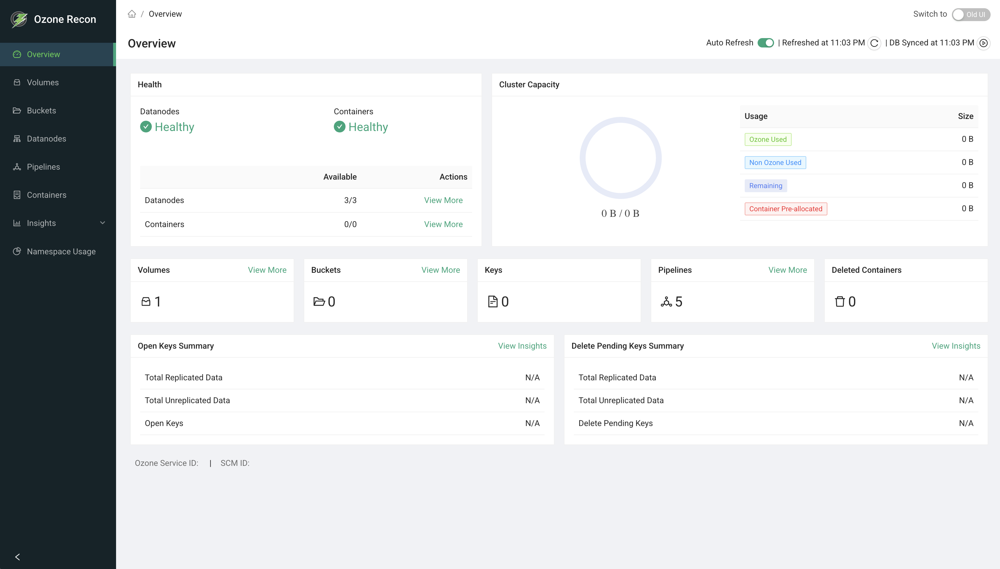

# Recon UI — Overview Page

## 1. Page Overview

The **Overview** page is the Recon landing page. It gives you an at-a-glance
summary of the health and size of your Ozone cluster: datanode and container
health, total storage capacity and how it is being used, counts of the main
objects (volumes, buckets, keys, pipelines, containers), and summaries of open
and delete-pending keys.

It is a read-only dashboard, and every card links to a more detailed page, so
the Overview is the usual starting point for any investigation.

## 2. When to Use This Page

- As your first stop after logging in, to confirm the cluster is healthy.
- To quickly spot missing containers or unhealthy datanodes.
- To check how full the cluster is (used vs. remaining capacity).
- To see whether there is a large backlog of open keys or keys pending deletion.
- To confirm the data Recon is showing is recent, and to trigger an on-demand
  sync from the Ozone Manager (OM).

## 3. How to Access the Page

The Overview page is shown by default when you open the Recon web UI. You can
also reach it any time from the **Overview** entry in the left navigation menu.

## 4. Information Displayed

At the top of the page is the page title and an **Auto Reload** panel (described
under Available Actions). At the bottom, the **Ozone Service ID** and **SCM ID**
are shown for reference.

### Health cards

Two cards, each showing a **Health** status (Healthy or Unhealthy) and an
**Availability** ratio in the form `available/total`:

- **Datanodes** — healthy datanodes out of the total. Links to the Datanodes
  page.
- **Containers** — available containers out of the total (total minus missing).
  Links to the Containers page.

A card is **Healthy** only when every unit is accounted for (available equals
total). Otherwise it shows **Unhealthy**.

### Ozone Capacity card

A storage breakdown with a stacked bar and a **View More** link to the Capacity
page. It shows:

- **TOTAL** — the space configured for Ozone to use in the cluster. The actual
  disk space may be larger than what is allocated to Ozone.
- **OZONE USED SPACE** — space used by data stored in Ozone.
- **OTHER USED SPACE** — space occupied by other Ozone-related files (logs,
  configuration, database files, and so on) rather than stored data.
- **CONTAINER PRE-ALLOCATED** — space committed/pre-allocated but not yet
  written.

### Count cards

Six single-number cards:

- **Volumes** — total volumes (links to the Volumes page).
- **Buckets** — total buckets (links to the Buckets page).
- **Keys** — total keys in the cluster.
- **Pipelines** — total pipelines (links to the Pipelines page).
- **Deleted Containers** — containers in the deleted state.
- **Open Containers** — containers in the open state.

### Summary tables

Two tables, each with **Name** and **Size** columns and a **View More** link to
the OM DB Insights page:

- **Open Keys Summary** — Total Replicated Data, Total Unreplicated Data, and
  the number of Open Keys.
- **Delete Pending Keys Summary** — Total Replicated Data, Total Unreplicated
  Data, and the number of Delete Pending Keys.

Values that are unavailable appear as **N/A**.

## 5. Available Actions

The **Auto Reload** panel in the header provides:

- **Auto Refresh** toggle — turns automatic refresh on or off. It refreshes
  every 60 seconds and remembers your choice for the session.
- **Refreshed at `<time>`** with a **reload** button — refreshes all data on the
  page immediately.
- **DB Synced at `<time>`** with a **sync** button — triggers an on-demand OM DB
  sync. Hovering over the time shows when the last delta and full updates
  happened, and whether a sync was just triggered or was already running.

Each health, capacity, and summary card also has a **View More** link that takes
you to the detailed page for that topic. There is no search, filter, sort,
pagination, or download on this page.

## 6. How to Interpret the Information

- **Health = Healthy (green check):** all units are accounted for. **Unhealthy
  (yellow warning):** at least one datanode is not healthy or at least one
  container is missing — use **View More** to drill down.
- **Missing containers** indicate a data-availability risk; investigate on the
  Containers page. The count is capped at 1001, so a value of **1001** means
  "1001 or more".
- **Ozone Capacity:** compare OZONE USED SPACE against TOTAL to judge how full
  the cluster is. A large OTHER USED SPACE means non-data files are consuming
  disk. CONTAINER PRE-ALLOCATED is space reserved but not yet written.
- **Open Keys Summary:** a large open-keys count or size can indicate many
  in-progress writes, or leaked/abandoned open keys.
- **Delete Pending Keys Summary:** a growing backlog can indicate that deletion
  is falling behind.
- **N/A** means the value was unavailable, which is not necessarily the same as
  zero.

## 7. Common Use Cases

1. **Daily health check.** Confirm both health cards show Healthy and capacity
   is within expectations. If a card is Unhealthy, click **View More** to
   investigate.
2. **Capacity planning.** Watch OZONE USED SPACE against TOTAL over time to
   decide when to add datanodes, then use **View More → Capacity** for the
   per-datanode breakdown.
3. **Deletion backlog triage.** If Delete Pending Keys is high, click **View
   More** to the OM DB Insights page to see the keys involved.

## 8. Important Notes and Limitations

- **Data freshness.** Volume, bucket, and key counts and the key summaries come
  from Recon's own copy of the OM database, which is updated by a periodic sync.
  The "DB Synced at" time shows how current that data is; use the sync button to
  force an update. Datanode, container, and capacity numbers depend on datanode
  reports and heartbeats.
- **Auto Refresh** only re-queries Recon; it does not force Recon to re-sync from
  OM. It runs every 60 seconds by default.
- **Capacity** is based on datanode reports and includes replicated data size.
  If some datanodes have not reported yet, capacity may be incomplete.
- On an error, a card shows an error state instead of values. Until the first
  successful load, counts appear as zero or N/A.
- The **Ozone Service ID** and **SCM ID** come from cluster configuration and may
  show N/A if they are not configured.

## 9. Related Pages

- **Datanodes** — detail behind the Datanodes health card.
- **Containers** — detail behind the Containers health card and missing-container
  investigations.
- **Capacity** — full storage and capacity breakdown.
- **Volumes**, **Buckets**, **Pipelines** — detail behind the count cards.
- **OM DB Insights** — detail behind the Open Keys and Delete Pending Keys
  summaries.
