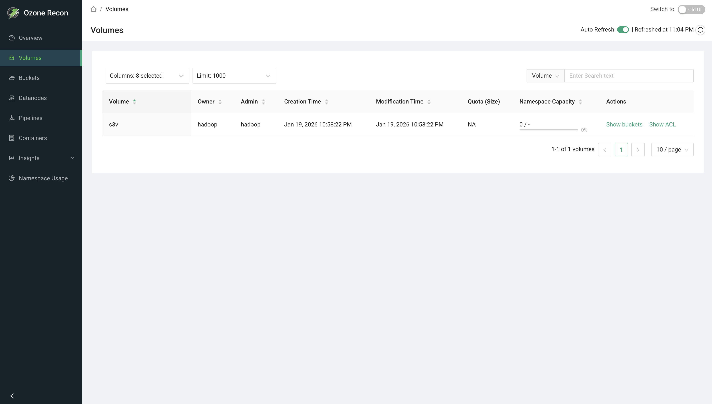

# Recon UI — Volumes Page

## 1. Page Overview

The **Volumes** page lists the volumes in your Ozone cluster and their key
properties: owner, administrator, creation and modification times, quota, and
namespace usage. From here you can inspect a volume's access control list (ACL)
and jump to the buckets inside a volume.

It is a read-only listing used to browse and search volumes and to review
their ownership and quota settings.

## 2. When to Use This Page

- To browse all volumes in the cluster and see who owns them.
- To find a specific volume by name, owner, or admin.
- To review a volume's quota and how much of its namespace is in use.
- To inspect the ACLs (permissions) configured on a volume.
- As a jumping-off point to the buckets contained in a volume.

## 3. How to Access the Page

Open the **Volumes** entry in the left navigation menu, or go to the `/Volumes`
route directly. You can also reach a filtered view from the **Volumes** count
card on the Overview page.

## 4. Information Displayed

The page header shows the title and an **Auto Reload** panel (see Available
Actions). The main area is a single table of volumes.

### Table columns

- **Volume** — the volume name. Sortable; sorted ascending by default.
- **Owner** — the user that owns the volume. Sortable.
- **Admin** — the administrator of the volume. Sortable.
- **Creation Time** — when the volume was created. Shows `NA` if not available.
- **Modification Time** — when the volume was last modified. Shows `NA` if not
  available.
- **Quota (Size)** — the storage quota set on the volume. Shows `NA` when no
  quota is set.
- **Namespace Capacity** — a bar showing used namespace against the namespace
  quota (number of objects allowed). Hovering shows the used and remaining
  values. A quota of `-1` (unset) is shown as `-`.
- **Actions** — per-row links:
  - **Show buckets** — opens the Buckets page filtered to that volume.
  - **Show ACL** — opens a side panel listing the volume's ACL entries.

### ACL side panel

Selecting **Show ACL** opens a drawer showing the access-control entries
configured on the volume (who has access and what permissions they hold).

## 5. Available Actions

- **Columns** selector — choose which columns are visible. The **Volume** column
  is always shown; you can remove others by unchecking them or closing their
  tag.
- **Limit** selector — controls how many volumes are fetched from the server.
  Options are 1000, 5000, 10000, and 20000 (default 1000).
- **Search** — filter the loaded rows by **Volume**, **Owner**, or **Admin**.
  Pick the field to search, then type; matching is a simple contains match and
  is applied to the rows already loaded. Search is disabled when the table is
  empty.
- **Sort** — click a sortable column header (Volume, Owner, Admin, Creation
  Time, Modification Time, Namespace Capacity).
- **Pagination** — page through results; the page size is adjustable and the
  footer shows the range and total (for example, `1-10 of 240 volumes`).
- **Auto Reload** panel — an **Auto Refresh** toggle (refreshes every 60 seconds
  and remembers your choice for the session) and a manual **reload** button that
  shows the last refreshed time.
- **Row links** — **Show buckets** and **Show ACL** as described above.

## 6. How to Interpret the Information

- **Quota (Size) = NA:** no size quota is set on the volume, so it is not
  limited by a volume-level size quota.
- **Namespace Capacity bar:** a nearly full bar means the volume is close to its
  namespace quota (the number of objects it may contain); `-` means no namespace
  quota is set.
- **Creation / Modification Time = NA:** a timestamp was not available for that
  volume.
- **Search vs. Limit:** search filters only the rows already loaded. If you
  expect a volume that is not showing, increase the **Limit** so it is included
  in what is fetched, then search.

## 7. Common Use Cases

1. **Find a tenant's volumes.** Set Search to **Owner**, type the user name, and
   review the matching volumes and their quotas.
2. **Check quota pressure.** Sort by **Namespace Capacity** to see which volumes
   are closest to their namespace quota, then plan quota increases.
3. **Audit access.** Use **Show ACL** on a volume to confirm which users and
   groups have permissions, and **Show buckets** to continue the review at the
   bucket level.

## 8. Important Notes and Limitations

- **Data freshness.** The volume list comes from Recon's own copy of the Ozone
  Manager (OM) database, which is updated by a periodic sync. Very recent
  changes on OM may not appear until the next sync. **Auto Refresh** only
  re-queries Recon; it does not force a re-sync from OM.
- **Limit caps the result set.** Only up to the selected limit of volumes is
  fetched. On very large clusters, raise the limit to see more, keeping in mind
  larger limits take longer to load.
- **Search and sorting apply to loaded rows only**, not to volumes beyond the
  selected limit.
- On an error, the page reports a data-fetch error and the table stays empty.

## 9. Related Pages

- **Buckets** — the buckets inside a volume (reachable via **Show buckets**).
- **Overview** — cluster-wide totals, including the volume count.
- **Namespace Usage** — disk usage broken down across the namespace.
