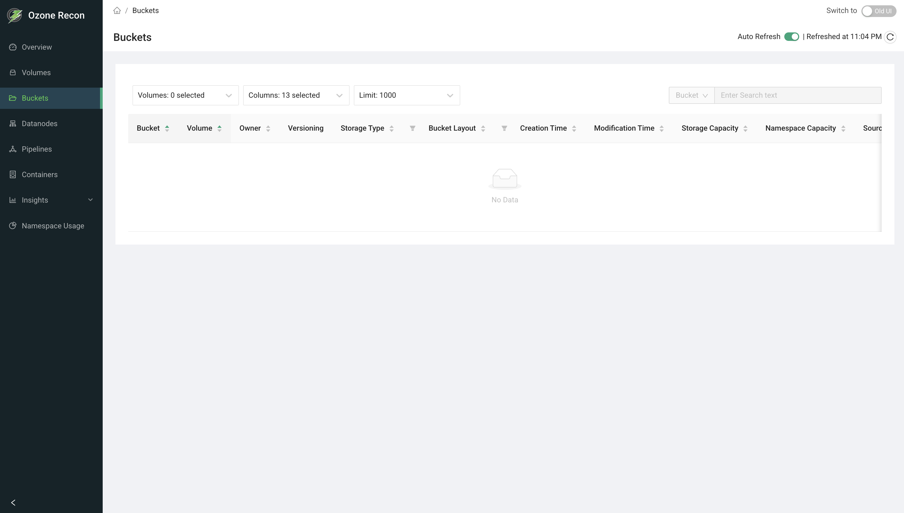

# Recon UI — Buckets Page

## 1. Page Overview

The **Buckets** page lists the buckets in your Ozone cluster along with their
properties: the volume they belong to, owner, versioning, storage type, bucket
layout, creation and modification times, storage and namespace usage against
quota, and (for linked buckets) their source volume and bucket. You can also
inspect each bucket's access control list (ACL).

It is a read-only listing for browsing, searching, and filtering buckets, and
for reviewing their configuration and quota usage.

## 2. When to Use This Page

- To browse all buckets, or just the buckets within one or more volumes.
- To find a bucket by name or by volume.
- To check a bucket's storage type, layout, and versioning setting.
- To review storage and namespace usage against quota.
- To inspect the ACLs (permissions) on a bucket.
- To identify link buckets and see their source.

## 3. How to Access the Page

Open the **Buckets** entry in the left navigation menu, or go to the `/Buckets`
route directly. From the **Volumes** page, the **Show buckets** action opens
this page pre-filtered to a single volume.

## 4. Information Displayed

The page header shows the title and an **Auto Reload** panel (see Available
Actions). The main area is a table of buckets, filtered by the selected
volume(s).

### Table columns

- **Bucket** — the bucket name (always shown, pinned to the left). Sortable.
- **Volume** — the parent volume (always shown, pinned to the left). Sortable.
- **Owner** — the bucket owner. Sortable.
- **Versioning** — a green check when versioning is enabled, otherwise a neutral
  cross.
- **Storage Type** — RAM_DISK, SSD, DISK, or ARCHIVE, each with an icon.
  Filterable and sortable.
- **Bucket Layout** — a colored tag: FILE_SYSTEM_OPTIMIZED (green), OBJECT_STORE
  (orange), or LEGACY (blue). Filterable and sortable.
- **Creation Time** — when the bucket was created. Shows `NA` if not available.
- **Modification Time** — when the bucket was last modified. Shows `NA` if not
  available.
- **Storage Capacity** — a bar showing used bytes against the size quota.
  Hovering shows used and remaining. Sortable by used bytes.
- **Namespace Capacity** — a bar showing used namespace (object count) against
  the namespace quota. Sortable by used namespace.
- **Source Volume** — for link buckets, the volume the bucket links to;
  otherwise `NA`.
- **Source Bucket** — for link buckets, the bucket it links to; otherwise `NA`.
- **ACLs** — a **Show ACL** link that opens a side panel with the bucket's ACL
  entries.

### ACL side panel

Selecting **Show ACL** opens a drawer listing the access-control entries on the
bucket (who has access and what permissions they hold).

## 5. Available Actions

- **Volumes** selector — choose one or more volumes to show buckets for.
  Supports search and select-all. When the page first loads, all volumes are
  selected; if you arrived from the Volumes page, only that volume is selected.
- **Columns** selector — choose which columns are visible. The **Bucket** and
  **Volume** columns are always shown.
- **Limit** selector — how many buckets are fetched from the server: 1000, 5000,
  10000, or 20000 (default 1000).
- **Search** — filter the shown rows by **Bucket** or **Volume** name; matching
  is a simple contains match on the rows already loaded. Disabled when there are
  no rows.
- **Column filters** — Storage Type and Bucket Layout can be filtered to
  specific values from their column headers.
- **Sort** — click a sortable column header.
- **Pagination** — page through results; page size is adjustable and the footer
  shows the range and total (for example, `1-10 of 320 buckets`).
- **Auto Reload** panel — an **Auto Refresh** toggle (refreshes every 60 seconds
  and remembers your choice for the session) and a manual **reload** button
  showing the last refreshed time.
- **Show ACL** — opens the ACL side panel for a bucket.

## 6. How to Interpret the Information

- **Versioning:** a green check means object versioning is enabled; a cross
  means each key keeps only its latest version.
- **Bucket Layout:** FILE_SYSTEM_OPTIMIZED (FSO) buckets behave like a file
  system with directories; OBJECT_STORE (OBS) buckets behave like flat object
  storage; LEGACY is the older layout. This affects how keys are organized.
- **Storage Type:** the storage medium the bucket's data targets (for example
  DISK or SSD).
- **Storage / Namespace Capacity bars:** a nearly full bar means the bucket is
  close to its size or object-count quota. A quota shown as `-` means no quota
  is set, so the bucket is not limited at the bucket level.
- **Source Volume / Source Bucket present (not NA):** the bucket is a link
  bucket that points to another bucket rather than storing its own data.
- **Creation / Modification Time = NA:** a timestamp was not available.

## 7. Common Use Cases

1. **Review one volume's buckets.** From the Volumes page click **Show buckets**
   (or pick the volume in the Volumes selector) to see just that volume's
   buckets, their layouts, and quota usage.
2. **Find quota pressure.** Sort by **Storage Capacity** or **Namespace
   Capacity** to see which buckets are closest to their limits.
3. **Audit configuration.** Filter by **Bucket Layout** or **Storage Type** to
   confirm buckets are configured as expected, and use **Show ACL** to verify
   permissions.

## 8. Important Notes and Limitations

- **Data freshness.** The bucket list comes from Recon's own copy of the Ozone
  Manager (OM) database, updated by a periodic sync. Very recent changes on OM
  may not appear until the next sync. **Auto Refresh** only re-queries Recon; it
  does not force a re-sync from OM.
- **Limit caps the result set.** Only up to the selected limit of buckets is
  fetched. On large clusters, raise the limit to see more, keeping in mind
  larger limits take longer to load.
- **Search, sorting, and column filters apply to loaded rows only**, not to
  buckets beyond the selected limit.
- The **Volumes** selector chooses which of the loaded buckets are shown; it
  does not fetch additional buckets beyond the limit.
- On an error, the page reports a data-fetch error and the table stays empty.

## 9. Related Pages

- **Volumes** — the parent volumes; use **Show buckets** to filter this page.
- **Overview** — cluster-wide totals, including the bucket count.
- **Namespace Usage** — disk usage broken down across the namespace.
