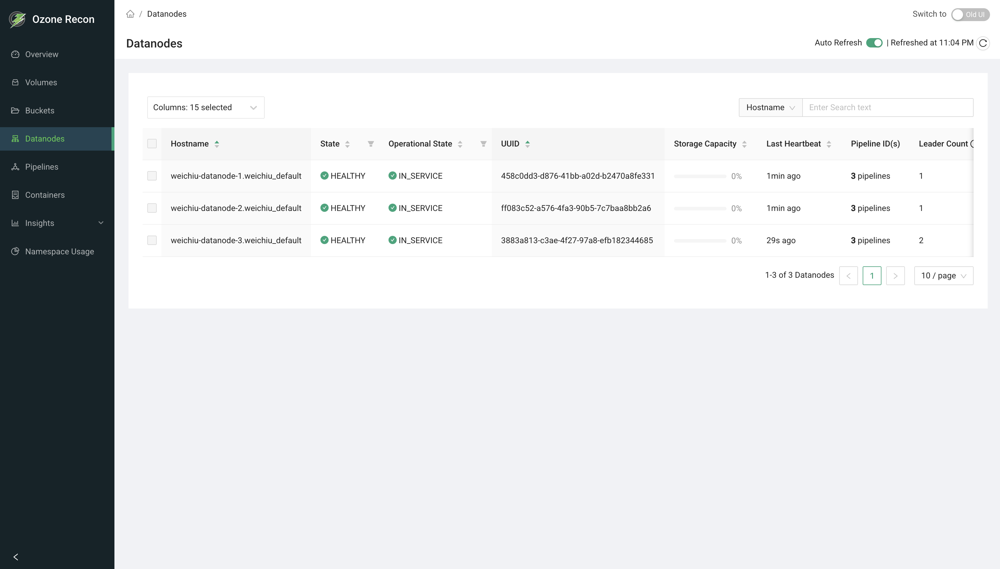

# Recon UI — Datanodes Page

## 1. Page Overview

The **Datanodes** page lists every datanode Recon knows about and shows the
health, operational state, storage usage, pipeline membership, container counts,
and build information for each one. It is the main place to check datanode
health and capacity across the cluster.

Besides browsing, the page lets you stop tracking datanodes that are no longer
part of the cluster (removing dead nodes from Recon).

## 2. When to Use This Page

- To confirm all datanodes are healthy and in service.
- To find stale or dead datanodes and investigate them.
- To see which datanodes are being decommissioned or are in maintenance.
- To check per-datanode storage usage and spot nodes that are filling up.
- To see which pipelines a datanode participates in and how many it leads.
- To clean up Recon's view by removing datanodes that are permanently gone.

## 3. How to Access the Page

Open the **Datanodes** entry in the left navigation menu, or go to the
`/Datanodes` route directly. You can also arrive here from the **Datanodes**
health card on the Overview page.

## 4. Information Displayed

The page header shows the title and an **Auto Reload** panel (see Available
Actions). The main area is a table of datanodes, one row per node.

### Table columns

- **Hostname** — the datanode host (always shown, pinned to the left). Sortable.
- **State** — datanode health, with an icon:
  - **HEALTHY** (green check) — heartbeating normally.
  - **STALE** (hourglass) — heartbeats delayed.
  - **DEAD** (red cross) — not heartbeating.
  Filterable and sortable.
- **Operational State** — the administrative state:
  - **IN_SERVICE** (green check) — serving normally.
  - **DECOMMISSIONING** (hourglass) — decommission in progress.
  - **DECOMMISSIONED** (warning) — decommission complete.
  - **ENTERING_MAINTENANCE** (hourglass) — entering maintenance.
  - **IN_MAINTENANCE** (warning) — under maintenance.
  Filterable and sortable.
- **UUID** — the datanode's unique ID. For datanodes that are actively
  decommissioning, this cell shows a decommission summary instead of the plain
  ID.
- **Storage Capacity** — a bar showing used, committed, and remaining storage
  for the node. Sortable by remaining storage.
- **Last Heartbeat** — how long ago the node last reported in; `NA` if never.
- **Pipeline ID(s)** — the number of pipelines the node is in; hover to see the
  list, each with its replication type/factor and an indicator of whether this
  node is the pipeline leader.
- **Leader Count** — the number of Ratis pipelines in which this datanode is
  elected leader. Sortable.
- **Containers** — the number of containers on the node. Sortable.
- **Open Container** — the number of open containers per pipeline. Sortable.
- **Version** — the Ozone version running on the node. Sortable.
- **Setup Time** — when the node was set up; `NA` if unavailable.
- **Revision** — the build revision. Sortable.
- **Build Date** — the build date. Sortable.
- **Network Location** — the node's rack/network location. Sortable.

## 5. Available Actions

- **Columns** selector — choose which columns are visible. **Hostname** is
  always shown.
- **Search** — filter the shown rows by **Hostname**, **UUID**, or **Version**;
  matching is a simple contains match on the loaded rows. Disabled when the
  table is empty.
- **State / Operational State filters** — filter to specific values from those
  column headers.
- **Sort** — click a sortable column header.
- **Pagination** — page through results; page size is adjustable and the footer
  shows the range and total (for example, `1-10 of 24 Datanodes`).
- **Row selection + Remove** — select one or more datanodes to reveal a red
  **Remove** button. Only **DEAD** datanodes can be selected; healthy or stale
  nodes cannot. Choosing **Remove** opens a **Stop Tracking Datanode**
  confirmation dialog before Recon stops tracking the selected node(s).
- **Auto Reload** panel — an **Auto Refresh** toggle (refreshes every 60 seconds
  and remembers your choice for the session; polling starts automatically on
  this page) and a manual **reload** button showing the last refreshed time.
- **Pipeline popover** — hover over the Pipeline ID(s) cell to see the node's
  pipelines and leadership.

## 6. How to Interpret the Information

- **State HEALTHY:** the node is heartbeating normally. **STALE:** heartbeats
  are late — the node may be under load or having network issues. **DEAD:** the
  node has stopped heartbeating and its data is treated as unavailable.
- **Operational State:** IN_SERVICE is the normal state. DECOMMISSIONING /
  DECOMMISSIONED mean the node is being or has been retired. ENTERING_MAINTENANCE
  / IN_MAINTENANCE mean it is temporarily out for maintenance.
- **Storage Capacity bar:** watch for nodes that are nearly full or unbalanced
  relative to others. Committed space is reserved but not yet written.
- **Last Heartbeat:** a large value (or `NA`) alongside a STALE/DEAD state
  confirms the node is not reporting.
- **Leader Count:** a very uneven leader distribution across nodes can indicate
  imbalance in Ratis leadership.
- **Remove eligibility:** the fact that only DEAD nodes can be selected is a
  safeguard — you cannot accidentally stop tracking a live node.

## 7. Common Use Cases

1. **Health sweep.** Filter **State** to STALE and DEAD to immediately see any
   datanodes that are not healthy, then check their Last Heartbeat.
2. **Capacity check.** Sort by **Storage Capacity** to find the fullest nodes
   and plan rebalancing or expansion.
3. **Clean up retired nodes.** After a node is permanently removed from the
   cluster and shows as DEAD, select it and use **Remove** to stop Recon from
   tracking it.

## 8. Important Notes and Limitations

- **Data source and freshness.** Datanode information comes from Recon's own SCM
  view, which is built from datanode heartbeats and reports. State and storage
  figures are only as current as the last heartbeat, and **Auto Refresh** only
  re-queries Recon.
- **Remove only affects Recon.** Removing a datanode stops Recon from tracking
  it (it is removed from Recon's memory and its record in Recon's database). It
  does not decommission or delete the node in the cluster, and only **DEAD**
  nodes can be removed. If a removed node comes back and heartbeats, it can
  reappear.
- **Decommission details** for actively decommissioning nodes are shown in the
  UUID cell as a summary.
- **Search and filters apply to the loaded rows.**
- On an error, the page reports a data-fetch error and the table stays empty.

## 9. Related Pages

- **Overview** — the Datanodes health card and cluster-wide totals.
- **Pipelines** — details of the pipelines a datanode participates in.
- **Containers** — container-level detail, including missing containers.
- **Capacity** — cluster-wide storage and capacity breakdown.
