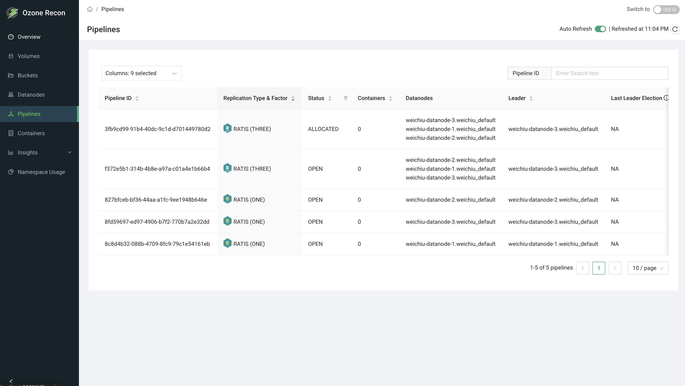

# Recon UI — Pipelines Page

## 1. Page Overview

The **Pipelines** page lists the pipelines in your Ozone cluster. A pipeline is
the group of datanodes that work together to store replicas of container data.
For each pipeline the page shows its replication type and factor, status, the
datanodes involved, the current leader, how long it has been alive, and
leader-election metrics.

It is a read-only listing used to review pipeline health, replication, and
datanode membership.

## 2. When to Use This Page

- To see all pipelines and their current status.
- To confirm replication type and factor across pipelines.
- To find which datanodes make up a pipeline and which one is the leader.
- To investigate pipelines that are not OPEN or that show frequent leader
  elections.
- To look up a specific pipeline by its ID.

## 3. How to Access the Page

Open the **Pipelines** entry in the left navigation menu, or go to the
`/Pipelines` route directly. You can also arrive here from the **Pipelines**
count card on the Overview page.

## 4. Information Displayed

The page header shows the title and an **Auto Reload** panel (see Available
Actions). The main area is a table of pipelines, one row per pipeline.

### Table columns

- **Pipeline ID** — the pipeline's unique identifier (always shown, pinned to
  the left). Sortable.
- **Replication Type & Factor** — the replication scheme (for example RATIS) and
  factor (for example 3), with a replication icon. Sortable.
- **Status** — the pipeline state: OPEN, CLOSING, QUASI_CLOSED, CLOSED,
  UNHEALTHY, INVALID, DELETED, or DORMANT. Filterable and sortable.
- **Containers** — the number of containers in the pipeline. Sortable.
- **Datanodes** — the datanodes that make up the pipeline, shown by hostname;
  hover a hostname to see its UUID.
- **Leader** — the datanode currently acting as the pipeline leader. Sortable.
- **Last Leader Election** — elapsed time since the current leader was elected.
  Shows `NA` unless a metrics provider such as Prometheus is configured.
- **Lifetime** — how long the pipeline has been alive. Sortable.
- **No. of Elections** — the number of leader elections in the pipeline. Shows
  `NA` unless a metrics provider such as Prometheus is configured.

## 5. Available Actions

- **Columns** selector — choose which columns are visible. **Pipeline ID** is
  always shown.
- **Search** — filter the shown rows by **Pipeline ID**; matching is a simple
  contains match on the loaded rows. Disabled when the table is empty.
- **Status filter** — filter to specific pipeline states from the Status column
  header.
- **Sort** — click a sortable column header.
- **Pagination** — page through results; page size is adjustable and the footer
  shows the range and total (for example, `1-10 of 42 pipelines`).
- **Auto Reload** panel — an **Auto Refresh** toggle (refreshes every 60 seconds
  and remembers your choice for the session) and a manual **reload** button
  showing the last refreshed time.
- **Datanode tooltip** — hover a datanode hostname to see its UUID.

## 6. How to Interpret the Information

- **Status OPEN:** the pipeline is active and accepting writes. CLOSING /
  QUASI_CLOSED / CLOSED indicate the pipeline is being or has been shut down.
  UNHEALTHY, INVALID, DELETED, or DORMANT indicate pipelines that are not in
  normal service and may warrant investigation.
- **Replication Type & Factor:** confirms how many replicas the pipeline
  maintains (for example RATIS with factor 3 keeps three copies).
- **Datanodes / Leader:** shows exactly which nodes hold the pipeline and which
  one leads it. Cross-reference with the Datanodes page if a member node is
  unhealthy.
- **Last Leader Election / No. of Elections:** frequent elections can indicate
  instability (for example a flaky leader node or network issues). These values
  are only populated when a metrics provider is configured; otherwise they show
  `NA` and are not an error.

## 7. Common Use Cases

1. **Spot unhealthy pipelines.** Filter **Status** to values other than OPEN to
   quickly find pipelines that are closing, unhealthy, or invalid.
2. **Trace a pipeline's datanodes.** Search for a Pipeline ID, then read the
   Datanodes and Leader columns to see which nodes hold its data.
3. **Investigate leader churn.** With a metrics provider configured, sort by
   **No. of Elections** to find pipelines with excessive leader elections and
   correlate with datanode health.

## 8. Important Notes and Limitations

- **Data source and freshness.** Pipeline information comes from Recon's own SCM
  view, built from datanode reports. It is only as current as the last refresh,
  and **Auto Refresh** only re-queries Recon.
- **Metrics columns need a metrics provider.** **Last Leader Election** and
  **No. of Elections** are populated only when a metrics service such as
  Prometheus is configured for the cluster. Without it, these columns show `NA`.
- **Search and filters apply to the loaded rows.**
- On an error, the page reports a data-fetch error and the table stays empty.

## 9. Related Pages

- **Datanodes** — health and details of the datanodes that make up pipelines.
- **Containers** — the containers stored within pipelines.
- **Overview** — cluster-wide totals, including the pipeline count.
