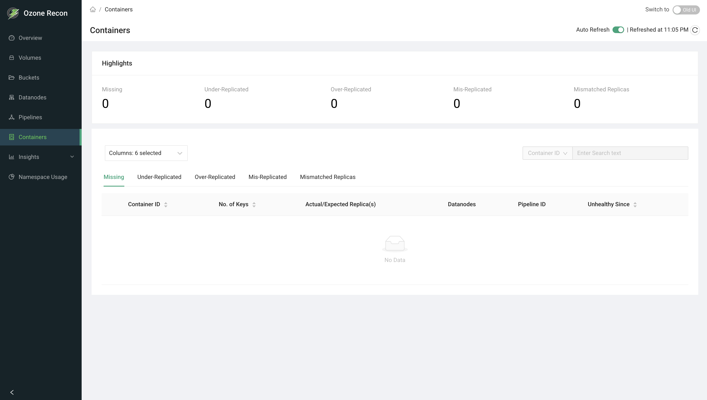
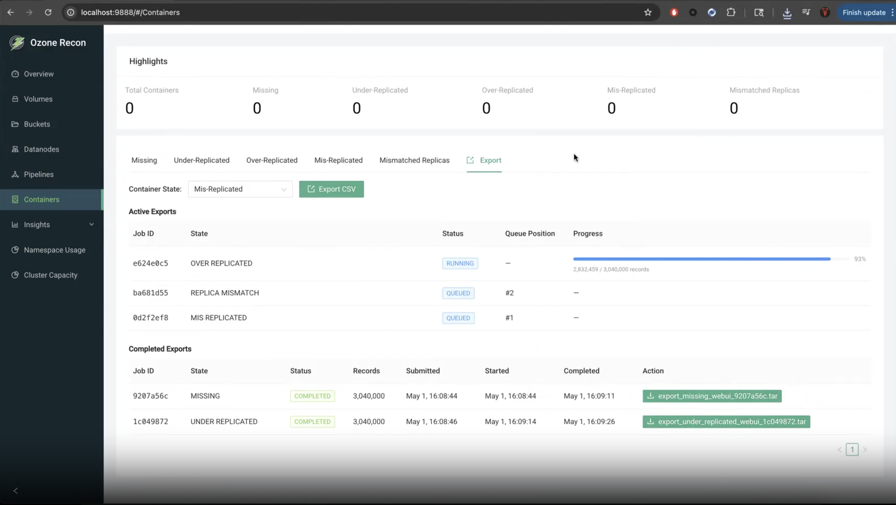

# Recon UI — Containers Page

## 1. Page Overview

The **Containers** page focuses on **unhealthy containers** — containers whose
replicas are missing, under- or over-replicated, mis-replicated, mismatched, or
quasi-closed. A highlights bar summarizes the counts, tabs break the containers
down by problem type, and each container can be expanded to see the keys it
holds. An Export tab lets you download the full list of a given unhealthy state
as a CSV.

It is the main page for diagnosing container-level replication and data-
availability problems.

## 2. When to Use This Page

- To check whether any containers are missing (a data-availability risk).
- To find under-replicated or over-replicated containers and track recovery.
- To identify mis-replicated or replica-mismatched containers.
- To see which keys are affected by an unhealthy container.
- To export a full list of containers in a given state for offline analysis or
  ticketing.

## 3. How to Access the Page

Open the **Containers** entry in the left navigation menu, or go to the
`/Containers` route directly. You can also arrive here from the **Containers**
health card on the Overview page.

## 4. Information Displayed

The page header shows the title and an **Auto Reload** panel (see Available
Actions).

### Highlights card

A summary bar of cluster-wide container counts:

- **Total Containers** — all containers in the cluster.
- **Missing** — containers with no available replicas.
- **Under-Replicated** — fewer replicas than expected.
- **Over-Replicated** — more replicas than expected.
- **Mis-Replicated** — replicas placed in a way that violates placement rules.
- **Mismatched Replicas** — replicas that disagree (for example, differing data
  checksums).
- **Quasi Closed** — containers stuck in the quasi-closed state.

### Tabs

Each of the first six tabs shows a table of containers in that state: **Missing**,
**Under-Replicated**, **Over-Replicated**, **Mis-Replicated**, **Mismatched
Replicas**, and **Quasi Closed**. The seventh tab is **Export**.

### Container table columns

- **Container ID** — the container identifier. Sortable.
- **No. of Blocks** — number of blocks/keys in the container. Sortable.
- **Actual/Expected Replica(s)** — the count of replicas present versus expected
  (for example `2 / 3`).
- **Datanodes** — the number of datanodes holding replicas; hover to list the
  hosts (and data checksums when available).
- **Pipeline ID** — the pipeline the container belongs to.
- **Unhealthy Since** — when the container entered this unhealthy state. On the
  Quasi Closed tab this column is labeled **State Enter Time**.

### Expanded row — keys in a container

Clicking a container row expands it and loads the keys stored in that container,
in a table with **Volume**, **Bucket**, **Key**, **Size**, **Date Created**,
**Date Modified**, and **Path**.

### Export tab

- A **Container State** selector and an **Export CSV** button to start an export
  job for one state.
- **Active Exports** table (shown when jobs are running/queued): Job ID, State,
  Status, Queue Position, Submitted, Started, and a live **Progress** bar with a
  processed/total record count.
- **Completed Exports** table: Job ID, State, Status, Records, Submitted,
  Started, Completed, and an **Action** column with **Download** (showing the
  number of downloads remaining) and **Delete**. Failed jobs show the error
  message instead of a download button.

## 5. Available Actions

- **Tabs** — switch between unhealthy states; each tab loads its own data on
  first open.
- **Columns** selector — choose visible columns. **Container ID** is always
  shown.
- **Search** — filter loaded rows by **Container ID** or **Pipeline ID**
  (contains match). Disabled when the table is empty.
- **Sort** — click a sortable column header.
- **Row expand** — click a row to load and view the keys in that container.
- **Pagination** — **Previous** / **Next** buttons with a **Rows per page**
  selector (10, 25, 50, 100). Paging uses container IDs, so it steps forward and
  backward through the list rather than jumping to arbitrary pages.
- **Auto Reload** panel — an **Auto Refresh** toggle (refreshes the active tab
  and highlights every 60 seconds) and a manual **reload** button.
- **Export actions** — start an export for a chosen state, watch progress,
  download the resulting archive (limited number of downloads), and delete
  finished jobs. Only one active/completed export per state is allowed at a
  time; the button is disabled and explains why if one already exists.

### Exporting a list of containers

To export every container in a given unhealthy state:

1. Open the **Export** tab.
2. Pick the state to export from the **Container State** selector (for example
   *Missing* or *Under-Replicated*).
3. Click **Export CSV**. The job appears under **Active Exports** as **QUEUED**
   (with its queue position), then **RUNNING** with a live progress bar showing
   processed / total records.
4. When it finishes, the job moves to **Completed Exports** as **COMPLETED**.
   Use **Download** in the **Action** column to save the archive (for example
   `export_missing_webui_<jobid>.tar`); the button shows how many downloads
   remain.
5. Use **Delete** to remove a finished job. A **FAILED** job shows its error
   message instead of a download button.

Only one active or completed export per state is allowed at a time, and each
completed export allows a limited number of downloads. The following video shows
the full flow:

<video controls width="100%" style={{maxWidth: '800px'}}>
  <source src="/img/recon-containers-export-demo.mp4" type="video/mp4" />
  Your browser does not support the video tag.
</video>

## 6. How to Interpret the Information

- **Missing > 0:** the most serious state — those containers have no reachable
  replicas, so their data is currently unavailable. Investigate immediately.
- **Under-Replicated:** fewer copies than required; the system normally
  re-replicates automatically, but persistent entries may indicate datanode or
  capacity problems.
- **Over-Replicated:** more copies than required; usually self-corrects, wasting
  some space until it does.
- **Mis-Replicated:** replica placement violates the configured placement policy
  (for example rack rules), even if the count is correct.
- **Mismatched Replicas:** replicas exist but disagree — check the per-datanode
  checksums in the Datanodes popover.
- **Quasi Closed:** containers that could not be cleanly closed; the State Enter
  Time shows how long they have been stuck.
- **Actual/Expected `2 / 3`:** actual is less than expected → under-replicated;
  greater → over-replicated.
- **Export status:** QUEUED (waiting), RUNNING (in progress, with a progress
  bar), COMPLETED (downloadable), FAILED (hover for the error).

## 7. Common Use Cases

1. **Data-availability check.** Open the page, read the **Missing** highlight,
   and if non-zero open the Missing tab and expand rows to see exactly which
   keys are affected.
2. **Track replication recovery.** Watch the Under-Replicated count and tab over
   time (with Auto Refresh on) to confirm the cluster is healing after a datanode
   outage.
3. **Hand off to another team.** Use the Export tab to generate a CSV of all
   containers in a given state and attach it to a ticket for follow-up.

## 8. Important Notes and Limitations

- **Data source and freshness.** Unhealthy-container information comes from
  Recon's own database, populated by Recon's periodic container-health checks;
  the keys shown when expanding a container come from Recon's copy of the OM
  database. Figures are only as current as those background tasks, and **Auto
  Refresh** only re-queries Recon.
- **The tables list unhealthy containers**, not all containers. Total container
  count appears only in the Highlights bar.
- **Missing count on the Overview page is capped at 1001**; this page shows the
  detailed per-state lists.
- **Search applies to the loaded page only** (contains match on Container ID or
  Pipeline ID).
- **Exports are limited:** one active/completed job per state at a time, a
  bounded number of downloads per completed job, and a bounded queue (starting an
  export may be rejected if the queue is full).
- On an error, the page shows a data-fetch error; export polling errors are
  silent by design.

## 9. Related Pages

- **Overview** — the Containers health card and total container count.
- **Datanodes** — health of the datanodes that hold container replicas.
- **Pipelines** — the pipelines containers belong to.
