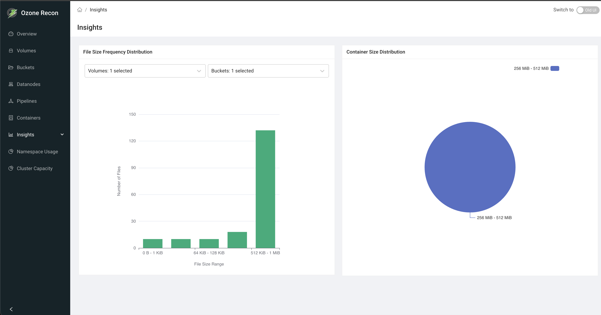

# Recon UI — Insights Page

## 1. Page Overview

The **Insights** page visualizes how data is distributed across the cluster by
size. It shows two charts: a **File Size Frequency Distribution** (how many
files fall into each size range) and a **Container Size Distribution** (how
containers are spread across size ranges). The file chart can be narrowed to
specific volumes and buckets.

It is a read-only analytics page for understanding data-size patterns — for
example, whether the cluster is dominated by many small files or a few large
ones.

> Note: this is the **Insights** page. A separate **OM DB Insights** page
> covers open keys, keys pending deletion, and related OM database details.

## 2. When to Use This Page

- To understand the file-size profile of the cluster or of a specific bucket.
- To detect a "small files problem" (a very high count of tiny files).
- To see how containers are distributed by size.
- To compare data-size patterns between volumes or buckets.

## 3. How to Access the Page

Open the **Insights** entry in the left navigation menu, or go to the
`/Insights` route directly.

## 4. Information Displayed

The page header shows the title. While data loads, a **"Charts are being
loaded"** message is shown. Once loaded, two cards appear side by side.

### File Size Frequency Distribution (bar chart)

- A bar chart where the **x-axis** is the file-size range (for example
  `512 KiB - 1 MiB`) and the **y-axis** is the **Number of Files** in that
  range.
- Ranges are power-of-two size buckets; hovering a bar shows the exact size
  range and count.
- Two filters above the chart:
  - **Volumes** — multi-select (with search and select-all) to include specific
    volumes.
  - **Buckets** — multi-select, enabled only when exactly one volume is
    selected; it lists that volume's buckets.

### Container Size Distribution (pie chart)

- A pie chart of containers grouped into size ranges; each slice is a range and
  its value is the number of containers in that range.
- Hovering a slice shows the size range and container count.
- This chart has no volume/bucket filter (containers are not tied to a single
  bucket).

## 5. Available Actions

- **Volumes filter** (file chart) — choose which volumes to include; supports
  search and select-all.
- **Buckets filter** (file chart) — choose buckets within a single selected
  volume. It is disabled when more than one volume is selected (unless the
  cluster has only one volume).
- **Chart tooltips** — hover any bar or slice for the exact size range and count.

There is no auto-refresh panel, search box, table, or download on this page.

## 6. How to Interpret the Information

- **Tall bars at small size ranges:** many small files. A very large count of
  tiny files can hurt performance and metadata scaling (the "small files
  problem").
- **Bars concentrated at large size ranges:** the cluster is dominated by large
  files.
- **Container pie skewed to small ranges:** many small or partially filled
  containers; skewed to large ranges means containers are well filled.
- **Filtering the file chart:** select a single volume, then its buckets, to see
  the size profile for just that bucket — useful for comparing workloads.
- **"No Data" result:** the corresponding metric has no data yet (for example a
  new cluster with no files). This is expected, not an error.
- **Error banner inside a chart** ("No data available. …"): the underlying data
  could not be fetched.

## 7. Common Use Cases

1. **Diagnose a small-files problem.** Open the file chart for the whole cluster
   and check whether the smallest size ranges dominate the file count.
2. **Profile one bucket.** Select a single volume and one of its buckets to see
   that bucket's file-size distribution in isolation.
3. **Assess container fill.** Use the container pie chart to judge whether
   containers are mostly small (poorly filled) or large (well filled).

## 8. Important Notes and Limitations

- **Data source and freshness.** Both charts are built from counts Recon
  maintains in its own database (file-count-by-size and container-count-by-size),
  populated by Recon background tasks that process its copy of the Ozone Manager
  (OM) data and container information. The charts reflect the last time those
  tasks ran, not real time.
- **Bucket filter needs a single volume.** The Buckets filter is only active when
  exactly one volume is selected; with multiple volumes it is disabled.
- **Size ranges are power-of-two buckets**, so exact per-file sizes are not
  shown — only how many files fall into each range.
- The page has **no manual refresh control**; reload the page to re-fetch.
- On no data, each chart shows a "No Data" message independently.

## 9. Related Pages

- **OM DB Insights** — open keys, keys pending deletion, and OM database
  details.
- **Namespace Usage** — size usage explored by path rather than by size range.
- **Containers** — container health and per-state detail.
- **Overview** — cluster-wide totals.
