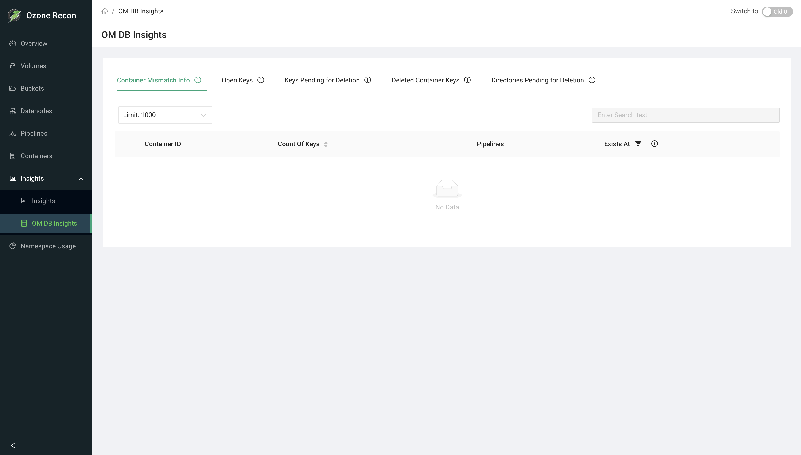

# Recon UI — OM DB Insights Page

## 1. Page Overview

The **OM DB Insights** page exposes detail from the Ozone Manager (OM) database
and how it lines up with SCM's container view. It is organized into five tabs:
container mismatches between OM and SCM, open (uncommitted) keys, keys pending
deletion, keys mapped to deleted containers, and directories pending deletion.

It is the drill-down destination for the Open Keys and Delete Pending Keys
summaries on the Overview page, and the main place to investigate deletion
backlogs and OM/SCM inconsistencies.

> Note: this is the **OM DB Insights** page. The separately named **Insights**
> page covers file-size and container-size charts.

## 2. When to Use This Page

- To investigate a growing backlog of keys or directories pending deletion.
- To find open keys that were never committed (possible leaked/abandoned writes).
- To find containers that exist in OM but not SCM (or vice versa).
- To see which keys map to containers SCM has marked deleted.
- To list the keys inside a specific container.

## 3. How to Access the Page

Open the **OM DB Insights** entry in the left navigation menu, or go to the
`/Om` route directly. From the **Overview** page, the **Open Keys Summary** card
opens this page on the Open Keys tab, and the **Delete Pending Keys Summary**
card opens it on the Keys Pending for Deletion tab.

## 4. Information Displayed

The page header shows the title. Below it are five tabs. Each tab has a **Limit**
selector and a table; some tables allow row expansion to list the affected keys.

### Tab 1 — Container Mismatch Info

Containers present in OM but missing in SCM, or the reverse. Columns:

- **Container ID**
- **Count Of Keys** — number of keys in the container.
- **Pipelines** — the pipelines involved.
- **Exists at** — where the container exists (OM or SCM).

A toggle switches between containers **missing in OM** and **missing in SCM**.
Rows expand to show the keys in the container.

### Tab 2 — Open Keys

Keys that are being written but not yet committed. Columns:

- **Key Name**
- **Size**
- **Path**
- **In state since** — how long the key has been open.
- **Replication Type** and **Replication Factor**
- **Type** — FSO or Non-FSO.

A toggle switches between **FSO** and **Non-FSO** keys.

### Tab 3 — Keys Pending for Deletion

Keys awaiting deletion. Columns:

- **Key Name**
- **Path**
- **Total Data Size**
- **Total Key Count**

Rows expand to show the individual pending-delete key entries.

### Tab 4 — Deleted Container Keys

Keys mapped to containers that SCM has marked as **DELETED**. Columns:

- **Container ID**
- **Count Of Keys**
- **Pipelines**

Rows expand to show the keys in the container.

### Tab 5 — Directories Pending for Deletion

Directories awaiting deletion. Columns:

- **Directory Name**
- **In state since**
- **Path**
- **Size**

### Expanded key table (shared)

When a container row is expanded, the keys are listed with **Volume**,
**Bucket**, **Key**, **Size**, **Date Created**, and **Date Modified**.

## 5. Available Actions

- **Tabs** — switch between the five views.
- **Limit** selector — how many rows to fetch (1000, 5000, 10000, 20000; default
  1000). The selection is shared across tabs.
- **Toggles:**
  - Container Mismatch: **missing in OM** vs **missing in SCM**.
  - Open Keys: **FSO** vs **Non-FSO**.
- **Search** — filter the loaded rows within a tab.
- **Row expand** — on the container-based tabs, expand a row to load and view
  its keys.
- **Pagination** — page through rows; the footer shows the range and total.

There is no auto-refresh panel on this page.

## 6. How to Interpret the Information

- **Container Mismatch entries:** a healthy cluster generally has none. Entries
  can appear transiently while OM and SCM converge; persistent mismatches warrant
  investigation. The **Exists at** column tells you which service still has the
  container.
- **Open Keys that are old (large "In state since"):** may be abandoned or
  leaked writes holding space; a large open-keys total also shows on the Overview
  Open Keys summary.
- **Keys / Directories Pending for Deletion growing over time:** the background
  deletion services may be falling behind; a steadily rising backlog is the
  signal to investigate.
- **Deleted Container Keys:** keys still referencing containers SCM considers
  deleted — useful when tracing why space is not being reclaimed.
- **FSO vs Non-FSO:** file-system-optimized buckets vs object-store/legacy
  buckets; the toggle lets you look at each layout's open keys separately.

## 7. Common Use Cases

1. **Diagnose a deletion backlog.** From the Overview Delete Pending Keys card,
   land on the Keys Pending for Deletion tab, raise the Limit, and review total
   size and counts to gauge the backlog.
2. **Find leaked open keys.** On the Open Keys tab, sort/scan by "In state since"
   to find keys that have been open a long time and were likely never committed.
3. **Investigate OM/SCM drift.** On the Container Mismatch tab, toggle between
   missing-in-OM and missing-in-SCM and expand rows to see exactly which keys are
   affected.

## 8. Important Notes and Limitations

- **Data source and freshness.** All tabs read from Recon's own copy of the OM
  database (and its comparison against SCM's container view for the mismatch
  tabs), updated by periodic sync. Values reflect the last sync, not real time,
  and there is no auto-refresh control on this page — reload to re-fetch.
- **Limit caps the result set.** Only up to the selected limit of rows is
  fetched per tab; raise the limit on large clusters, keeping in mind larger
  limits take longer to load.
- **Search applies to the loaded rows only.**
- **Mismatches can be transient** during normal OM/SCM synchronization and do not
  always indicate a problem.
- On an error, the page shows a data-fetch error and the affected table stays
  empty.

## 9. Related Pages

- **Overview** — the Open Keys and Delete Pending Keys summary cards link here.
- **Containers** — container health and unhealthy-state detail.
- **Insights** — file-size and container-size distribution charts.
- **Namespace Usage** — size usage explored by path.
