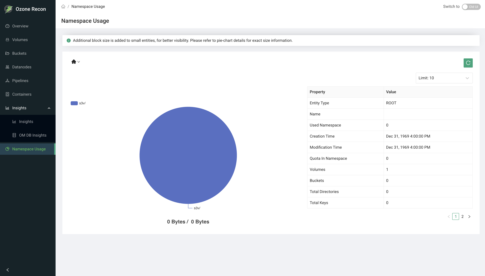

# Recon UI — Namespace Usage Page

## 1. Page Overview

The **Namespace Usage** page (also called Disk Usage) lets you explore how
storage is consumed across the Ozone namespace. Starting from a path, it shows a
pie chart of the largest sub-paths by size and a metadata table describing the
selected entity (volume, bucket, directory, or key). You can drill down into
sub-paths to find what is using the most space.

It is an interactive, read-only explorer for capacity investigation at the
namespace level.

## 2. When to Use This Page

- To find which volumes, buckets, or directories are consuming the most space.
- To drill down a path and locate large sub-directories or keys.
- To inspect the metadata and quota of a specific volume, bucket, directory, or
  key.
- To compare a path's logical size against its size with replication.

## 3. How to Access the Page

Open the **Namespace Usage** entry in the left navigation menu, or go to the
`/NamespaceUsage` route directly.

## 4. Information Displayed

The page header shows the title. Below it are informational banners, a
breadcrumb navigator, a limit selector, a pie chart, and a metadata table.

### Banners

- An **info** banner explaining that a small amount of extra block size is added
  to small entities in the chart for visibility, and that the pie-chart tooltip
  shows exact sizes.
- At the root path (`/`), a **warning** banner noting that root-path usage can
  be expensive in large deployments and suggesting you enter an exact path.

### Breadcrumb navigator

Shows the current path and lets you move up or down the namespace. Selecting a
segment or sub-path reloads the chart and metadata for that location.

### Pie chart

A pie of the current path's sub-paths by size:

- Each slice is a sub-path; keys are shown with no trailing slash and
  directories with a trailing `/`.
- If there are more sub-paths than the selected limit (or leftover size beyond
  the shown slices), the remainder is grouped into an **Other Objects** slice.
- The chart title shows the currently selected size against the total (for
  example, `12 GB / 40 GB`).
- Hovering a slice shows its exact **Total Data Size** and **Percentage**.
- Toggling slices in the chart updates the selected-size shown in the title.

### Metadata table

A **Property / Value** table describing the current entity. Depending on the
entity type, it can include:

- **Entity Type** (volume, bucket, directory, or key).
- Object information such as Volume, Bucket, Name, Owner, Storage Type, Bucket
  Layout, Used Namespace, and (for linked entities) Source Volume / Source
  Bucket.
- **Creation Time** and **Modification Time**.
- **Used Bytes** / **Data Size**.
- **Quota In Namespace**, **Quota Allowed**, and **Quota Used** (only when a
  quota is set).
- Replication details: **Replication Factor**, **Replication Type**, and
  **Replication Required Nodes**.
- Counts for container-like paths: **Volumes**, **Buckets**, **Total
  Directories**, **Total Keys**.
- For a **key**, a focused view with **File Size** and **File Size With
  Replication** plus creation and modification times.

## 5. Available Actions

- **Breadcrumb navigation** — click path segments or sub-paths to drill in and
  out.
- **Limit** selector — how many sub-paths to show as individual slices: 5, 10,
  15, 20, or 30 (default 10). Sub-paths beyond the limit roll into **Other
  Objects**.
- **Reload** button — re-fetches usage for the current path. At the root path it
  re-triggers the root-path load confirmation.
- **Load usage / root-path confirmation** — at the root path, usage is not
  loaded automatically. You must click **Load usage** and confirm the
  "expensive operation" dialog before root usage is calculated.
- **Pie-chart interactions** — hover a slice for exact size and percentage;
  toggle slices to update the selected-size total.

## 6. How to Interpret the Information

- **Slice size vs. Other Objects:** the largest slices are the biggest consumers
  at the current level. A large **Other Objects** slice means much of the usage
  is spread across sub-paths beyond the selected limit — raise the limit or drill
  in to see them.
- **Extra block size note:** very small entities are padded slightly in the
  chart so they remain visible; always trust the tooltip's exact size over the
  slice's apparent area.
- **Size vs. Size With Replication:** the plain size is logical data; the
  replicated size reflects the physical space used after replication.
- **Quota Allowed vs. Quota Used:** how close the entity is to its configured
  quota; absent when no quota is set.
- **Status messages:**
  - **INITIALIZING** — Recon is still building its namespace summary; wait and
    retry.
  - **PATH_NOT_FOUND / Invalid Path** — the entered path does not exist.

## 7. Common Use Cases

1. **Find the biggest space consumer.** Enter a bucket path, review the pie
   chart, and drill into the largest slice repeatedly until you reach the
   directory or key responsible.
2. **Inspect a specific key.** Navigate to a key to see its File Size, File Size
   With Replication, and timestamps in the metadata table.
3. **Check quota headroom.** Open a volume or bucket and compare Quota Used
   against Quota Allowed to decide whether to raise the quota.

## 8. Important Notes and Limitations

- **Root path is not loaded by default.** Because computing usage from `/` can be
  expensive on large clusters, you must explicitly click **Load usage** and
  confirm. Entering an exact path loads directly without the prompt.
- **Data source and freshness.** Usage, summary, and quota data come from
  Recon's namespace summary, which Recon builds from its copy of the Ozone
  Manager (OM) database. If it is still building, the page reports
  **INITIALIZING**; wait and retry.
- **Limit affects the chart only.** It controls how many sub-paths are drawn as
  individual slices; the rest are grouped into **Other Objects**.
- **Small entities are visually padded** in the chart; use the tooltip for exact
  values.
- On an invalid path or fetch error, the page shows an error notification.

## 9. Related Pages

- [Volumes](./volumes) and [Buckets](./buckets) — the entities whose usage you explore here.
- [Overview](./overview) — cluster-wide capacity and object totals.
- [Capacity](./capacity) — cluster-level storage breakdown.
