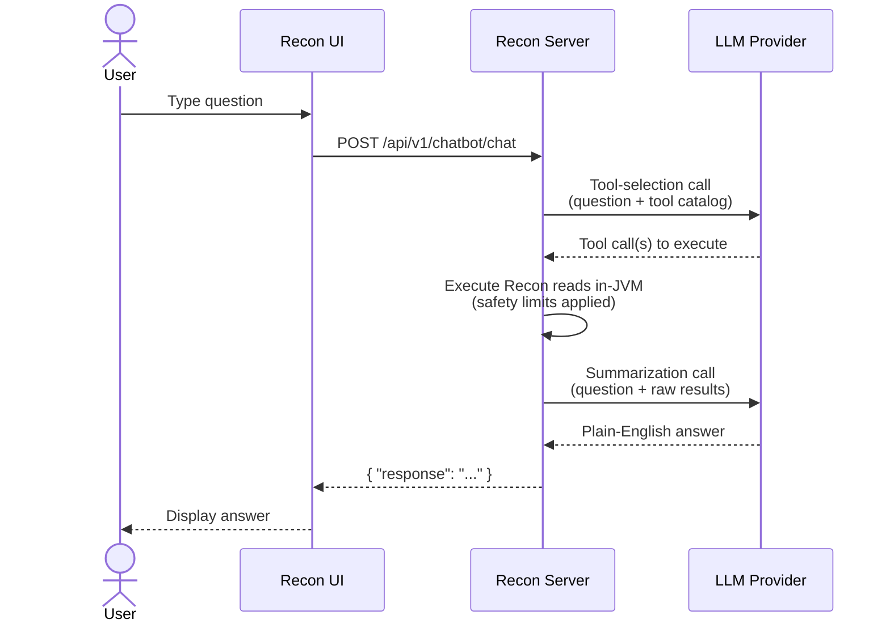

# Recon AI Assistant

The **Recon AI Assistant** lets you ask questions about your Apache Ozone cluster in plain English
and get answers assembled from the data Recon already collects. It is an optional, **disabled by
default**, experimental feature of the Recon service.

> **Note:** This page is for operators (who enable, secure, configure and run the assistant) and end
> users (who ask it questions). It is not a code walkthrough; contributors can find the internal flow
> in `CODE_FLOW.md` next to the chatbot source.

## 1. Overview

Recon continuously derives a large amount of cluster metadata - container health and replica state,
namespace and usage rollups, open and pending-delete keys, datanode and pipeline status, background
task and sync state - and exposes it across many REST endpoints and UI screens. In practice most of
that information is never seen or correlated, because you have to know which endpoint or screen holds
the answer.

The assistant closes that gap: you ask a question, and it decides which Recon view(s) answer it, runs
those reads, and writes back a readable summary.

**What it is not:**

- It is **not** a query engine that runs server-side aggregations across all cluster data - it
  reports what individual Recon endpoints return. The `LLM` may reason over the data it receives (for
  example, count or compare items in a result set), but it does not issue cross-endpoint joins or
  scan unbounded datasets server-side.
- It is **read-only** - it never mutates the cluster.
- Its results are **bounded** (at most 1000 records per read - see [Limits](#11-limits--boundary-conditions)).
- Its answers reflect Recon's **last metadata sync**, not the live cluster state.

> **Important:** The assistant calls an **external `LLM` provider**, so cluster metadata leaves your
> network when it is used. Read [Data sent to third-party providers](#5-data-sent-to-third-party-llm-providers)
> before enabling it. The feature is marked **Beta** and may change between releases.

## 2. Architecture at a glance

At a high level a question flows through three steps:

1. **Tool selection** - the assistant asks the `LLM` which Recon view(s) can answer the question.
2. **In-process execution** - Recon runs those reads inside the Recon JVM (no HTTP loopback), with
   hard safety limits applied.
3. **Summarization** - the raw results are sent back to the `LLM`, which writes the final answer.



The assistant is **provider-agnostic**: OpenAI, Google Gemini, and Anthropic are all reachable behind
one interface (see [Supported providers & models](#supported-providers)).

## 3. Supported providers & models {#supported-providers}

The assistant supports **three** `LLM` providers. You configure one (or more) by supplying an API key;
a provider with no key is simply unavailable.

| Provider | Reached via | Notes |
|---|---|---|
| **OpenAI** | Native OpenAI API (`https://api.openai.com`) | Standard chat-completions API. |
| **Google Gemini** | Google's **OpenAI-compatible** endpoint (`https://generativelanguage.googleapis.com/v1beta/openai/`) | Used instead of the native Gemini client for reliable timeout handling. |
| **Anthropic (Claude)** | Native Anthropic API | Sends a beta header for the 1M-token context window (`anthropic.beta.header`). |

**Default model lists** (configurable without a code change; surfaced by `GET /chatbot/models`):

| Provider | Config key | Default models |
|---|---|---|
| OpenAI | `ozone.recon.chatbot.openai.models` | `gpt-4.1, gpt-4.1-mini, gpt-4.1-nano` |
| Gemini | `ozone.recon.chatbot.gemini.models` | `gemini-2.5-pro, gemini-2.5-flash, gemini-3-flash-preview, gemini-3.1-pro-preview` |
| Anthropic | `ozone.recon.chatbot.anthropic.models` | `claude-opus-4-6, claude-sonnet-4-6` |

The **default selection** is provider `gemini`, model `gemini-2.5-flash`.

> **Tip - reasoning vs. fast models:** "Reasoning" models (for example `gemini-2.5-pro`) spend output
> tokens on internal thinking and are slower and more token-hungry; "fast" models (for example
> `gemini-2.5-flash`) return snappier answers. For an interactive assistant, prefer a fast model as
> the default and reserve reasoning models for harder questions.

### Provider & model routing (fallback behavior)

A request may name a `provider` and/or `model`, but the assistant resolves them against what is
actually configured. This explains why an answer can come from a different model than requested:

- A requested **provider** is honored only if it is **configured** (has an API key). Otherwise the
  provider is inferred from the requested model; if that fails, the **default provider** is used.
- A requested **model** is used only if it appears in a configured model list. Otherwise the
  **default model** is used.
- If the resolved model is not valid for the resolved provider, **both reset to the defaults**.

## 4. Prerequisites & network egress

Before enabling the assistant:

- Recon is deployed and running.
- You have an account and API key for at least one supported provider.
- The **Recon server** can make **outbound HTTPS** calls to the configured provider endpoint(s)
  (public cloud API or an in-VPC gateway — see [Supported providers](#supported-providers)). Only
  the Recon server needs egress; end users' browsers do not.

> **Note:** In firewalled or proxied environments, allowlist the provider hostnames on HTTPS (443),
> or route through your outbound proxy. In air-gapped or strict-egress environments, either leave
> the feature disabled, or set the relevant `*.base.url` config key to an internal endpoint that
> speaks the OpenAI-compatible chat-completions API — for example a self-hosted vLLM, Ollama, or a
> private LiteLLM gateway running inside your network. When using such a gateway, set the matching
> `*.api.key` to any non-empty placeholder value if the gateway does not require authentication. See
> [Base URL overrides](#configuration-reference) in the Configuration reference for the exact key
> names.

Each concurrent query holds one Recon worker thread for its full duration (up to two `LLM` calls plus
up to five Recon reads), so size the thread pool to your expected concurrency (see
[Configuration reference](#configuration-reference)).

## 5. Data sent to third-party `LLM` providers

Because the assistant calls an external provider, you should understand exactly what leaves your
cluster before enabling it.

**Transmitted to the provider:**

- The user's **question text**.
- The **system prompts** (the catalog of Recon tools and the semantic guide describing them).
- The **raw JSON results** of the Recon reads used to answer - this is cluster **metadata** such as
  volume / bucket / key names, paths, container and pipeline IDs, sizes, counts, and health states.
- A second round-trip containing those results for **summarization**.

**Not transmitted:**

- Ozone object **data** (file contents) - only metadata is ever read.
- Any credential beyond the provider's own API authentication.

> **Warning:** Object **names and paths are themselves potentially sensitive** - real volume, bucket,
> and key names can reveal business or data structure. The 1000-record cap bounds the *volume* of
> data sent, not its sensitivity.

**Controls and mitigations:**

- Keep the feature **disabled** where data-egress policy forbids sending metadata off-cluster.
- Encourage **scoped** queries (a specific volume/bucket/path) so less data is read and sent.
- Point `*.base.url` at a **self-hosted or in-VPC** OpenAI-compatible endpoint to avoid public egress.
- Review each provider's **data-retention and training** policy.
- **Restrict access** to the Recon chat endpoint, since all users share the server-configured key.

## 6. Managing API keys (secure vs. insecure storage) {#managing-api-keys}

API keys are resolved **server-side only** - they are never accepted per request, and every chat user
shares the single admin-configured key. (This is why you should gate who can reach the endpoint.)

**Resolution order** (handled by Recon's `CredentialHelper`):

1. The Hadoop Credential Provider (`JCEKS`), if `hadoop.security.credential.provider.path` is set.
2. A plaintext value in `ozone-site.xml` (backward-compatible fallback).

### Insecure: plaintext in `ozone-site.xml` (dev/test only)

```xml
<property>
  <name>ozone.recon.chatbot.gemini.api.key</name>
  <value>YOUR_API_KEY</value>
</property>
```

> **Warning:** Plaintext keys are readable by anyone who can read `ozone-site.xml`. Use this only for
> local development or testing, never in production.

### Secure: Hadoop Credential Provider (`JCEKS`) - recommended

The credential **alias must equal the config key name** (for example
`ozone.recon.chatbot.gemini.api.key`).

1. Create the keystore and add each secret:

   ```bash
   hadoop credential create ozone.recon.chatbot.gemini.api.key \
     -provider localjceks://file/etc/security/recon-keys.jceks
   ```

   Repeat for `ozone.recon.chatbot.openai.api.key` and
   `ozone.recon.chatbot.anthropic.api.key` as needed. The command prompts for the secret value.

2. Point Recon at the keystore in `ozone-site.xml`:

   ```xml
   <property>
     <name>hadoop.security.credential.provider.path</name>
     <value>localjceks://file/etc/security/recon-keys.jceks</value>
   </property>
   ```

3. Protect the keystore. Restrict file permissions (for example `chmod 600`, owned by the Recon
   service user) and supply the keystore password out-of-band - for example via
   `HADOOP_CREDSTORE_PASSWORD` or a password file - rather than relying on the default.

4. Restart Recon and verify with `GET /api/v1/chatbot/health` (`llmClientAvailable` should be `true`).

**Rotation / removal:** update or delete the alias with `hadoop credential create` / `hadoop
credential delete`, then restart Recon. If a key is missing, that provider is simply unavailable; the
feature still works through any other configured provider.

| Environment | Recommended storage |
|---|---|
| Local dev / testing | `ozone-site.xml` (plaintext) |
| Production | Hadoop Credential Provider (`JCEKS`) |

## 7. Getting started

1. Enable the feature:

   ```xml
   <property>
     <name>ozone.recon.chatbot.enabled</name>
     <value>true</value>
   </property>
   ```

2. Choose a provider and model (defaults are `gemini` / `gemini-2.5-flash`).
3. Supply an API key - see [Managing API keys](#managing-api-keys).
4. Restart Recon and verify:
   - `GET /api/v1/chatbot/health`
   - `GET /api/v1/chatbot/models`
   - open the assistant panel in the Recon UI.

When the feature is disabled, none of its components are wired in and it cannot affect Recon.

## 8. Configuration reference {#configuration-reference}

All keys are under the prefix `ozone.recon.chatbot.`.

### Feature toggle

| Key | Default | Description |
|---|---|---|
| `enabled` | `false` | Master switch for the assistant. Off by default. |

### Provider & model

| Key | Default | Description |
|---|---|---|
| `provider` | `gemini` | Default provider: `openai`, `gemini`, or `anthropic`. |
| `default.model` | `gemini-2.5-flash` | Default model when none is requested or the requested one is unavailable. |

### API keys (see Section 6)

| Key | Default | Description |
|---|---|---|
| `openai.api.key` | _(none)_ | OpenAI API key. Prefer `JCEKS` storage. |
| `gemini.api.key` | _(none)_ | Gemini API key. Prefer `JCEKS` storage. |
| `anthropic.api.key` | _(none)_ | Anthropic API key. Prefer `JCEKS` storage. |

### Base URL overrides

| Key | Default | Description |
|---|---|---|
| `openai.base.url` | `https://api.openai.com` | Override to target an OpenAI-compatible gateway. |
| `gemini.base.url` | `https://generativelanguage.googleapis.com/v1beta/openai/` | Gemini's OpenAI-compatible endpoint. |

### Execution policy

| Key | Default | Description |
|---|---|---|
| `exec.require.safe.scope` | `true` | Require a bucket-scoped prefix for key listings. Keep enabled in production (see [Limits](#11-limits--boundary-conditions)). |
| `max.tool.calls` | `5` | Maximum number of Recon reads a single question may trigger. |

### Concurrency & timeouts

| Key | Default | Description |
|---|---|---|
| `thread.pool.size` | `5` | Worker threads for chatbot requests. Size to expected concurrent users. |
| `max.queue.size` | `10` | Requests that may wait when all threads are busy; beyond this, clients get HTTP 503. |
| `timeout.ms` | `120000` | Timeout for a single provider call (ms). |
| `request.timeout.ms` | `180000` | Overall per-request wall-clock timeout (ms); exceeding it returns HTTP 504. Default is 3 minutes. |

### Model lists (UI dropdown)

| Key | Default |
|---|---|
| `openai.models` | `gpt-4.1, gpt-4.1-mini, gpt-4.1-nano` |
| `gemini.models` | `gemini-2.5-pro, gemini-2.5-flash, gemini-3-flash-preview, gemini-3.1-pro-preview` |
| `anthropic.models` | `claude-opus-4-6, claude-sonnet-4-6` |

### Anthropic header

| Key | Default | Description |
|---|---|---|
| `anthropic.beta.header` | `context-1m-2025-08-07` | Anthropic beta header (enables the 1M-token context window). Set empty to disable. |

## 9. Using the assistant - what you can ask

<video controls width="100%" style={{maxWidth: '800px'}}>
  <source src="/img/recon-ai-assistant-demo.mp4" type="video/mp4" />
  Your browser does not support the video tag.
</video>

Ask by **intent**; the assistant maps your question to the right Recon view. It can answer questions
about:

- **Cluster & capacity** - overall health, storage used/available.
- **Datanodes** - inventory, health, dead/stale nodes.
- **Pipelines** - inventory, leaders, members, state.
- **Containers** - inventory and health: unhealthy, missing, deleted, OM/SCM mismatch, quasi-closed.
- **Keys** - committed key listings, open/uncommitted keys, pending-delete keys, multipart uploads.
- **Volumes & buckets** - inventory, ownership, layout, quotas.
- **Namespace** - disk usage, object counts, quota usage, file-size distribution for a path.
- **Tasks** - Recon background task and sync status.

**Example questions:** "How much storage is used?", "Are any containers under-replicated?", "Show
open keys in `/vol1/bucket1`", "List buckets in volume `sales`", "What is the disk usage of
`/vol1/bucket1`?", "Did any Recon task fail?".

**Conceptual questions** (for example "What is an FSO bucket?") are answered directly, without reading
cluster data.

**What it cannot do** (it will decline and suggest the nearest supported view rather than guess):
per-container replica timelines, raw block-to-key mapping, any mutation, and arbitrary computation.

> **Tip:** Name the volume and bucket, and say "open" when you mean uncommitted keys. FSO/OBS is a
> bucket *layout*, not a key *state* - "FSO keys" means committed keys in an FSO bucket, while "open
> FSO keys" means uncommitted keys.

### Example: Filtering by Storage Mode

You can ask the assistant to filter results based on the storage mode (OBS or FSO). For example, you can request only the open keys of type OBS:


Or request only the open keys of type FSO:


You can also ask the assistant to list all open keys and categorize them by their storage mode:


## 10. Tool (endpoint) reference

These are the Recon views the assistant can call. This list mirrors the in-code catalog (see
[Extending](#14-extending-the-assistant-for-new-recon-features)).

| Group | Tool | Answers |
|---|---|---|
| Cluster | `api_v1_clusterState` | Overall cluster snapshot (capacity, counts, health). |
| Cluster | `api_v1_datanodes` | Datanode inventory and health. |
| Cluster | `api_v1_pipelines` | Pipeline inventory, leaders, members, state. |
| Containers | `api_v1_containers` | General container inventory. |
| Containers | `api_v1_containers_missing` | Missing / lost containers. |
| Containers | `api_v1_containers_unhealthy` | All unhealthy containers (aggregate). |
| Containers | `api_v1_containers_unhealthy_state` | Unhealthy containers filtered to one state. |
| Containers | `api_v1_containers_deleted` | Containers deleted in SCM. |
| Containers | `api_v1_containers_mismatch` | OM/SCM existence mismatches. |
| Containers | `api_v1_containers_mismatch_deleted` | Deleted in SCM but still present in OM. |
| Containers | `api_v1_containers_quasiClosed` | Quasi-closed containers. |
| Containers | `api_v1_containers_unhealthy_export` | Export jobs for unhealthy-container data. |
| Keys | `api_v1_keys_open` | Open / uncommitted keys (detailed). |
| Keys | `api_v1_keys_open_summary` | Open-key totals. |
| Keys | `api_v1_keys_open_mpu_summary` | Open multipart-upload totals. |
| Keys | `api_v1_keys_deletePending` | Keys pending deletion (detailed). |
| Keys | `api_v1_keys_deletePending_summary` | Pending-delete key totals. |
| Keys | `api_v1_keys_deletePending_dirs` | Directories pending deletion. |
| Keys | `api_v1_keys_deletePending_dirs_summary` | Pending-delete directory totals. |
| Keys | `api_v1_keys_listKeys` | Committed key/file listing and filtering. |
| Namespace | `api_v1_volumes` | Volume inventory. |
| Namespace | `api_v1_buckets` | Bucket inventory (optionally by volume). |
| Namespace | `api_v1_namespace_summary` | Object counts under a path. |
| Namespace | `api_v1_namespace_usage` | Disk usage for a path. |
| Namespace | `api_v1_namespace_quota` | Quota limit vs. usage for a path. |
| Namespace | `api_v1_namespace_dist` | File-size distribution under a path. |
| Utilization | `api_v1_utilization_fileCount` | File-count distribution by size tier. |
| Utilization | `api_v1_utilization_containerCount` | Container-count distribution by size tier. |
| Tasks | `api_v1_task_status` | Recon background task and sync status. |

## 11. Limits & boundary conditions

The assistant is a bounded, read-only summarizer - not a query engine. Keep these in mind when
interpreting answers:

- **At most 1000 records per read, no pagination.** Answers are a **sample / first page**, not the
  full dataset. Narrow the scope (path prefix, filters) to see more.
- **Not randomized.** A request for a "random sample" returns the first page and is presented as a
  sample, not a true random draw.
- **Not a computing engine.** It reports what endpoints return; it does not run ad-hoc aggregations,
  joins, or math across the cluster.
- **Safe-scope for key listings.** When `exec.require.safe.scope` is enabled (default), listing keys
  requires a bucket-scoped prefix (`/<volume>/<bucket>` or deeper), preventing full-cluster scans.
- **Sync freshness.** Answers reflect Recon's **last successful OM/SCM metadata sync**, not the live
  cluster. Recon syncs on a configurable interval, so very recent changes may not appear yet; ask
  about task/sync status (`api_v1_task_status`) to gauge freshness.
- **Bounded concurrency and time.** Requests beyond pool + queue capacity get HTTP 503; requests
  exceeding `request.timeout.ms` get HTTP 504.
- **No conversation memory.** Each query is independent - the assistant does not retain context from
  previous questions in the same session. If a follow-up question relies on a prior answer, repeat
  the relevant detail in the new query.
- **Honest answers.** Truncation, empty results, and sampling are called out in the response text.

## 12. REST API endpoints

The assistant is exposed under `/api/v1/chatbot`.

### `POST /api/v1/chatbot/chat`

Request (`model`, `provider`, and `userId` are optional):

```json
{
  "query": "How many datanodes are healthy?",
  "model": "gemini-2.5-flash",
  "provider": "gemini",
  "userId": "alice"
}
```

Response:

```json
{ "response": "...", "success": true }
```

### `GET /api/v1/chatbot/health`

Always returns HTTP 200 with the current state. `llmClientAvailable` is `true` only when the feature
is enabled **and** at least one provider has a usable API key:

```json
{ "enabled": true, "llmClientAvailable": true }
```

### `GET /api/v1/chatbot/models`

Returns the model lists for the configured (key-present) providers - exactly what the UI dropdown
should offer. The list is empty when no provider is configured:

```json
{ "models": ["gemini-2.5-pro", "gemini-2.5-flash"] }
```

### Status codes

| Code | Meaning |
|---|---|
| 200 | Success. |
| 400 | Empty/blank query. |
| 503 | Feature disabled, or the request queue is full (overloaded). |
| 504 | Request exceeded `request.timeout.ms`. |
| 500 | Internal error (details are logged, not returned). |

The `userId` is masked in logs so identities are not leaked.

## 13. Security model

Defenses are layered so that even a fully prompt-injected model cannot make Recon do anything unsafe:

- **Prompt-level** - the model is told the user message is untrusted and to ignore embedded
  instructions.
- **Allowlist** - only the registered Recon tools can ever execute.
- **Safe-scope** - key listings require a bucket-scoped prefix (default).
- **Record cap** - every read is capped at 1000 records.
- **Credential isolation** - API keys are resolved server-side (see
  [Managing API keys](#managing-api-keys)); never per request.
- **Resource bounds** - a bounded thread pool, queue, and per-request timeout.
- **Read-only** - by construction, the assistant only reads Recon metadata.

See also [Data sent to third-party providers](#5-data-sent-to-third-party-llm-providers) for the
data-egress considerations.

## 14. Extending the assistant for new Recon features

The assistant is built to grow with Recon:

- **Tunable semantics live in resources** (the prompt files) and can be edited without recompiling.
- **The tool catalog lives in code** as a small, reviewed set.

To expose a **new** Recon endpoint to the assistant:

1. Add it to the in-code catalog - a tool spec (name, description, parameters), an allowlist entry,
   and a router case that calls the Recon bean.
2. Document its semantics in `recon-tool-semantics.md` so the model knows when to choose it.

An automated consistency test keeps the catalog, allowlist, and router in sync - adding a tool in
only one place fails the build.

> **Note:** Do not hand-edit the tuned prompt wording. The shipped prompts are tuned for Recon;
> extend the semantic guide for new tools, but otherwise leave the prompts as they are.

## 15. Prompt & resource files

The editable prompt resources live in `hadoop-ozone/recon/src/main/resources/chatbot/`:

| File | Role |
|---|---|
| `recon-tool-selection-prompt-preamble.txt` | Tool-selection rules and prompt-injection defense. |
| `recon-tool-semantics.md` | The per-tool semantic guide. **Extend this when adding a tool.** |
| `recon-summarization-prompt.txt` | Rules for formatting the final answer. |
| `recon-fallback-prompt-template.txt` | Reply used when no tool fits / off-topic questions. |

The shipped versions are tuned for Recon - change them deliberately.

## 16. Troubleshooting & operations

| Symptom | Likely cause / fix |
|---|---|
| Empty answer from a reasoning model (e.g. `gemini-2.5-pro`) | The model spent its token budget "thinking". Prefer a fast model (flash), or raise token limits. |
| Answered by an unexpected model/provider | Routing fallback - the requested provider/model was not configured. See [routing](#provider--model-routing-fallback-behavior). |
| "No API key configured" | Check the provider, the key, and `hadoop.security.credential.provider.path`. |
| HTTP 504 (timeout) / HTTP 503 (overloaded) | Tune `thread.pool.size`, `max.queue.size`, `request.timeout.ms`. |
| Stale answers | Recon sync lag - answers reflect the last sync. Check `api_v1_task_status`. |
| Egress / connection failures | Firewall, proxy, or `*.base.url`. See [Prerequisites & egress](#4-prerequisites--network-egress). |

Logs record request lifecycle and token counts but **not** the query text or any secrets.

## 17. References

- `CODE_FLOW.md` (internal design, for contributors).
- Hadoop Credential Provider API and Ozone security documentation.
- Provider documentation (OpenAI / Gemini / Anthropic), including their data-retention and training
  policies.
