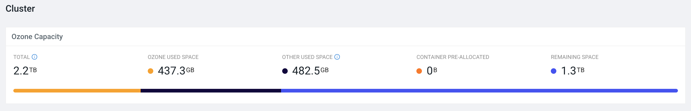
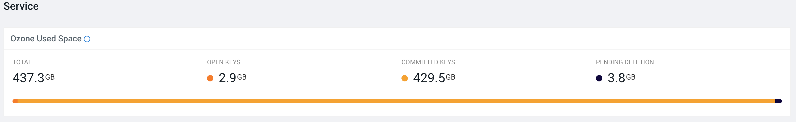
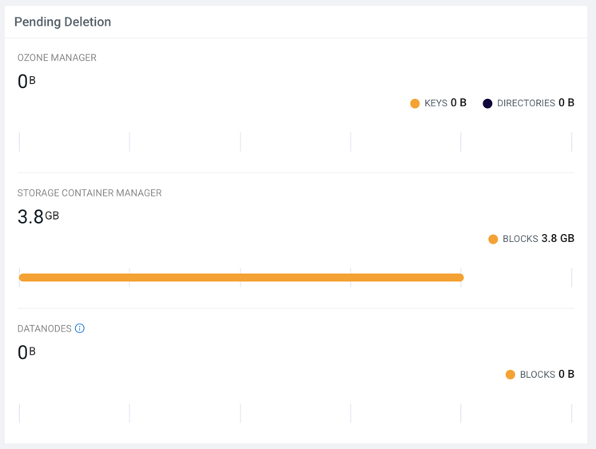
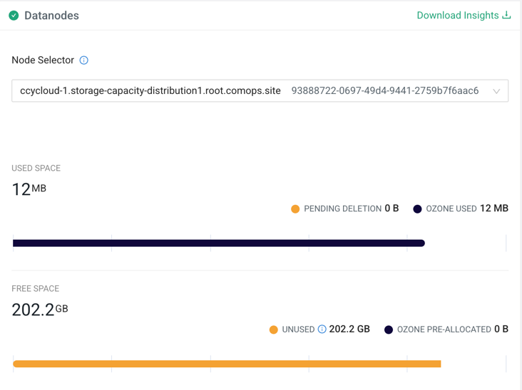

# Cluster Capacity User Guide

This page is the central place for understanding storage distribution across the Ozone cluster.
It moves from a high-level physical view to logical service usage, and down to individual node diagnostics.
Use this guide to understand exactly where your storage capacity is going.

## Dashboard Layout Overview

The Cluster Capacity page is organized logically from top to bottom, increasing in granularity:

1. Cluster Summary: The total physical disk view.
2. Service Summary: The logical state of Ozone data (Open, Committed, Pending Deletion).
3. Pending Deletion & Datanode Insights: Deep dives into data deletion life cycles and individual node performance.

---

## Cluster (Physical Capacity)

The **Cluster** widget provides a high-level summary of the total physical storage managed by Ozone Datanodes. It helps you distinguish between space used by Ozone and space taken by other processes on the underlying hardware.

### Metric Definitions

> Note: All metric values presented here are obtained from a representative sample cluster and are for reference purposes only.

- **Total Capacity (2.2 TB)**  
  The combined capacity of all configured storage directories across all live Datanodes in the cluster.
  It shows how much usable space is available after subtracting the reserved space from the file system capacity.

- **Ozone Used Space (437.3 GB)**  
  Physical space currently occupied by replicated Ozone blocks.
  > Note: This accounts for the replication factor (e.g., a 100 GB key with 3x replication uses 300 GB of physical space).

- **Other Used Space (482.5 GB)**  
  This is the space occupied by other Ozone related files but not actual data stored by Ozone. This may include things like logs, configuration files, Rocks DB files etc.

- **Container Pre-allocated (0 B)**  
  Space reserved for open containers that have been allocated to clients but not yet written to, ensuring capacity is available when needed. This reserved space decreases as data is written to the containers, and any remaining unused portion is released when the containers are closed.

- **Remaining Space (1.3 TB)**  
  The actual amount of unused physical disk space available for new Ozone data or other files.

---

## Service (Logical Capacity)

The **Service** widget transitions from the physical view to the logical view. It breaks down the **Ozone Used Space** based on the state of the keys within the Ozone architecture.

### Ozone Used Space Breakdown

- **Total (437.3 GB)**  
  The sum of all Ozone data currently tracked in the system across all states. This matches the physical Ozone Used Space.

- **Open Keys (2.9 GB)**  
  Data in keys that are currently being written to by clients or have not yet been committed to the system. This data is temporary.

- **Committed Keys (429.5 GB)**  
  Finalized and immutable data that is successfully stored and accessible by users.

- **Pending Deletion (3.8 GB)**  
  Data from keys that have been logically deleted by a user but have not yet been physically scrubbed from the Datanodes. This is the combined total size of data pending deletion across OM, SCM, and Datanodes. This space will eventually be reclaimed.

> 💡 **Administrator Tip:**  
> A high and persistent **Pending Deletion** value might indicate that the automated deletion process is lagging. This guide explains how to investigate that lifecycle in the next section.

---

## Pending Deletion Lifecycle

This widget provides transparency into the multi-stage process of data deletion in Ozone. It tracks how deletion requests flow from the Ozone Manager through the Storage Container Manager to final removal of block on Datanodes.

### Tracking the Stages

- **Ozone Manager (OM) (0 B)**  
  Keys or directories deleted by the client but whose underlying blocks have not yet been processed by SCM.

- **Storage Container Manager (SCM) (3.8 GB)**  
  Blocks that SCM has identified as ready for deletion and is actively trying to command Datanodes to remove.

- **Datanodes (0 B)**  
  Blocks that are queued on the individual Datanodes waiting for physical disk deletion.

> 💡 **Diagnostic Tip:**  
> If SCM shows 1 TB pending deletion but the Datanodes stage shows 0 B, SCM may be having trouble communicating deletion commands to the nodes.

---

## Datanode Insights

The **Datanodes** section moves from the cluster level to individual node performance. This is crucial for identifying imbalances, failing disks, or nodes that are filling up faster than others.

### Using the Datanode Inspector

- **Download Insights**  
  Download a snapshot report of all Datanode storage distribution in CSV format.

- **Node Selector**  
  Use the searchable dropdown to pick a specific Datanode. It displays both the hostname and the unique UUID for precise identification (e.g., `ozone-datanode-1.ozone_defa`).

Once a node is selected, the specific storage charts appear.

### Individual Node Metric Definitions

- **Used Space (Node Level) (12 MB)**  
  Storage distribution on the selected node.

- **Pending Deletion (0 B)**  
  Space occupied by blocks on this node that are queued for immediate physical deletion.

- **Ozone Used (12 MB)**  
  Physical space used by active, replicated Ozone blocks on this specific node.

- **Free Space (Node Level) (202.2 GB)**  
  Remaining capacity on the selected node.

- **Unused (202.2 GB)**  
  Total unused physical disk space available on this specific node.

- **Ozone Pre-allocated (0 B)**  
  Space reserved specifically for Ozone open containers on this node.

> 💡 **Diagnostic Tip:**  
> Compare multiple nodes using the Node Selector. Large discrepancies in **Ozone Used** space can indicate data balancing issues in your cluster.

---
