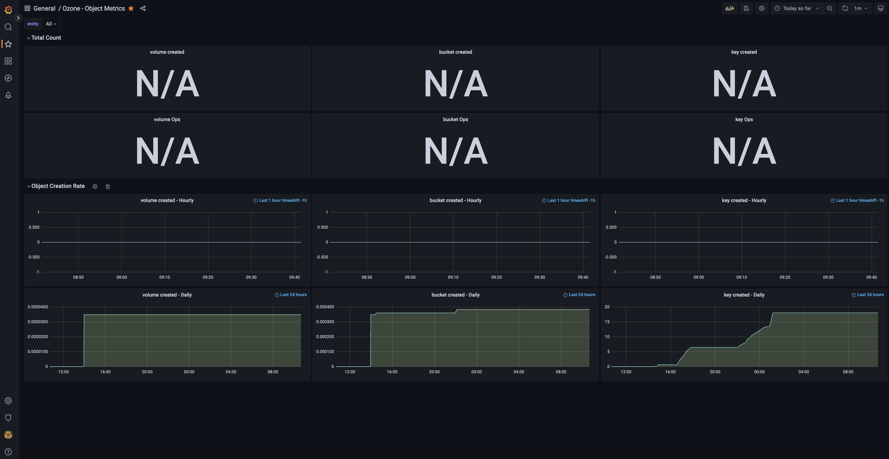
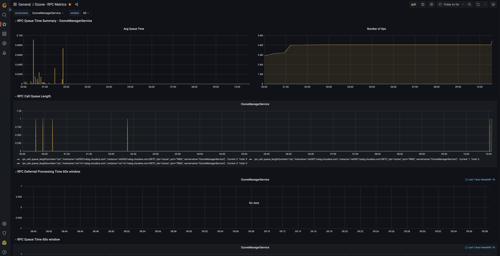

<!---
  Licensed to the Apache Software Foundation (ASF) under one or more
  contributor license agreements.  See the NOTICE file distributed with
  this work for additional information regarding copyright ownership.
  The ASF licenses this file to You under the Apache License, Version 2.0
  (the "License"); you may not use this file except in compliance with
  the License.  You may obtain a copy of the License at

      http://www.apache.org/licenses/LICENSE-2.0

  Unless required by applicable law or agreed to in writing, software
  distributed under the License is distributed on an "AS IS" BASIS,
  WITHOUT WARRANTIES OR CONDITIONS OF ANY KIND, either express or implied.
  See the License for the specific language governing permissions and
  limitations under the License.
-->

# Dashboarding With Grafana

Once Prometheus is up and running, Grana can be configured to monitor and visualize Ozone metrics.

## Add Prometheus as a data source

In the Grafana web UI, go to `Add Data Sources` and then select `Prometheus`.

Enter the Prometheus hostname/port in the `HTTP`. For example, http://localhost:9094 (verify the port used by looking at Prometheus command line flags `-web.listen-address`. The port can also be found from Prometheus web UI → Status → Command-Line Flags.)

Choose Prometheus type: `Prometheus`

Choose Prometheus version: `2.37.x`

Finish the setup by clicking on `Save and Test`.

## Import a Grafana dashboard for Ozone

Apache Ozone comes with a default Grafana dashboard. Follow the instructions below to import it:

Download dashboard json:

```shell
wget https://raw.githubusercontent.com/apache/ozone/master/hadoop-ozone/dist/src/main/compose/common/grafana/dashboards/Ozone%20-%20Overall%20Metrics.json
```

Open Grafana portal and click on Dashboards on the left and select `Import`.

Click at `Upload JSON file` and select the file `Ozone - Overall Metrics.json` that was just downloaded.

The dashboard is now imported.


Repeat the same for [Object Metrics](https://raw.githubusercontent.com/Xushaohong/ozone/master/hadoop-ozone/dist/src/main/compose/common/grafana/dashboards/Ozone%20-%20Object%20Metrics.json) dashboard and [RPC Metrics](https://raw.githubusercontent.com/Xushaohong/ozone/master/hadoop-ozone/dist/src/main/compose/common/grafana/dashboards/Ozone%20-%20RPC%20Metrics.json) dashboard.





More dashboards are constantly being added. Check out the [dashboard repo](https://github.com/apache/ozone/tree/master/hadoop-ozone/dist/src/main/compose/common/grafana/dashboards) for more.

Check out the official Grafana doc [Monitor Apache Ozone with Prometheus and Grafana Cloud](https://grafana.com/docs/grafana-cloud/send-data/metrics/metrics-prometheus/prometheus-config-examples/the-apache-software-foundation-apache-ozone/) for more details.
