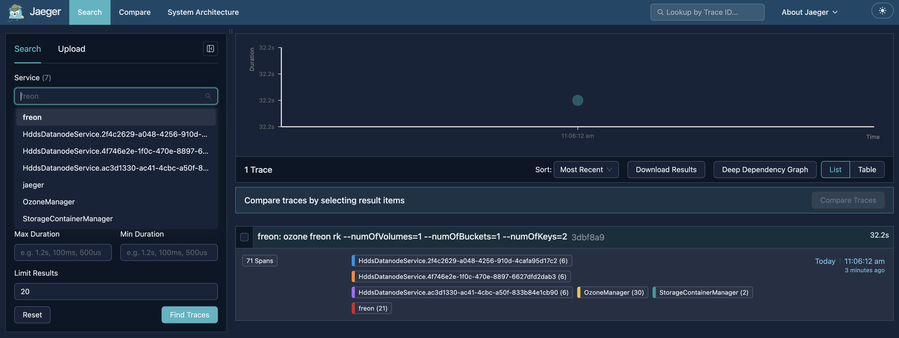

# Distributed tracing

Distributed tracing can help to understand performance bottleneck with visualizing end-to-end performance.
Ozone makes use of [OpenTelemetry](https://opentelemetry.io/) API for tracing and uses OTLP with gRPC format for sending traces.
[jaeger](https://jaegertracing.io) tracing library as collector can collect traces from Ozone over default port 4317 (as default).

## Enabling Tracing

Tracing is turned off by default. To enable it across Ozone services, configure the following property in `ozone-site.xml`:

```xml
<property>
   <name>ozone.tracing.enabled</name>
   <value>true</value>
</property>
```

## Application-Aware Client Tracing

Application-aware tracing lets Ozone participate in an existing application trace without starting its own
root traces when cluster-wide tracing is disabled. It applies only when `ozone.tracing.enabled=false` and parent context is passed.

This is controlled by:

```xml
<property>
   <name>ozone.tracing.client.application-aware</name>
   <value>true</value>
</property>
```

**Default Value:** `true`

**Behavior:**

- When `true`, the Ozone client can create child spans if an application trace is already active
  (via the application's Global OpenTelemetry instance or a W3C-propagated context).
  Ozone will not start a new root trace on its own.
- When `false` (with `ozone.tracing.enabled=false`), client tracing is fully off.
- When `ozone.tracing.enabled=true`, Ozone uses its own OpenTelemetry SDK and exports
  spans normally; application-aware mode does not change that behavior.
- Set `ozone.tracing.endpoint` on the Ozone side to the same OTLP collector endpoint used by your application.

## Configuration Priorities

When resolving configurations for endpoints and sampling strategies, Ozone evaluates sources in the following order of priority:

1. Explicit Configuration Keys (defined in `ozone-site.xml`)
2. Environment Variables
3. Default Internal Values

## Collector Endpoint Configuration

The endpoint specifies the destination where the Jaeger collector is listening.

### Via `ozone-site.xml`

```xml
<property>
   <name>ozone.tracing.endpoint</name>
   <value>http://localhost:4317</value>
</property>
```

### Via Environment Variable

You can also set this environment variable for each Ozone component (OM, SCM, Datanode) and the Ozone client:

```env
export OTEL_EXPORTER_OTLP_ENDPOINT=http://localhost:4317
```

**Default Value:** `http://localhost:4317` (if neither the configuration key nor the environment variable is provided).

## Sampling Strategies

To minimize performance overhead, Ozone supports sampling at both the trace level and the span level.

### 1. Trace-Level Sampling

This controls the global percentage of end-to-end requests that will be tracked, accepting a ratio from `0.0` (0%) to `1.0` (100%).

#### Via `ozone-site.xml`

```xml
<property>
   <name>ozone.tracing.sampler</name>
   <value>0.01</value>
</property>
```

#### Via Environment Variable

```env
export OTEL_TRACES_SAMPLER_ARG=0.01
```

> **Note:** This configuration records 1% of total requests. If an invalid or negative value is provided, it defaults to `1.0` (100%).

### 2. Span-Level Sampling

This allows you to set sampling for specific, high-interest operations. It accepts a comma-separated list of `spanName:rate` pairings.

#### Via `ozone-site.xml`

```xml
<property>
   <name>ozone.tracing.span.sampling</name>
   <value>createVolume:1.0,getBucket:0.5</value>
</property>
```

#### Via Environment Variable

```env
export OTEL_SPAN_SAMPLING_ARG="createVolume:1.0,getBucket:0.5"
```

> **Note:** In this example, 100% of `createVolume` spans and 50% of `getBucket` spans will be collected.

## Instrumented Components

When tracing is enabled, specific services emit spans using the designated identifiers below.
Trace context is propagated across service boundaries via gRPC and W3C context propagation.

| Service / Component       | Service Name |
|---------------------------| ------------ |
| Ozone Manager             | `OzoneManager` |
| Storage Container Manager | `StorageContainerManager` |
| Datanode                  | `HddsDatanodeService.{datanodeId}` |
| S3 Gateway                | `S3gateway` |
| Ozone Client              | `client` (when Ozone initializes tracing in the JVM) |
| CLIs (Shell / FS / Freon) | `shell`, `FsShell`, `freon` |

> **Note:** If an application registers OpenTelemetry first, client spans are exported under that application's service name, not `client`.

## Dynamic Reconfiguration

You can update the following tracing properties at runtime on the OM, SCM, and Datanodes
without restarting the processes:

- `ozone.tracing.enabled`
- `ozone.tracing.endpoint`
- `ozone.tracing.sampler`
- `ozone.tracing.span.sampling`
- `ozone.tracing.client.application-aware`

> **Note:** S3 Gateway and the Ozone client do not support dynamic reconfiguration.

For more details on dynamic property reload, see [Dynamic Property Reload](../dynamic-property-reload).

## Quick Start

1. Start your Ozone cluster and a Jaeger collector.
2. Enable tracing and set the collector endpoint to your Jaeger OTLP receiver. See [Enabling Tracing](#enabling-tracing) and [Collector Endpoint Configuration](#collector-endpoint-configuration).
3. Generate sample traces:

   ```shell
   ozone freon rk --numOfVolumes=1 --numOfBuckets=1 --numOfKeys=2
   ```

4. Open the Jaeger UI, select a service such as `OzoneManager` or `freon`, and click **Find Traces**.



## References

- Design doc: [HDDS-13679 Distributed tracing improvement](https://github.com/apache/ozone/blob/master/hadoop-hdds/docs/content/design/distributed-tracing-OpenTelemetry.md)
- Jira: [HDDS-13679](https://issues.apache.org/jira/browse/HDDS-13679)
