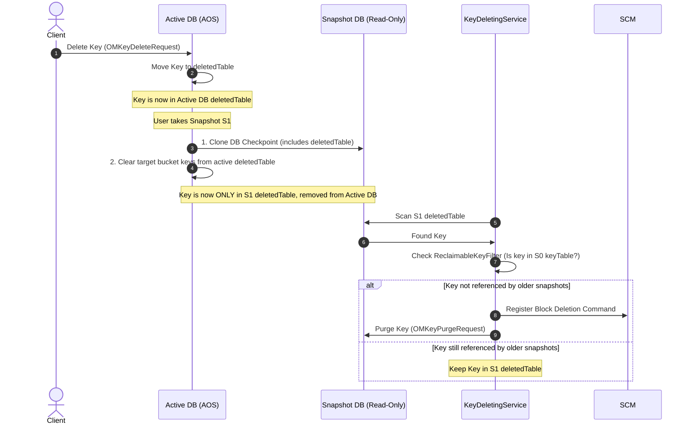

# Implementation of Delete Operations

A common question is: after a user deletes something, when is space actually reclaimed? Ozone spreads work across the client, Ozone Manager (OM), Storage Container Manager (SCM), and Datanodes. This page is a single map of that pipeline: **metadata moves first**, then **blocks are deleted asynchronously**, and **bytes on disk** disappear only after Datanodes finish their background cleanup.

## Client: CLI, FileSystem, and trash

Deletion depends on **which API** you use and on **bucket layout**. Trash is implemented on the **client** (renames into `.Trash`), not as a separate table inside OM.

### Ozone CLI (`DeleteKeyHandler`)

- **FSO buckets**  
  - If trash is enabled (`fs.trash.interval > 0`), the CLI **renames** the key into the Hadoop trash layout: `.Trash`, a per-user segment, `Current`, then the key’s relative path.  
  - If trash is disabled, it calls **`bucket.deleteKey(keyName)`** for a direct delete.
- **OBS / legacy buckets**  
  - **`ozone sh key delete`** calls **`bucket.deleteKey(keyName)`** directly. Trash is **not** supported for this path the way it is for FSO.

### Hadoop FileSystem (`o3fs://`, `ofs://`)

`hadoop fs -rm` follows the usual Hadoop **TrashPolicy**:

- With trash enabled, the client issues a **rename** from the source path to `/.Trash/Current/...`.
- With **`-skipTrash`** or trash disabled, it calls **`FileSystem.delete()`**, which becomes a **`deleteKey`** RPC to OM.

### What OM sees for trash vs delete

- **Rename into `.Trash`** is a normal **metadata rename** in **`keyTable`** or **`fileTable`**. The object id and blocks stay put; **no space is reclaimed**.
- **`deleteKey`** removes the key from the live namespace and stages it for asynchronous block cleanup (see [OM](#ozone-manager-tables-and-background-services) below).

### Trash emptier

`.Trash` is an ordinary directory tree. A **Trash emptier** (Hadoop client background thread or scheduled job) eventually:

1. Renames `.Trash/Current` to a timestamped checkpoint under `.Trash/`.
2. After retention, issues a **recursive delete** on that checkpoint.
3. Those **`deleteKey`** operations finally move keys into **`deletedTable`** and start physical reclamation.

### Client summary

| Client action | Trash | OM operation | Result |
| --- | --- | --- | --- |
| `rm` file | Off | `deleteKey` | Entry moves toward **`deletedTable`**; async reclamation begins |
| `rm` file | On | `renameKey` | Data under **`.Trash/Current`**; no reclamation yet |
| `rm -skipTrash` | On | `deleteKey` | Same as direct delete |
| Trash emptier | — | `deleteKey` (recursive) | Keys reach **`deletedTable`**; space can be reclaimed |

**Takeaway:** OM has **no trash table**. It only sees **renames** or **final deletes**.

## Ozone Manager: tables and background services

Deletion in OM is **multi-phase** and **asynchronous** so large trees and huge key counts do not block a single RPC.

### Synchronous delete (`OMKeyDeleteRequest`)

When **`deleteKey`** is processed:

- **File (FSO):** Row leaves **`fileTable`** (or **`keyTable`** in non-FSO layouts) and is recorded in **`deletedTable`**.
- **Directory (FSO):** Row moves from **`directoryTable`** to **`deletedDirectoryTable`**.
- **Quota:** Bucket **used bytes** and **namespace** usage are updated for the **logical** delete at this stage; retained usage stays in quota totals until **`OMKeyPurgeRequest`** clears it ([quota internals](./quota)).

### Directory expansion (`DirectoryDeletingService`) — FSO

Deleting a directory does **not** instantly move every descendant. The service:

1. Scans **`deletedDirectoryTable`** for pending directory deletes.
2. Moves child **files** from **`fileTable`** → **`deletedTable`** and child **directories** from **`directoryTable`** → **`deletedDirectoryTable`** for later iterations.
3. When a directory has **no remaining children** in the live tables, it sends **`PurgePathRequest`** to drop that directory from **`deletedDirectoryTable`**.

### Block handoff and purge (`KeyDeletingService`, `OMKeyPurgeRequest`)

**`KeyDeletingService`** drains **`deletedTable`**:

1. Reads **block groups** for each deleted key.
2. Asks **SCM** to persist **delete-block** intent and waits for acknowledgement that SCM has recorded it.
3. Submits **`OMKeyPurgeRequest`** to remove metadata from **`deletedTable`** once SCM has accepted the work.

**`OMKeyPurgeRequest`** is the terminal metadata step for a key. With **snapshots**, purge may **retain** or **redirect** entries (for example toward a snapshot’s deleted tables) so snapshot chains stay consistent—details depend on snapshot configuration and chain state.

### OM table flow (FSO)

| Step | Entity | From | To | Handler / service |
| --- | --- | --- | --- | --- |
| 1 | File | `fileTable` | `deletedTable` | `OMKeyDeleteRequest` |
| 1 | Directory | `directoryTable` | `deletedDirectoryTable` | `OMKeyDeleteRequest` |
| 2 | Child file | `fileTable` | `deletedTable` | `DirectoryDeletingService` |
| 2 | Child dir | `directoryTable` | `deletedDirectoryTable` | `DirectoryDeletingService` |
| 3 | File metadata | `deletedTable` | removed | `KeyDeletingService` → `OMKeyPurgeRequest` |
| 4 | Directory metadata | `deletedDirectoryTable` | removed | `DirectoryDeletingService` → `PurgePathRequest` |

## Interaction with Ozone Snapshots

When Ozone Snapshots are enabled on a bucket, the deletion process differs to guarantee that historical snapshot read integrity is preserved and blocks are only reclaimed when no longer referenced.

### 1. Deleted Key Partitioning (Snapshot Creation)
To prevent double-counting and key duplication across databases, deleted keys are cleanly partitioned during snapshot creation:
1. **DB Checkpoint**: When a snapshot is taken, the active DB is checkpointed to create a frozen, read-only snapshot DB. At this point, the snapshot DB's `deletedTable` and `deletedDirTable` contain all keys that were deleted in the active namespace prior to the snapshot's creation.
2. **Active DB Purge**: Immediately following checkpoint creation, the active DB transaction deletes all keys matching the bucket's prefix from the **active DB's** `deletedTable` and `deletedDirTable`.
3. **Partition Effect**: 
   * Keys deleted **before** snapshot creation reside **only in the snapshot DB's deleted tables**.
   * Keys deleted **after** snapshot creation reside **only in the active DB's deleted tables**.
   * Consequently, a specific deleted key (identified by its path and unique `objectId`) resides in at most one deleted table at any time.

### 2. Reclaimable Key Filtering
The `KeyDeletingService` runs background tasks against both the active DB and the snapshot DBs. To determine if a deleted key's block space can be safely reclaimed, it uses a `ReclaimableKeyFilter`:
* When scanning a `deletedTable` entry in snapshot `S_n`, the filter checks if the key exists in the `keyTable` or `fileTable` of the previous snapshot `S_{n-1}` in the bucket's snapshot chain.
* If the key is present in `S_{n-1}`, it means the key is still referenced by an older snapshot. The key is **not reclaimable** and remains in the `deletedTable`.
* If the key is not referenced by any older snapshot, the filter marks it reclaimable. The block delete commands are registered with SCM, and an `OMKeyPurgeRequest` removes the metadata entry.

### 3. Snapshot Reclamation (Snapshot Deletion)
When a snapshot is deleted, its keys must be reconciled with the rest of the chain:
* The Snapshot Deleting Service (SDS) executes an `OMSnapshotMoveDeletedKeysRequest`.
* It scans the deleted snapshot's local `deletedTable`.
* Any keys that are still referenced by the next snapshot in the chain are **moved** from the deleted snapshot's `deletedTable` to the next snapshot's `deletedTable`.
* If there is no next snapshot, the keys are moved back to the active DB's `deletedTable`.
* This ensures that as snapshots are deleted, block deletion intent is safely passed forward until the blocks are no longer protected by any snapshot.

### 4. Quota Accounting for Snapshots
* When a key is logically deleted, if snapshots exist, its size is subtracted from `usedBytes` and added to `snapshotUsedBytes` (the pending deletion bucket).
* When a key is permanently reclaimed (via `KeyDeletingService` or snapshot delete), `purgeSnapshotUsedBytes` is called to decrement the `snapshotUsedBytes` metric.

---

## OBS and LEGACY buckets

OBS / legacy layouts use a **flat key namespace** (paths with slashes are still **one key**). There is **no** directory tree in **`directoryTable`**, so there is **no** **`DirectoryDeletingService`** expansion step.

1. **`OMKeyDeleteRequest`** works against **`keyTable`** (`BucketLayout.OBJECT_STORE` / legacy equivalents). A **tombstone** may be visible in cache while the transaction completes; quota updates apply with the delete.
2. **`OMKeyDeleteResponse`** persists: **delete** from **`keyTable`**, **insert** into **`deletedTable`** (often keyed like `volume/bucket/keyName/objectId`). “Directories” in the name are **string prefixes**, not rows in **`directoryTable`**.
3. From **`deletedTable`** onward, **`KeyDeletingService`**, SCM, and Datanodes behave **like FSO file deletes**.

| | FSO | OBS / LEGACY |
| --- | --- | --- |
| Live tables | `fileTable`, `directoryTable` | `keyTable` |
| Directory staging | `deletedDirectoryTable` | — |
| Deleted keys | `deletedTable` | `deletedTable` |
| Directory expansion | Yes (`DirectoryDeletingService`) | No |

## Physical reclamation: SCM and Datanodes {#deleting-data}

OM never deletes bytes on disk directly. It hands **block ids** to **SCM**, which coordinates **replicas** on **Datanodes**.

### SCM: log, throttle, dispatch

1. **Persist intent:** On **`deleteKeyBlocks`** from OM, SCM **groups** blocks by **container**, creates **`DeletedBlocksTransaction`** records with **transaction ids (TXIDs)**, and stores them in **`DeletedBlocksTXTable`** (RocksDB in SCM). A restart replays this log—work is not forgotten.
2. **`SCMBlockDeletingService`:** Periodically scans pending transactions, respects **healthy Datanodes** and **queue limits**, builds **`DeleteBlocksCommand`** payloads (often batched), and attaches them to **heartbeat responses**.
3. **Completion:** Datanodes report **`ContainerBlocksDeletionACKProto`** / delete-block status. **`SCMDeletedBlockTransactionStatusManager`** tracks which replicas acknowledged which TXID. SCM removes a transaction from **`DeletedBlocksTXTable`** only after **all required replicas** have acknowledged.

This design favors **eventual completion** under failures, **no orphan replicas** left behind, and **fewer RPCs** via batching.

### Datanode: ACK first, erase in the background

1. **`DeleteBlocksCommandHandler`:** Commands go on **`deleteCommandQueues`**; **`DeleteCmdWorker`** runs **`ProcessTransactionTask`** per TX. The handler **records deletion intent** in the container DB—**schema v2/v3:** transactions in **`DeletedBlocksTXTable`** inside the container DB; **schema v1:** block keys move to a **`deletedBlocksTable`** / deleting prefix. It then **ACKs** SCM so the control plane can track replica progress.
2. **`BlockDeletingService`:** A background loop schedules **`BlockDeletingTask`** per container, calls **`handler.deleteBlock()`** to **remove chunk files** from disk, then **cleans DB state** (block rows, transaction rows, **`usedBytes`**, pending-delete counters). **Empty containers** can be marked so SCM may retire the container later.

| Piece | Role |
| --- | --- |
| `DeleteBlocksCommandHandler` | Apply SCM command, persist intent in container DB, send ACK |
| `BlockDeletingService` | Throttled physical deletes and DB cleanup |
| `BlockDeletingTask` | Per-container work unit; uses the container **handler** (e.g. key-value) |

**Net effect:** SCM and OM do not wait for slow disks before moving their own state forward; Datanodes **guarantee** eventual removal or keep retrying until the cluster agrees every replica is gone.

## See also

- [RocksDB in Ozone](../../administrator-guide/configuration/performance/rocksdb) — OM, SCM, and Datanode RocksDB usage, including tables such as `fileTable` and `deletedTable`.
- [Datanode container schema (RocksDB)](../components/datanode/rocksdb-schema) — per-container metadata layout on the Datanode.
- [Trash](../../administrator-guide/operations/trash) — operations-focused trash behavior.
