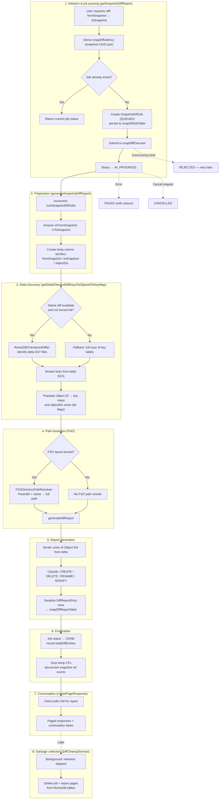

# Snapshot Diff Lifecycle

The lifecycle of a Snapshot Diff in Ozone is an asynchronous, job-based process designed to handle potentially millions of key changes without blocking the Ozone Manager.

Based on `SnapshotDiffManager.java`, here is the step-by-step lifecycle:

## 1. Initiation & Job Queuing (`getSnapshotDiffReport`)

*   **Request**: A user requests a diff between `fromSnapshot` and `toSnapshot`.
*   **Job Key**: A unique `snapDiffJobKey` is generated using the UUIDs of the two snapshots.
*   **Check/Create Job**:
    *   If a job already exists for this pair, its current status is returned.
    *   If no job exists, a new `SnapshotDiffJob` is created with status `QUEUED` and persisted in the `snapDiffJobTable` (RocksDB).
*   **Submission**: The job is submitted to the `snapDiffExecutor` (a thread pool). The status transitions from `QUEUED` to `IN_PROGRESS`.

## 2. Preparation & Snapshots Opening (`generateSnapshotDiffReport`)

*   **Metrics**: Increments the `numSnapshotDiffJobs` metric.
*   **Snapshot Handles**: The service acquires "Active Snapshot" handles (`rcFromSnapshot`, `rcToSnapshot`) which are reference-counted to prevent the snapshots from being deleted while the diff is running.
*   **Temporary Tables**: Three temporary RocksDB Column Families (CF) are created specifically for this Job ID:
    1.  `fromSnapshotColumnFamily`: Maps Object IDs to Key Names in the source.
    2.  `toSnapshotColumnFamily`: Maps Object IDs to Key Names in the target.
    3.  `objectIDsColumnFamily`: Tracks the union of unique Object IDs and whether they are directories.

## 3. Delta Discovery (`getDeltaFilesAndDiffKeysToObjectIdToKeyMap`)

*   **Efficient Diff (Native)**: If enabled, it uses the `RocksDBCheckpointDiffer` to identify the exact SST files that changed between the two snapshot checkpoints.
*   **Full Diff (Fallback)**: If native libs are missing or a full diff is forced, it performs a complete scan of the key tables.
*   **SST Parsing**: It streams keys from the delta SST files.
*   **Object Mapping**: It populates the temporary "Object ID to Key Name" maps. This is critical for detecting Renames (same Object ID, different Key Name).

## 4. Path Resolution (FSO specific)

*   **FSO Layout**: If the bucket is File System Optimized (FSO), keys are stored as `ParentID/FileName`.
*   **Path Resolver**: The `FSODirectoryPathResolver` is used to recursively resolve the `ParentID` into a full human-readable path (e.g., `vol1/bucket1/dir1/file1`).

## 5. Report Generation (`generateDiffReport`)

*   **Comparison**: The service iterates through the union of all Object IDs found in the delta.
*   **Classification**: It classifies changes into four types:
    *   **CREATE**: Present in `toSnapshot` map but not `fromSnapshot`.
    *   **DELETE**: Present in `fromSnapshot` map but not `toSnapshot`.
    *   **RENAME**: Present in both maps with the same Object ID but different paths/names.
    *   **MODIFY**: Present in both with the same path, but metadata (like ACLs or Block Versions) has changed.
*   **Persistence**: The resulting `DiffReportEntry` objects are serialized and stored in the `snapDiffReportTable`.

## 6. Finalization

*   **Status Update**: On success, the job status in `snapDiffJobTable` is updated to `DONE`, and the `totalDiffEntries` count is saved.
*   **Cleanup**: The temporary Column Families used for Object ID mapping are dropped and closed. The snapshot reference counts are decremented.

## 7. Consumption & Pagination (`createPageResponse`)

*   **Polling**: The client polls the OM for the report.
*   **Paged Results**: Since reports can be massive, the OM returns them in pages.
*   **Token**: Each response includes a token (the index of the next entry). The client provides this token in the next call to fetch the subsequent page.

## 8. Garbage Collection (Background)

*   **Cleanup Service**: (Referenced as `DiffCleanupService`) After a configurable interval, a background task deletes the job from `snapDiffJobTable` and the associated report entries from `snapDiffReportTable` to reclaim space.

## Summary of Job Statuses

*   **QUEUED**: Job registered, waiting for a thread.
*   **IN_PROGRESS**: Currently scanning SSTs or generating the report.
*   **DONE**: Report is ready for paging.
*   **FAILED**: An error occurred (e.g., I/O error); includes a reason.
*   **REJECTED**: Too many concurrent jobs; the client should retry later.
*   **CANCELLED**: The job was manually stopped via a cancel request.

## Lifecycle flow

