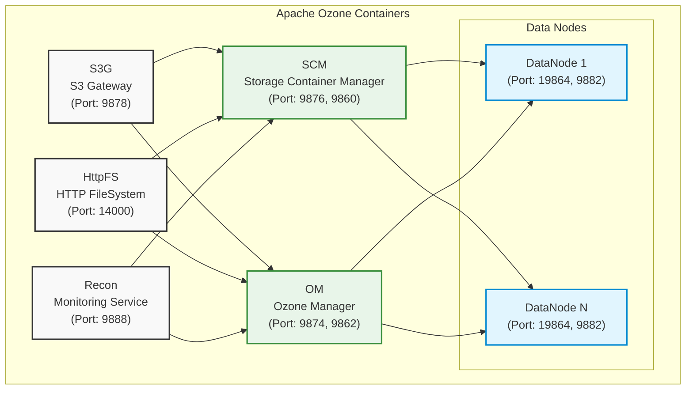

# Running Ozone From Docker Compose

**TODO:** File a subtask under [HDDS-9861](https://issues.apache.org/jira/browse/HDDS-9861) and complete this page or section.

- Reference common clusters from acceptance tests that can be used.
- Define the Ozone runner image at `ozone-docker-runner` and its purpose to wrap Ozone binaries.
- How to define which image gets used in the cluster (runner or other pre-built image).
- Changing configurations in Docker Compose (`docker-config` file, transformation.py, etc).

This guide explains how to run Apache Ozone using Docker Compose, either with locally built sources or pre-built images.

## Prerequisites

- [Docker Engine](https://www.docker.com/products/docker-desktop/) 20.10.0 or higher
- [Docker Compose](https://docs.docker.com/compose/install/) V2
- Built Ozone distribution (if running from local build)

## Running Ozone

You can run Ozone either using your locally built version or using official pre-built Docker images.

### Option 1: Running from Local Build

If you've built Ozone from source, follow these steps:

1. Navigate to the compose directory in your build output:

    ```bash
    cd hadoop-ozone/dist/target/ozone-*-SNAPSHOT/compose/ozone
    ```

2. Start the cluster:

    ```bash
    docker compose up -d
    ```

The local build uses the `ozone-docker-runner` image, which is automatically created during the build process to wrap your compiled Ozone binaries.

### Option 2: Running from Pre-built Images

If you haven't built Ozone locally, you can quickly start a cluster using official pre-built images from Docker Hub:

1. Create a directory for your Ozone deployment:

    ```bash
    mkdir ozone && cd ozone
    ```

2. Download the example compose file:

    ```bash
    curl \
   https://raw.githubusercontent.com/apache/ozone/master/hadoop-ozone/dist/src/main/compose/ozone/docker-compose.yaml \
   -o docker-compose.yaml
    ```

3. Start the cluster:

    ```bash
    docker compose up -d
    ```

This will pull the official Apache Ozone images from Docker Hub.

## Container Diagram

This image shows the containers that will be created by the `docker compose up -d` command.

<!-- cspell:word DN -->



## Cluster Configuration

### Default Services

The default Docker Compose configuration includes:

- Storage Container Manager (SCM)
- Ozone Manager (OM)
- S3 Gateway
- Recon (Monitoring Service)
- Datanodes
- HttpFS

## Cluster Management

Common Docker Compose commands:

```bash
# Start the cluster
docker compose up -d

# Stop the cluster
docker compose down

# View service logs
docker compose logs -f [service_name]

# Scale data nodes
docker compose up -d --scale datanode=3

# Check service status
docker compose ps
```
