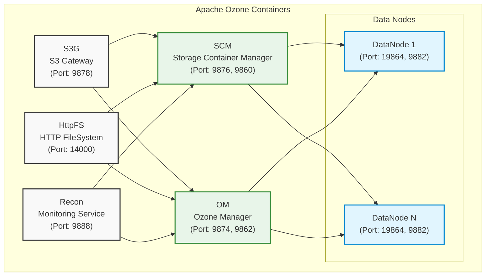

# Running Ozone From Docker Compose

import Tabs from '@theme/Tabs';
import TabItem from '@theme/TabItem';

This guide walks you through the process of building Apache Ozone from source and running it using Docker Compose. This approach is particularly useful for development, testing, and understanding Ozone's architecture.

## Prerequisites

Before you begin, ensure you have installed:

- [Docker Engine](https://docs.docker.com/engine/install/) - Latest stable version
- [Docker Compose](https://docs.docker.com/compose/install/) - Latest stable version

## Building and Deploying Ozone

### Step 1: Build from Source

First, build Ozone from source following our [Build with Maven](/docs/08-developer-guide/01-build/02-maven.md) guide.

### Step 2: Locate Docker Compose Files

Navigate to the compose directory in your build output:

```bash
cd ./hadoop-ozone/dist/target/ozone-<VERSION>/compose/ozone
```

### Step 3: Configure Your Deployment (Optional)

You can customize your Ozone deployment by modifying the configuration parameters in the `docker-compose.yaml` file:

1. **Common Configurations**: Located under the `x-common-config` section
2. **Service-Specific Settings**: Found under the `environment` section of individual services

Example configuration modification:

```yaml
# Example configuration modifications
x-common-config:
  environment:
    OZONE-SITE.XML_ozone.scm.container.size: 1GB
    OZONE-SITE.XML_ozone.scm.block.size: 256MB
```

### Step 4: Launch the Cluster

Start your Ozone cluster:

```bash
docker compose up -d --scale datanode=3
```

This command creates a fully functional Apache Ozone cluster using the `ozone-docker-runner` base image, which mounts your locally compiled Ozone binaries.

## Container Diagram

This image shows the containers that will be created by the `docker compose up -d` command when running the default Docker Compose configuration under `/compose/ozone` .

<!-- cspell:word DN -->



## Cluster Components

### Core Services

Your Ozone cluster includes the following components:

- **Storage Container Manager (SCM)**: Manages storage containers and block allocation
- **Ozone Manager (OM)**: Handles namespace operations and metadata management
- **S3 Gateway**: Provides S3-compatible API access
- **Recon**: Monitoring and management service
- **Datanodes**: Distributed storage nodes
- **HttpFS**: HTTP-based filesystem interface

## Cluster Management

### Essential Commands

Here are the key commands for managing your Ozone cluster:

```bash
# Start the cluster
docker compose up -d

# Stop and remove all containers
docker compose down

# Monitor service logs
docker compose logs -f [service_name]

# Scale the number of datanodes
docker compose up -d --scale datanode=3

# Check cluster status
docker compose ps
```

### CLI Access

Access the Ozone command-line interface from any Ozone container:

```bash
# Enter the Ozone Manager container or any other container
docker compose exec om bash

# Run Ozone commands
ozone
```

## Advanced Configurations

The compose directory includes several specialized configurations for different use cases:

<!-- cspell:word  ozonesecure -->

| Configuration  | Purpose                                 |
|----------------|-----------------------------------------|
| ozone-ha       | High availability deployment setup      |
| ozonesecure    | Security features with SSL and Kerberos |
| ozone-topology | Rack-aware deployment configuration     |
| upgrade        | Non-rolling upgrade testing environment |

To explore these configurations:

```bash
cd hadoop-ozone/dist/target/ozone-*-SNAPSHOT/compose/
```

## Next Steps

After setting up your development cluster:

1. Explore the [Ozone CLI documentation](/docs/04-user-guide/02-clients/01-ozone.md)
2. Experiment with the various compose configurations for specific use cases
