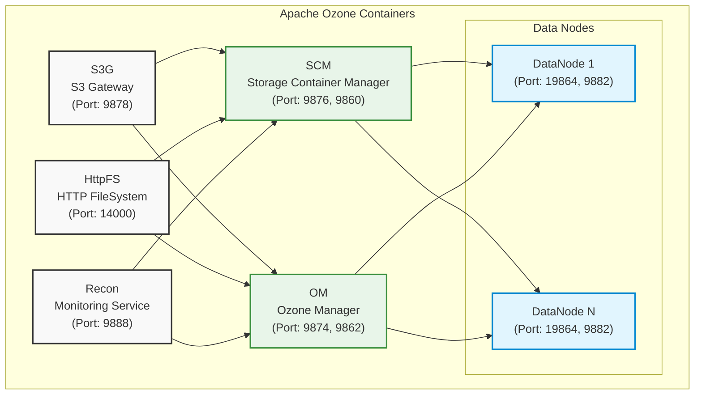

<!-- cspell:words xzf -->

# Running Ozone From Docker Compose

import Tabs from '@theme/Tabs';
import TabItem from '@theme/TabItem';

This guide explains how to run Apache Ozone using Docker Compose, either with locally built sources or pre-built images.

## Prerequisites

- [Docker Engine](https://www.docker.com/products/docker-desktop/) 20.10.0 or higher
- [Docker Compose](https://docs.docker.com/compose/install/) V2
- Built Ozone distribution (if running from local build)

## Running Ozone

Follow the [Try Ozone with Docker](/docs/02-quick-start/01-installation/01-docker.md) quick start guide to run Ozone via Docker Compose

## Container Diagram

This image shows the containers that will be created by the `docker compose up -d` command when running the default `ozone` Docker Compose configuration as listed under the [Try Ozone with Docker](/docs/02-quick-start/01-installation/01-docker.md) quick start guide.

<!-- cspell:word DN -->



## Cluster Configuration

### Default Services

The default Docker Compose configuration includes:

- Storage Container Manager (SCM)
- Ozone Manager (OM)
- S3 Gateway
- Recon (Monitoring Service)
- Datanodes
- HttpFS

## Cluster Management

Common Docker Compose commands:

```bash
# Start the cluster
docker compose up -d

# Stop the cluster
docker compose down

# View service logs
docker compose logs -f [service_name]

# Scale data nodes
docker compose up -d --scale datanode=3

# Check service status
docker compose ps
```

# Next Steps

This page explains the Docker Compose configuration for a basic Ozone cluster.
You can next explore some of the other Docker Compose configurations that are available under the compose directory.

```bash
cd hadoop-ozone/dist/target/ozone-*-SNAPSHOT/compose/
```

| Docker Compose configuration | Description |
|--------------|-------------|
| ozone-ha     | Explore Ozone high availability with this configuration |
| ozone-secure | Explore various SSL certificate and Kerberos configurations |
| topology     | Explore the rack-aware configuration |
| upgrade      | Explore the non-rolling upgrade configuration |
